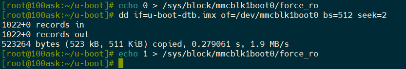

1. 清理编译环境

```sh
make distclean
```

<br/>

2. 生成编译配置

```sh
make mx6ull_14x14_evk_defconfig
```

<br/>

3. 执行目标编译

```sh
make
```

<br/>

4. 编译生成后的`u-boot-dtb.imx`文件可以烧录到TF卡、EMMC



```sh
echo 0 > /sys/block/mmcblk1boot0/force_ro
dd if=u-boot-dtb.imx of=/dev/mmcblk1boot0 bs=512 seek=2
echo 1 > /sys/block/mmcblk1boot0/force_ro
```

<br/>

<br/>

***

U-Boot 和 GRUB 都是计算机系统中至关重要的引导加载程序（Bootloader），但它们的设计目标、应用场景和特性有显著不同。为了帮助你快速了解，我先用一个表格来概括它们的核心区别：

|特性维度|U-Boot (Universal Boot Loader)|GRUB (GRand Unified Bootloader)|
|:--|:--|:--|
|**主要应用领域**|嵌入式系统 (路由器、工控设备、物联网设备等)|通用PC、服务器|
|**硬件支持**|支持多种架构（ARM, MIPS, PowerPC, RISC-V）及众多SoC和开发板|主要面向x86、x86_64架构，依赖标准硬件接口（如BIOS/UEFI）|
|**核心功能特点**|高度定制化、网络启动（TFTP/NFS）、Flash读写、强大的命令行调试|多操作系统引导、图形化菜单界面、模块化动态加载文件系统驱动|
|**交互方式**|主要基于命令行界面（CLI），适合开发和调试|主要提供图形化菜单界面，方便终端用户选择系统|
|**架构依赖**|直接管理硬件，不依赖BIOS/UEFI|通常运行于BIOS或UEFI固件之上|
|**典型使用场景**|设备启动、固件更新、系统恢复、硬件调试|桌面/服务器多系统引导、系统修复|
|**可定制性**|非常高，可深度裁剪和适配特定硬件|相对固定，主要在配置文件和模块层面|

接下来，我们详细了解一下它们的主要特点。

### 🖥️ 1. 主要应用领域与硬件支持

- **U-Boot** 专为**嵌入式系统**设计，常见于路由器、智能家居设备、工业控制设备等资源受限或硬件多样化的环境 。它支持**多种处理器架构**（如 ARM, MIPS, PowerPC, RISC-V），并能为特定的 SoC（系统级芯片）和开发板进行高度定制 。
- **GRUB** 则主要面向 **x86/x86_64 架构**的通用计算机，如个人电脑（PC）、笔记本电脑和服务器 。它严重依赖标准的 **BIOS** 或 **UEFI** 固件来抽象底层硬件 。

### ⚙️ 2. 核心功能与交互方式

- **U-Boot** 强调**高度定制化**和对硬件的直接控制。它支持**网络启动**（如通过TFTP、NFS）和**Flash存储器操作**，这对于嵌入式开发调试和远程更新非常有用 。其交互主要通过**命令行界面（CLI）**，提供了丰富的调试命令（如内存读写、设备检测等），方便开发者直接与硬件交互 。
- **GRUB** 的核心功能是**多操作系统引导**（如 Linux, Windows, macOS） 。它提供用户友好的**图形化菜单界面**，允许用户轻松选择要启动的系统 。GRUB 2 采用**模块化设计**，可以动态加载所需的文件系统驱动，增强了灵活性 。

### 🛠️ 3. 架构依赖与可定制性

- **U-Boot** 通常直接运行在硬件之上，**不依赖**BIOS或UEFI等底层固件，直接初始化和管理硬件资源 。其**可定制性极高**，开发者可以根据目标硬件平台裁剪功能、添加驱动或修改启动流程 。
- **GRUB** 通常作为**第二阶段的引导加载程序**，由 BIOS 或 UEFI 加载并运行 。它的可定制性主要体现在修改配置文件（如 `grub.cfg`）和添加模块上，但对核心代码的修改通常不如 U-Boot 常见和灵活 。

### 📊 4. 工作流程对比

下图简要对比了 U-Boot 和 GRUB 在典型嵌入式设备与 PC 系统中的启动流程差异：

```mermaid
flowchart TD
    subgraph A [U-Boot 在嵌入式系统中的启动流程]
        A1([设备上电]) --> A2[SoC内置BootROM<br>执行初始硬件初始化]
        A2 --> A3[加载U-Boot SPL<br>Secondary Program Loader]
        A3 --> A4[U-Boot 完整镜像初始化<br>内存、串口、网卡等]
        A4 --> A5[U-Boot 命令行界面<br>提供调试与手动操作能力]
        A5 --> A6[根据环境变量<br>如 bootcmd 自动启动]
        A6 --> A7[加载并跳转到<br>Linux 内核]
    end

    subgraph B [GRUB 在 PC 中的启动流程]
        B1([PC 上电]) --> B2[BIOS/UEFI 固件<br>执行硬件自检与初始化]
        B2 --> B3[加载 GRUB 引导程序]
        B3 --> B4[GRUB 解析 grub.cfg<br>配置文件]
        B4 --> B5[显示图形化菜单<br>供用户选择操作系统]
        B5 --> B6[加载选中的操作系统内核<br>与 initramfs]
        B6 --> B7[将控制权移交<br>给内核]
    end
```



### 💡 5. 如何选择 Bootloader

选择 U-Boot 还是 GRUB，主要取决于你的**硬件平台**和**应用场景**：

- 为 **ARM、MIPS、RISC-V 等架构的嵌入式设备**（如开发板、路由器、物联网终端）选择 **U-Boot**。它提供了所需的硬件控制灵活性、调试功能和定制化能力 。
- 为 **x86/x86_64 架构的台式机、笔记本电脑或服务器**，尤其是需要**引导多个操作系统**时，选择 **GRUB**。它提供了更好的硬件兼容性（通过BIOS/UEFI）和用户友好的体验 。