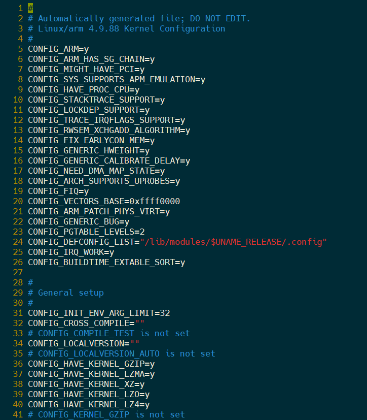
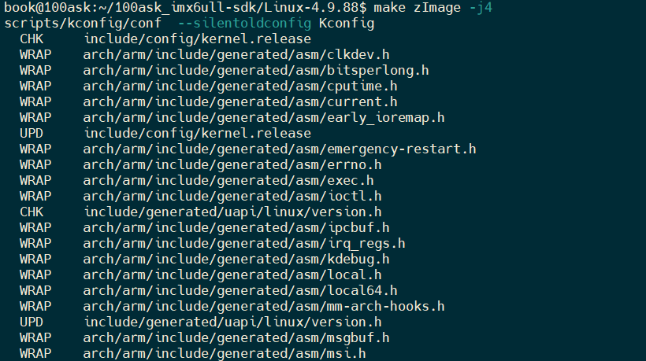
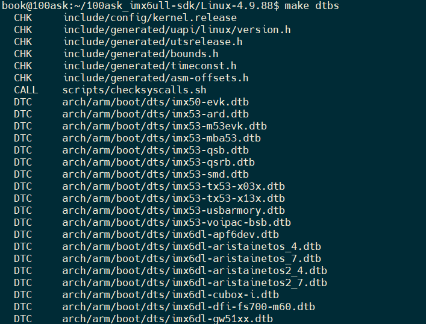
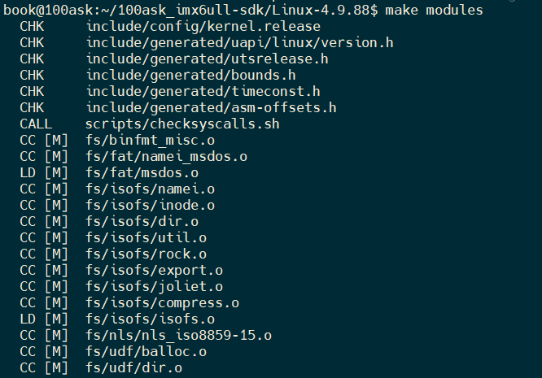
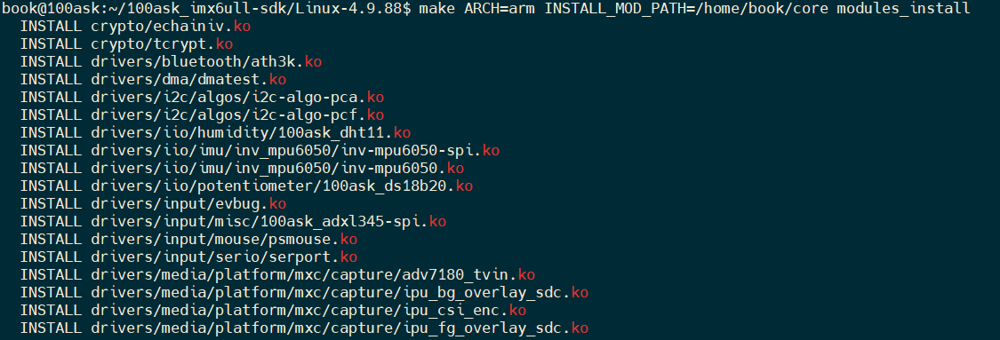
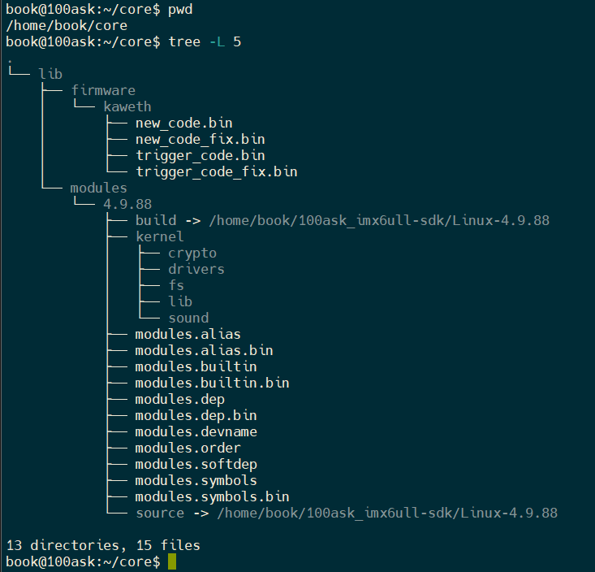
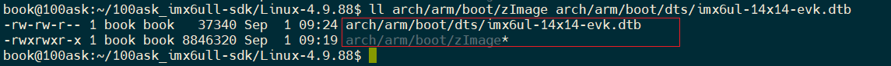

进入内核目录`~/Linux-4.9.88`

<br/>

1. 清理编译环境

```sh
make mrproper
```

此操作可以将之前编译产生的所有文件都删除，效果比`make clean`更彻底。

`make clean` 仅删除编译生成的中间文件（如 .o），保留配置（.config）。

`make mrproper` 会连配置文件一起删除，相当于“重置”编译环境。

2. 生成目标内核配置

```sh
 make 100ask_imx6ull_defconfig
```

在当前目录下生成内核环境配置`.config`文件



3. 编译内核目标

```sh
make zImage -j4
```

生成内核文件zImage，并指定4个主机cpu核心进行编译加快编译速度。



4. 编译设备树文件

```sh
make dtbs
```

生成设备树文件



5. 编译内核模块

```sh
make modules
```

生成内核运行时需要用到的模块



6. 将指定内核模块安装到指定目录

```sh
make ARCH=arm INSTALL_MOD_PATH=/home/book/core modules_install
```





<br/>

7. 获得目标文件并将其传输到目标开发板指定位置



```sh
adb push zImage /boot  
adb push imx6ull-14x14-evk.dtb /boot
adb push lib/modules /lib
```

将`zImage`和`dtb`文件放到开发板`/boot`目录

将内核模块`lib/modules`放到开发板`/lib`目录

<br/>

<br/>

***

编译 Linux 内核后，只需要 `zImage` 和 `dtb` 文件来启动系统，主要是因为它们是内核启动过程中最核心的两个组成部分，分别承载了**操作系统核心**和**硬件描述信息**。

下面的表格汇总了它们的主要作用和特点，帮助你快速了解：

|文件|全称|作用|特点|是否必需|
|:--|:--|:--|:--|:--|
|**zImage**|Compressed Kernel Image|包含压缩的 Linux 内核核心代码，是系统运行的基础。|经过压缩，体积较小；包含自解压代码。|是|
|**dtb**|Device Tree Blob|以二进制形式描述开发板的硬件配置（CPU、内存、外设等）。|使内核与硬件解耦，提高了内核的通用性和可维护性。|是|
|vmlinux|未压缩的内核文件|包含完整的调试符号，用于调试。|文件较大，不用于实际部署。|否|
|**.ko**|Kernel Object|内核模块文件，可以在需要时动态加载。|不是内核启动所必需的，可以在系统启动后根据需要手动加载。|否|

🧩 **为什么两者缺一不可**

`zImage` 和 `dtb` 文件在启动过程中是分工协作的：

1. **Bootloader 加载**：Bootloader（如 U-Boot）首先将 `zImage` 和 `dtb` 文件加载到内存的特定地址。
2. **解压与传递**：Bootloader 将控制权交给 `zImage`。`zImage` 中的自解压代码开始工作，将压缩的内核解压到内存中并运行。同时，Bootloader 会将 `dtb` 文件在内存中的地址传递给内核。
3. **内核解析**：内核启动后，会解析 `dtb` 文件，根据其中的信息来识别和初始化硬件设备，从而避免了对硬件平台的硬编码依赖。

⚙️ **其他编译产出文件的作用**

编译内核后还会生成其他文件，但它们通常不是启动所必需的：

- **vmlinux**：这是**未压缩的原始内核ELF文件**，包含了所有调试符号。它文件巨大，主要用于内核调试，不会用于实际部署或启动。
- **内核模块 (.ko)**：这些是**可动态加载的内核模块**。不是所有驱动或功能都直接编译进 `zImage`，有些会编译成 `.ko` 模块文件。它们可以在系统启动后根据需要手动加载（如 `insmod` 命令），或者由 `initramfs` 在早期用户空间加载，**并非内核启动阶段的必备文件**。

💡 **关于initramfs**
在某些配置下，除了 `zImage` 和 `dtb`，可能还需要一个 `initramfs`（初始内存文件系统）镜像。它是一个临时的根文件系统，内含一些必要的驱动、工具和脚本，用于在挂载真正的根文件系统之前进行一些前期初始化工作（例如加载特殊硬盘控制器驱动、解密磁盘等）。是否需要 `initramfs` 取决于你的硬件配置和根文件系统类型。