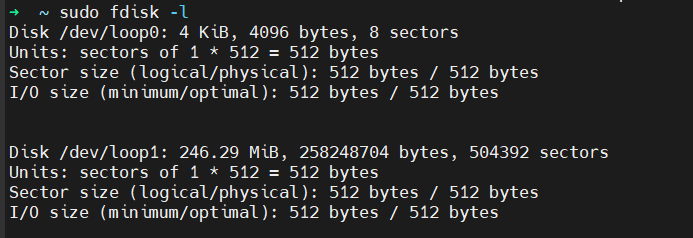
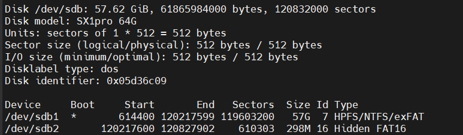
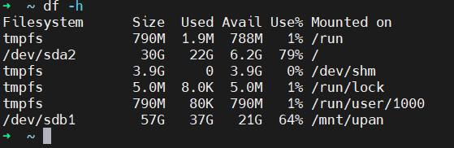
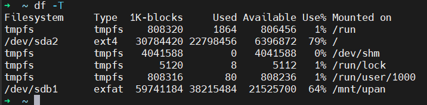
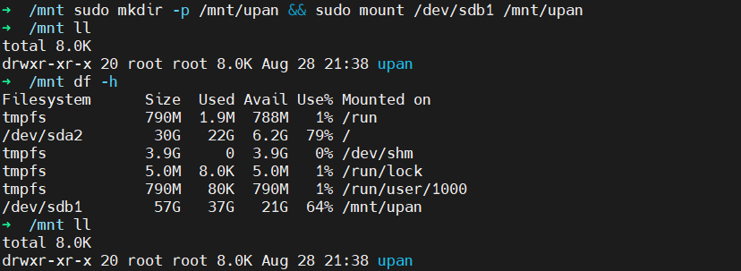

### 1、挂载U盘

 

#### ① 查看设备文件

`sudo fdisk -l`   查看当前系统上所有磁盘设备信息

#### ② 查看设备信息

`df -h`   查看磁盘空间

`df -T`   查看文件系统

#### ③ 挂载到文件系统

`sudo mkdir -p /mnt/upan && sudo mount /dev/sdb1 /mnt/upan`

创建挂载点 并 将U盘设备文件挂载到指定的挂载点下

