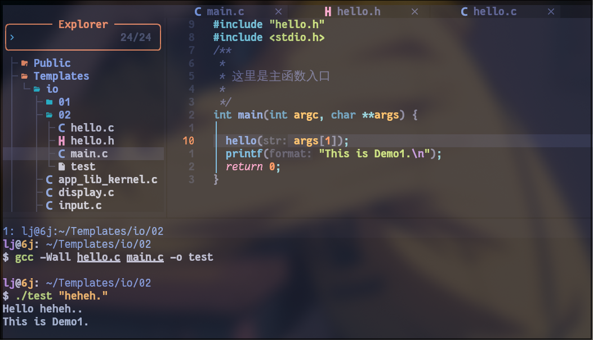
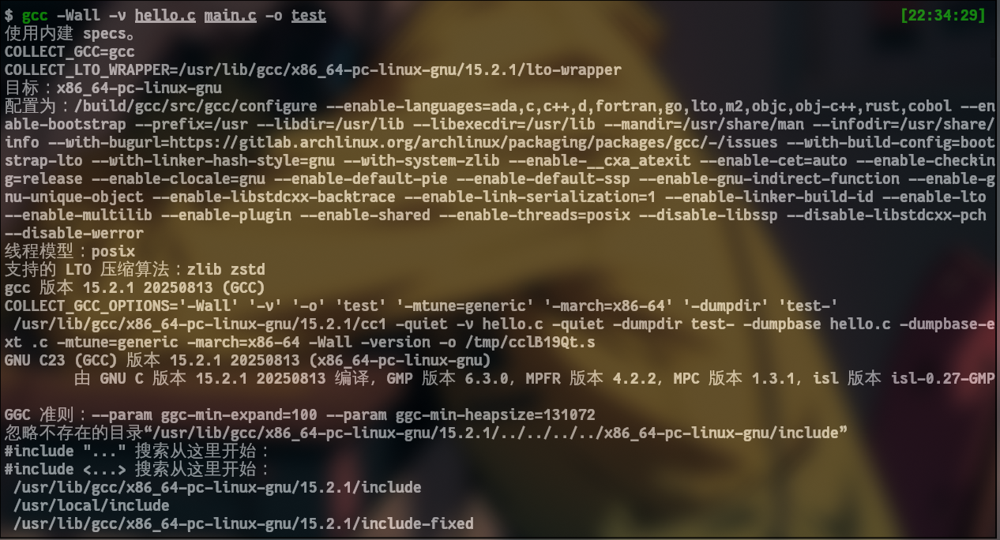
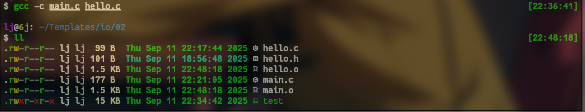
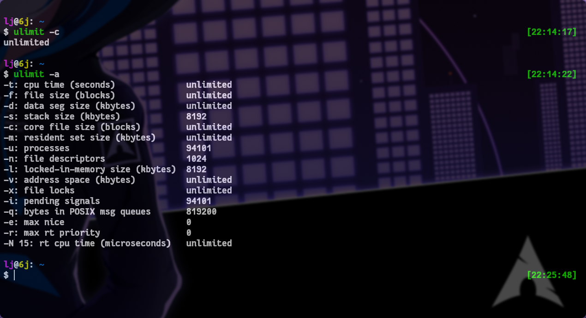
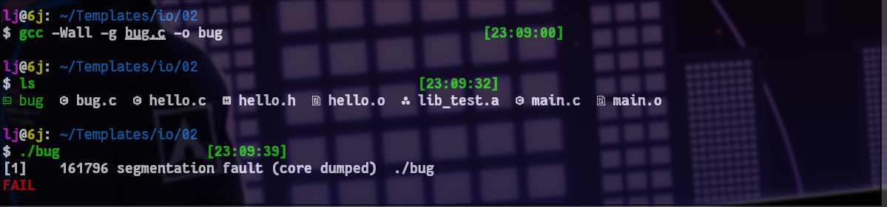
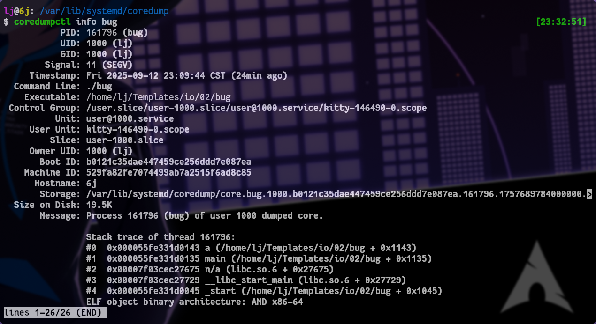
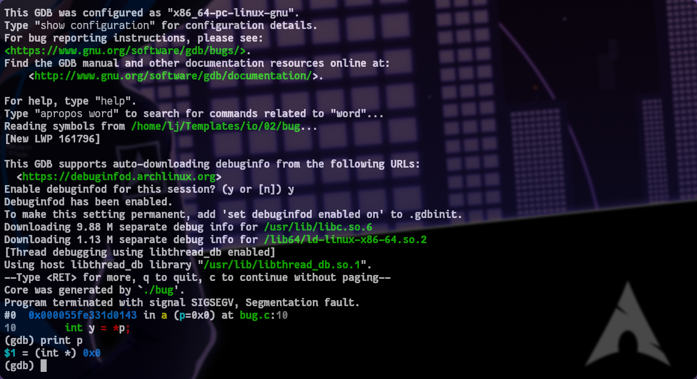
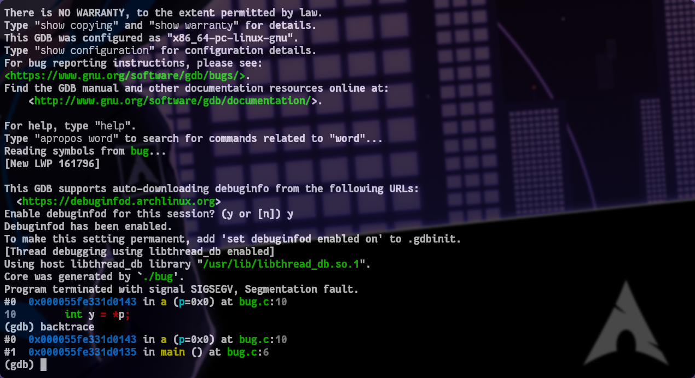
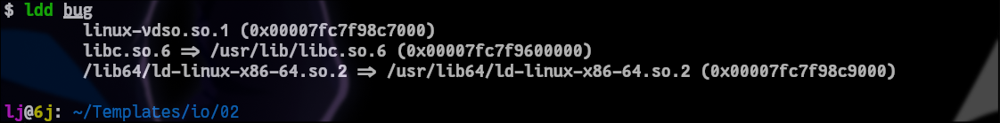

# GCC常用指令

<br>

## 🚀基础编译选项

***

* **`-Wall`** : 分成两部分`-W`+`all`, 检测程序中各种问题

```bash
$ gcc -Wall hello.c -o hello
```



> 不需要编译`.h`文件，因为`.h`文件在`.c`文件里显式包含了，代码检查时会自动引入编译

***

* **`-v`** : 显示编译过程信息

```bash
$ gcc -Wall -v hello.c main.c -o test
```



***

* **`-c`** : 执行‘预处理’‘汇编’‘编译’步骤，生成`.o`文件

```bash
$ gcc -Wall -c main.c hello.c
```



> 无需添加`-o`选项，`-o`会调用链接器生成目标可执行文件

```bash
$ gcc main.o hello.o -o test
```

> 这里无需`-Wall`，因为`-Wall`是检查编译过程中的问题，这里只执行了链接操作


* **`-MM`** : 该选项可以列出文件指定源程序目标文件`.o`的依赖文件

在编写Makefile时非常好用

```bash
$ gcc -MM main.c
```


### ❗编译次序问题

> 主要针对一些比较老的编辑器

  + gcc检测文件是从右往左
  + 某个源文件需要依赖另一个源文件时需要把依赖放在前面(右边)


### 字符编码指定

在一些情况下源码文件用的utf-8编码，但是在程序运行环境中只支持gbk或其他编码显示否则乱码，这时就需要用到下列选项


* `-finput-charset` : 告诉gcc源文件使用的字符编码


* `-fexec-charset` : 此选项指定编译后的程序中字符串常量的编码


示例：从 GBK 编码源文件编译为使用 UTF-8 编码的程序

```bash
gcc -finput-charset=GBK -fexec-charset=UTF-8 -o myprogram source.c
```

* `-fwide-exec-charset` : 这个选项指定宽字符字符串字面量在编译后的执行文件中使用的编码格式

宽字符是C/C++中用于表示扩展字符集（如Unicode）的一种数据类型。与普通的char类型（通常为1字节）不同，宽字符使用wchar_t类型，其大小取决于平台（通常是2或4字节）

```bash
# 处理GBK编码的源文件，生成使用UTF-8窄字符和UTF-32宽字符的程序
gcc -finput-charset=GBK \
    -fexec-charset=UTF-8 \
    -fwide-exec-charset=UTF-32 \
    program.c -o program
```

<br>

## 🎉库文件

> 多个目标文件`.o`打包到一个文件里，标准库一般位于`/usr/lib`、`/lib`、`/usr/local/lib`目录里，以`.a`为后缀名

 * 静态库 : 在类unix系统里一般以`.a`文件为主，windows中一般以`.lib`文件为主
 * 动态库 : 在linux中是`.so`文件，在windows中是`.dll`文件

### 🔗链接外部静态库

> 通过在命令中添加库文件的路径(一般是相对路径)来引入外部库依赖

1. 显式指定外部库文件

```bash
$ gcc -Wall main.c /usr/lib/libm.a -o calc
```

> ⚠️注意: 指定库文件是，需要注意文件依赖顺序(右->左)

2. 使用`-l`选项指定外部库文件，需要注意命令规则`lib程序名.a`

```bash
$ gcc -Wall main.c -lm -o calc
```

这里的`-lm`也是一个组合选项，从系统库目录找文件，表示链接标准库目录`/usr/lib`

> ⚠️注意: 在使用库文件里面的函数时需要在源代码中包含使用到的库函数的头文件，就算你手动链接了目标函数的库文件，也会报错，因为需要显式声明

3. 指定外部库目录(✨推荐)

不需要外部环境依赖，一般在项目目录里创建目录

* **`-I`** : 指定头文件搜索目录

* **`-L`** : 指定库文件搜索目录

4. 设置系统环境变量

* **`C_INCLUDE_PATH`** : 指定头文件目录

* **`LIBRARY_PATH`** : 指定库文件目录


#### 🔧手动创建库文件

+ 创建库

```bash
$ ar cr lib_name.a file1.o file2.o file3.o
```

+ 查看库文件里有多少个目标文件
```bash
$ ar t lib_name.a
```


### 😄链接动态库

> ⚠️注意：如果有两个内容一样的库，分别被编译成静态库和动态库，GCC在都被指定时，系统会优先使用动态库来链接

1. 指定环境变量

程序在执行的时候会从这个环境变量指定的目录寻找动态库文件

* **`LD_LIBRARY_PATH`** : 配置动态库文件目录的环境变量

```bash
$ export LD_LIBRARY_PATH=/home/xxx/lib
```

<br>

## 👨‍💻C标准指定

通常不同C标准编译时，编译器识别的c关键字不同，包含不同的功能。所以在编译时针对不同标准的源代码需要指定编译标准

通常情况下使用c99标准

* **`-ansi`** : 使用ansi标准来编译（标准C）

* **`-c99`** : 使用c99标准来编译（升级版）

```bash
$ gcc -Wall -ansi -c main.c
```

或者

```bash
$ gcc -Wall -std=c99 -c main.c
```

> 还有很多其他细节指定选项等用到的时候再去查，比如：
> `-Wcomment`
> `-Wformat`
> `-Wunused`
> `-Wimplicit`
> `-Wreturn-type`

<br>

## ⚓预处理宏

GCC编译是会对#开头的行检测是否宏关键字，执行相关语义的编译操作

### 🦽宏定义

* **`-D`** : 宏定义选项，在编译时指定一个宏

```bash
$ gcc -Wall -DNUM=123 main.c -o test
```

> 在编译是会将指定的宏替换到代码中，效果相当于：`#define NUM 123`

宏表达式

```bash
$ gcc -Wall -DSUM="1+2" main.c -o test
```

什么都不写

```bash
$ gcc -Wall -DFLAG main.c -o test
```

> 这里相当于`#define FLAG 1`，因为定义了一个空的宏时，默认值就是1

* **`-E`** : 可以将指定源码里的宏替换为宏定义的值(宏展开)，在分析复杂代码时很有用

```bash
$ gcc -Wall -E main.c
```

> 这个过程只做宏替换后输出(预处理步骤)，不编译


* **`-save-temps`** : 保存编译过程文件

```bash
$ gcc -Wall -save-temps -c main.c
```

> 此选项会将编译过程临时文件预处理结果保存到`.i`文件中，将汇编结果保存到`.s`文件中

### 🚲条件编译

* **`#if`** : 如果常量表达式为真，则编译后续代码至`#endif`等指令之间的代码块

* **`#elif`** : 类似于 else if，用于提供多个编译条件分支

* **`#else`** : 用于 `#if`、`#ifdef`或 `#ifndef`的最后一个分支

* **`#endif`** : 结束一个条件编译块

* **`#ifdef`** : 如果指定的宏已定义，则编译后续代码

* **`#ifndef`** : 如果指定的宏未定义，则编译后续代码

* **`#defined`** : 可在 `#if`或 `#elif`中使用的运算符，用于检查宏是否已定义

<br>

## 🐛编译调试

* **`-g`** : 在目标可执行文件中生成一些调试的信息

| 选项   | 描述                            |
| :----- | :----------------------------- |
| **-g** | **默认级别**。生成标准调试信息，通常包括变量、行号、函数等基本信息。在大多数 Linux 系统上，默认生成 DWARF 格式的调试信息 。 |
| **-g0** | **不生成任何调试信息**。相当于完全没有 `-g` 选项 。                                              |
| **-g1** | **生成最少的调试信息**。仅包含基本的行号和函数信息，不包括变量描述等细节。可能无法查看所有变量的值 。        |
| **-g2** | 与 `-g` 相同，生成**完整的标准调试信息**（包括变量和行号等），推荐用于大多数调试场景 。                      |
| **-g3** | 生成**最详细的调试信息**，除了 `-g2` 包含的所有内容外，还包括**宏定义信息**。这使得在 GDB 中可以查看和展开宏 。 |


```bash
$ gcc -Wall -g main.c -o test
```

| 场景                           | 推荐编译选项                     |
| :----------------------------- | :------------------------------- |
| **常规调试**                   | `-g` 或 `-g2`                    |
| **需要调试宏**                 | `-g3`                            |
| **希望调试时代码更易理解**     | `-g -O0` (默认)                  |
| **希望在调试时也有较好性能**   | `-g -Og`                         |
| **需要检查汇编或极致性能调试** | `-g -O2` (注意优化可能影响调试)  |
| **生成最终发布版本**           | 不加 `-g`，或编译后使用 `strip` |

* **`ulimit`命令** ： 可用于配置系统生成程序崩溃瞬间的内存信息

该命令用来解除coredump大小限制

> `coredump`核心转储文件，程序执行的尸体。在内存中执行的程序因为错误挂掉了，会生成该文件。用于帮助开发者定位程序崩溃原因。通常使用GDB分析

> 注意；如果解除了大小限制，主机磁盘有可能被写满

```bash
$ ulimit -c unlimited
```

| 选项 | 含义                                                         | 单位                  |
| :--- | :----------------------------------------------------------- | :-------------------- |
| `-a` | **显示当前所有资源的限制设置**                               | -                     |
| `-c` | 设置 **core 文件** 的最大大小（常用于程序调试）              | 512 字节块 (blocks)   |
| `-f` | 设置 Shell **可创建文件**的最大大小                          | 512 字节块 (blocks)   |
| `-n` | 设置进程可以**同时打开的文件描述符**的最大数量（非常重要）     | 个数                  |
| `-s` | 设置进程的**堆栈**的最大大小                                  | KB                    |
| `-t` | 设置进程允许使用的最大 **CPU 时间**                          | 秒                    |
| `--u` | 设置用户最多可运行的**进程数目**                             | 个数                  |
| `-l` | 设置进程可以**锁定在内存中**的最大大小                       | KB                    |
| `-v` | 设置进程可使用的**虚拟内存**的最大大小                       | KB                    |
| `-H` | 设置指定资源的**硬限制**（严格上限，通常只有 root 可提高）    |                       |
| `-S` | 设置指定资源的**软限制**（实际生效的限制，用户可调整直至硬限制） |                       |



运行错误程序



查看coredump生成的目录
```bash
$ cat /proc/sys/kernel/core_pattern
```


发现系统配置了systemd-coredump，核心转储文件默认会被压缩并存储在 /var/lib/systemd/coredump/目录下


这里只能选择使用`coredumpctl`工具来查看被打包的zst文件

```bash
$ coredumpctl list
$ coredumpctl info bug
```




调试coredump，coredumpctl可以调用gdb来解析

```bash
$ coredumpctl debug bug
```



导出原始core文件，直接使用gdb来解析

```bash
$ coredumpctl -o core.dump dump bug
```

> coredumpctl -o <coredump文件名> dump <被打包的程序名>

使用gdb调试

```bash
$ gdb bug core.bug
```



<br>

## 🍟指令优化


- GCC内置的优化示例

```c
double sq(double x)
{
    return (x * x);
}

sum = 0.0;

for(i = 0; i < 10000000; i++)
{
    sum += sq(i+0.5);
}
```

gcc编译器优化后

```c
for(i = 0; i < 10000000; i++)
{

    sum += (i + 0.5) * (i + 0.5);
}
```

* `inline` ： 编译器关键字(指令)，涉及到了CSE、FL优化技术，这条指令添加在上面示例sq函数的前面，可以避免函数调用时的内存压栈出栈操作，节省内存切换的开销

这里不展开，有需要可以查找其他资料


### 🏋️‍♂️编译优化


* **`-OLEVEL`** : 制定编译过程中的优化等级，LEVEL: 0~3

> ⚠️注意：优化等级太高可能会增加Debug调试的难度，因为代码被编译器改了很多。一般使用`-O2`

✨有时候通过不同等级的优化，可以发现隐藏的逻辑bug，编译时会被发现，但也有可能是误报。

✨通常出现在一些逻辑不严谨，或者过度设计时。所以写代码应该朴实无华可读性好一些

| 优化级别       | 核心特点      | 主要优化内容          | 典型用途                     |
| :------------- | :------------------- | :-------------------- | :--------------------------- |
| **`-O0`**      | **不进行任何优化**                         | 保持源代码的直接映射                                                         | 开发调试阶段                 |
| **`-O1`**      | **基本优化**，不影响编译速度               | 删除未使用变量、简化算术运算、常量传播等                 | 希望提高性能但编译不宜太慢时 |
| **`-O2`**      | **推荐的产品发布级别**，平衡性能与编译时间 | 包含 `-O1` 所有优化，并增加指令调度、循环优化、分支预测等  | 生产环境发布                 |
| **`-O3`**      | **激进的性能优化**，可能增加代码大小        | 包含 `-O2` 所有优化，并增加函数内联、循环展开、自动向量化等  | 对性能有极致要求的计算密集型应用 |
| **`-Os`**      | **优化代码尺寸**                           | 在 `-O2` 基础上，禁用那些通常会增大代码体积的优化（如循环展开）      | 嵌入式系统或存储空间受限的环境 |
| **`-Ofast`**   | **超越标准的性能优化**，可能违反严格标准     | 包含 `-O3` 所有优化，并启用可能违反严格标准合规性的优化（如 `-ffast-math`） | 对浮点计算性能有极高要求且能接受标准偏差的场景 |
| **`-Og`**      | **优化但保持良好可调试性**                 | 进行不影响调试信息的优化                                           | 希望有一定优化又能调试的阶段   |


其他优化选项介绍

| **优化类别**       | **常用选项**                                     | **主要作用**                                                                 | **典型使用场景**                     |
| :----------------- | :----------------------------------------------- | :--------------------------------------------------------------------------- | :----------------------------------- |
| **循环优化**       | `-floop-unroll-and-jam`                          | 循环展开和融合，提高数据局部性和并行性                                         | 数据密集型循环                       |
|                    | `-funroll-loops`                                 | 展开循环，减少循环开销                                                       | 循环次数固定且较少的情况               |
| **内联控制**       | `-finline-functions`                             | 编译器自主决定内联哪些函数                                                   | 通用优化，减少函数调用开销             |
|                    | `-finline-small-functions`                      | 内联较小的函数                                                               | 希望控制代码大小增长                 |
|                    | `-fno-inline`                                    | 禁用内联                                                                     | 调试时保持函数调用结构               |
| **架构特定优化**   | `-march=<arch>`                                  | 生成特定架构可用的所有指令                                                   | 为特定目标 CPU 编译                  |
|                    | `-mtune=<arch>`                                  | 为特定架构调整调度策略，但不使用专属指令                                     | 在兼容性和性能间平衡                 |
|                    | `-mavx2`, `-msse4.2`                            | 启用特定指令集扩展                                                           | 利用特定 CPU 特性                    |
| **代码大小优化**   | `-ffunction-sections`, `-fdata-sections`         | 将函数和数据放入独立段，配合链接器移除未使用项                                 | 嵌入式系统，对空间极度敏感           |
|                    | `-Wl,--gc-sections`                              | 链接时移除未使用的段                                                         | 配合 `-ffunction-sections` 等使用    |
| **链接时优化**     | `-flto`                                          | 在链接阶段进行跨模块的全局优化                                                 | 项目有多个源文件                     |
| **其他常用优化**   | `-fomit-frame-pointer`                           | 省略帧指针，腾出一个通用寄存器（可能影响调试）                                 | 对性能有极致要求的场景               |
|                    | `-fstrict-aliasing`                              | 启用严格别名规则，可能提升性能（但需注意代码合法性）                           | 需要高性能且代码符合严格别名规则的场景 |
|                    | `-ftree-vectorize`                               | 启用自动向量化（通常已在 `-O2` 及以上级别隐含开启）                             | 循环计算，支持向量指令集的架构       |

> ⚠️再次强调：要使用优化优化选项的话，会影响`-g`选项生成的调试信息。在使用时应合理配置优化与调试

<br>

## 🧸编译过程

1. 预处理

**`-E`** : 生成预处理信息，也包含了头文件里所有预处理宏判断

```bash
$ gcc -Wall -E hello.c -o hello.i
```

2. 编译

**`-S`** : 生成编译后信息(汇编信息)，产生`.s`文件，并预留外部库函数的回调指令，等待链接器填充

```bash
$ gcc -Wall -S hello.i
```

3. 汇编

使用`as`命令将汇编文件生成目标二进制文件

```bash
$ as hello.s -o hello.o
```

4. 链接

将目标文件链接为二进制可执行程序

```bash
$ gcc hello.o -o hello
```

### 🚛拓展学习

在编译过程中，有一些用于分析过程文件的工具

* **`objdump`** : 这个命令可以查看目标文件内容

```bash
$ objdump -s hello.o
```

**主要应用场景**

**程序调试与故障排查**：当程序出现崩溃（如 Segment Fault） 或异常行为，而常规调试手段难以定位时，可以用 `objdump` 反汇编检查可疑函数的指令逻辑，或者结合 `addr2line` 工具将崩溃地址映射到源码行。

**逆向工程与分析**：分析闭源程序或库文件的内部结构、算法逻辑或函数调用关系。安全研究人员也常用它分析软件漏洞。

**性能分析与优化**：通过检查关键函数的汇编代码，分析指令执行效率、循环展开情况、缓存使用等，从而进行针对性优化。

**嵌入式系统与交叉编译**：在嵌入式开发中，常用 `objdump` 验证生成固件的段布局是否正确，指令集是否兼容目标硬件平台。

**验证编译与链接结果**：检查符号是否正确解析和链接，重定位条目是否正常，或者查看调试信息是否完整包含。

| **功能类别**         | **常用选项**       | **作用描述**            | **示例命令**             |
| :------------------- | :----------------- | :----------------- | :--------------------------- |
| **文件头信息查看**   | `-f` (`--file-headers`)   | 显示文件的整体头部摘要信息（如格式、架构、入口地址）                             | `objdump -f myapp`                               |
|                      | `-h` (`--section-headers`) | 显示所有段（Section）的头信息（名称、大小、虚拟地址、偏移量等）                    | `objdump -h myapp`                               |
|                      | `-x` (`--all-headers`)    | 显示所有头信息（相当于 `-a -f -h -r -t` 的组合）                               | `objdump -x myapp`                               |
| **反汇编指令**       | `-d` (`--disassemble`)    | **反汇编包含指令的段**（通常是 `.text` 段）                                      | `objdump -d myapp`                               |
|                      | `-D` (`--disassemble-all`) | 反汇编**所有段**，包括数据段（可能会解析出无效指令）                               | `objdump -D myapp`                               |
|                      | `-S` (`--source`)         | **混合显示源代码和汇编代码**（需编译时加 `-g` 生成调试信息）                      | `objdump -S myapp`                               |
|                      | `-M` `<options>`          | 指定反汇编选项，例如 `intel` 使用 Intel 汇编语法风格（默认为 AT&T 语法）           | `objdump -d -M intel myapp`                      |
| **符号表分析**       | `-t` (`--syms`)           | 显示**普通符号表**（所有符号，包括局部和全局符号）                                | `objdump -t myapp`                               |
|                      | `-T` (`--dynamic-syms`)   | 显示**动态符号表**（用于共享库）                                                 | `objdump -T libc.so.6`                           |
| **重定位信息查看**   | `-r` (`--reloc`)          | 显示**普通重定位表**（可重定位目标文件 `.o` 中的未解析引用）                      | `objdump -r main.o`                              |
|                      | `-R` (`--dynamic-reloc`)  | 显示**动态重定位表**（动态目标文件中的重定位条目）                                | `objdump -R libapp.so`                           |
| **调试信息解析**     | `-g` (`--debugging`)      | 尝试显示调试信息（DWARF 或 STABS 格式）的内容                                   | `objdump -g myapp`                               |
|                      | `-l` (`--line-numbers`)   | 显示反汇编代码时**标注文件名和行号**（需调试信息，常与 `-d`/`-D`/`-r` 配合）       | `objdump -d -l myapp`                            |
| **段内容查看**       | `-s` (`--full-contents`)  | 显示指定段的**完整原始内容**（十六进制 + ASCII）                                 | `objdump -s -j .data myapp`                      |
|                      | `-j` `<section>`          | **仅操作指定的段**（可与 `-s`, `-d` 等选项配合）                                | `objdump -d -j .text myapp`                      |

***

* **`nm`** ： 该命令可以查看可执行文件里某个函数在哪个文件里定义等，用于分析程序的符号表

```bash
$ nm -l test
```

**常用选项详解：**

`-C` (`--demangle`): 解析 C++ 符号。C++ 编译器会对函数名进行名称修饰（Name Mangling），使用此选项可将其解码为可读的原始函数名，对于分析 C++ 代码至关重要。

`-D` (`--dynamic`): 显示动态符号。此选项对于分析共享库（`.so` 文件）特别有用，它显示的是动态符号表中的符号，这些符号是运行时动态链接器实际使用的符号。

`-u` (`--undefined-only`): 仅显示未定义符号。这些符号在当前文件中被引用但未定义，需要从其他目标文件或库中解析。常用于检查缺少的依赖。

`-l` (`--line-numbers`): 显示符号的行号信息。对于已定义的符号，尝试显示其地址对应的源代码行号；对于未定义符号，尝试显示引用它的重定位条目行号。前提是编译时使用了 `-g` 选项生成调试信息。

`--defined-only`: 仅显示已定义符号。与 `-u` 相反，只列出在当前文件中有定义的符号。

`-n` (`--numeric-sort`): 按符号地址的数值顺序排序输出，而不是按符号名称的字母顺序。

`-S` (`--print-size`): 显示符号的大小。对于已定义的符号，会输出其值（地址）和大小。

* **`ldd`** : 该指令可以用来检测动态库依赖，当存在多级动态库依赖时，可以用这个工具

```bash
$ ldd test
```



***

* **`gprof`** : 常用于性能分析，帮助开发者了解程序在运行时各个函数消耗了多少时间，以及函数的调用关系

a. **插桩（Instrumentation）**：
    在编译和链接程序时，如果使用了 `-pg` 标志，GCC 编译器会在每个函数的入口处插入一小段额外的代码（称为“探针”）。
    这段代码用于记录函数的调用次数和调用关系（即哪个父函数调用了当前函数）。
    这部分数据构成了 “调用图”（Call Graph 分析的基础。

b. **采样（Sampling）**：
    在程序运行时，操作系统会定期向程序发送 `SIGPROF` 信号。
    `gprof` 的信号处理程序会捕获这个信号，并记录当前程序计数器（PC）的值，即程序当时正在执行哪个函数。
    通过统计这些采样点落在各个函数里的次数，`gprof` 可以估算出每个函数所占用的 CPU时间比例。采样频率通常为 100Hz（每秒钟100次）。

程序运行结束后，这些数据会被写入一个名为 `gmon.out` 的文件。`gprof` 工具随后读取这个文件和你的可执行文件，生成一个易于阅读的分析报告。

如何使用（基本步骤）

1. **编译和链接**：使用 `-pg` 标志编译和链接你的程序。
    ```bash
    gcc -pg -o my_program my_program.c
    ```
2. **运行程序**：像平时一样执行程序。运行结束后，会生成一个 `gmon.out` 文件。
    ```bash
    ./my_program
    ```
3. **生成分析报告**：使用 `gprof` 命令分析 `gmon.out` 文件。
    ```bash
    gprof my_program gmon.out > analysis.txt
    ```
4. **查看报告**：打开 `analysis.txt` 文件查看性能分析结果。

***

* **`gcov`** : 可以用来查看覆盖率，一些不可能被调用到的代码会被检测出来

```bash
$ gcc -Wall fprofile-arcs -ftest-coverage test.c -o test.elf
$ ./test.elf
$ gcov test.elf
```

使用现代化工具查看测试报告

```bash
# 1. 捕获覆盖率数据并生成 info 文件
$ lcov --capture --directory . --output-file coverage.info
# 2. 生成HTML报告
$ genhtml coverage.info --output-directory coverage_report
```
