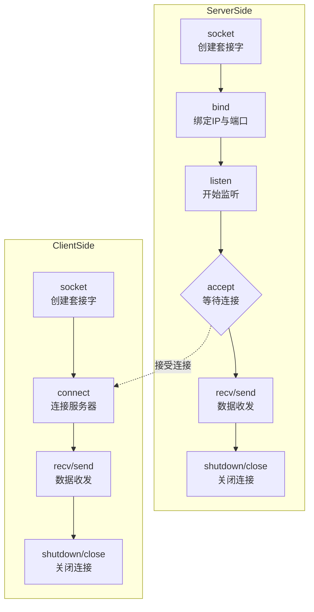

## 概要

在Linux下进行网络编程，核心在于理解**Socket（套接字）** 的概念，它就像是网络通信的端点，允许你的程序与其他程序进行数据传输。下面我将为你梳理一个清晰的学习路径，包括核心概念、常用函数和重要的实践建议。

为了让你对网络编程的流程有个全局认识，下图展示了一个典型的TCP服务器与客户端的工作流程及核心函数调用：



### 🛠️ 掌握核心函数

在流程图中的每个步骤，都有特定的函数来完成其功能。

**基础套接字函数**
这些是构建网络程序的基础，无论是TCP还是UDP都会用到：
- **`socket(int domain, int type, int protocol)`**：**创建套接字**。`domain` 通常填 `AF_INET`（IPv4）或 `AF_INET6`（IPv6）；`type` 指定是面向连接的 **`SOCK_STREAM`** （TCP）还是无连接的 **`SOCK_DGRAM`** （UDP）；`protocol` 一般填0。
- **`bind(int sockfd, struct sockaddr *my_addr, socklen_t addrlen)`**：**将套接字与一个本地IP地址和端口号绑定**。服务器通常必须调用此函数，客户端可以不调用而由系统自动分配。
- **`close(int sockfd)`**：**关闭套接字，终止连接**。

**TCP专用函数**
TCP提供可靠的、面向连接的通信，其流程如图所示：
- **`listen(int sockfd, int backlog)`**：**服务器开始监听，等待客户端连接**。`backlog` 参数指定了连接请求队列的最大长度。
- **`accept(int sockfd, struct sockaddr *addr, socklen_t *addrlen)`**：**从已完成连接队列中取出一个连接，并创建一个新的套接字用于与此客户端通信**。这是服务器实现并发处理的关键。
- **`connect(int sockfd, struct sockaddr *serv_addr, socklen_t addrlen)`**：**客户端主动连接服务器**。
- **`send(int s, const void *buf, int len, int flags)`** / **`recv(int s, void *buf, int len, int flags)`**：在**已连接**的套接字上**发送和接收数据**。

**UDP专用函数**
UDP是无连接的，通信过程更简单，直接使用：
- **`sendto(int s, const void *buf, int len, int flags, const struct sockaddr *to, socklen_t tolen)`** / **`recvfrom(int s, void *buf, int len, int flags, struct sockaddr *from, socklen_t *fromlen)`**：**发送和接收数据，同时需要指定对方的地址信息**。由于无连接，每次发送都需要指定目标地址。

**地址转换与辅助函数**
- **`htons()` / `ntohs()`**：**主机字节序与网络字节序之间的转换**。网络使用**大端字节序**，而我们的PC通常是小端字节序，因此在将端口等数据放入网络数据包前必须转换。
- **`inet_addr()` / `inet_ntoa()`**：**点分十进制字符串形式的IP地址（如"192.168.1.1"）与网络字节序的整型IP地址之间的转换**。
- **`gethostbyname()`**：**通过主机名获取其IP地址**。

### ⚠️ 重要注意事项与最佳实践

了解了函数，要想写出稳定高效的网络程序，还需要注意以下关键点：

1.  **理解TCP与UDP的核心区别**
    - **TCP**：可靠、有序、面向连接（如打电话）。适用于文件传输、网页浏览等要求数据完整性的场景。
    - **UDP**：不可靠、无序、无连接（如寄明信片）。适用于视频通话、DNS查询等对实时性要求高、可容忍少量丢失的场景。

2.  **处理并发连接**
    基础的`accept`、`recv`默认是**阻塞**的，这意味着服务器在同一时间只能处理一个客户端。要服务多个客户端，必须引入并发技术：
    - **多进程/多线程**：为每个新连接创建一个新的进程或线程。简单直观，但连接数高时资源消耗大。
    - **I/O多路复用**：这是构建高性能网络程序的核心技术。使用 **`select`**、**`poll`** 或 **`epoll`** 等系统调用，**单个线程可以同时监视多个连接上的事件**，极大地提高了程序的效率和可扩展性。其中`epoll`在处理大量连接时表现尤为出色。

3.  **进行完备的错误处理**
    网络环境复杂多变，**几乎所有的套接字函数调用都必须检查返回值**！
    - 常见的错误有：`EINTR`（系统调用被信号中断）、`EAGAIN`/`EWOULDBLOCK`（在非阻塞模式下操作暂时无法完成）、`ECONNREFUSED`（连接被拒绝）、`EADDRINUSE`（地址已被占用）等。
    - 使用`perror()`或`strerror()`来打印可读的错误信息。

4.  **注意字节序和地址转换**
    如前所述，忘记使用`htons()`转换端口号或错误地使用`inet_addr()`转换IP地址，是初学者常见的错误，会导致连接失败。

5.  **小心处理数据收发**
    - `send()`和`recv()`的返回值表示**实际成功发送或接收的字节数**，这个值可能小于你请求的长度。因此，**务必在循环中重复调用，直到所有数据处理完毕**。
    - 要注意**粘包问题**：TCP是字节流协议，消息没有边界。你需要自己在应用层设计协议（如添加消息头、使用固定长度、或用特殊分隔符）来界定每个消息。

6.  **管理好资源**
    - 务必及时`close()`不再使用的套接字，避免耗尽系统的文件描述符。
    - 可以使用`shutdown()`来更精细地控制连接的关闭，例如只关闭写的这一半。

### 📝 一个简单的TCP Echo服务器示例

以下是一个非常简化的TCP服务器代码框架，它实现了经典的Echo服务（客户端发什么，服务器就回什么）：

```c
#include <stdio.h>
#include <stdlib.h>
#include <string.h>
#include <unistd.h>
#include <sys/types.h>
#include <sys/socket.h>
#include <netinet/in.h>
#include <arpa/inet.h>

#define PORT 8080
#define BACKLOG 10

int main() {
    int sockfd, new_sockfd;
    struct sockaddr_in server_addr, client_addr;
    socklen_t sin_size;
    char buf[1024];
    int bytes_recv;

    // 1. 创建套接字
    if ((sockfd = socket(AF_INET, SOCK_STREAM, 0)) == -1) {
        perror("socket");
        exit(1);
    }

    // 2. 绑定地址和端口
    server_addr.sin_family = AF_INET;
    server_addr.sin_port = htons(PORT);         // 端口转换
    server_addr.sin_addr.s_addr = INADDR_ANY;   // 绑定到本机所有IP
    bzero(&(server_addr.sin_zero), 8);          // 其余部分置零

    if (bind(sockfd, (struct sockaddr *)&server_addr, sizeof(struct sockaddr)) == -1) {
        perror("bind");
        close(sockfd);
        exit(1);
    }

    // 3. 开始监听
    if (listen(sockfd, BACKLOG) == -1) {
        perror("listen");
        close(sockfd);
        exit(1);
    }

    printf("Server listening on port %d...\n", PORT);

    while(1) { // 主循环
        sin_size = sizeof(struct sockaddr_in);
        // 4. 等待客户端连接 (阻塞)
        new_sockfd = accept(sockfd, (struct sockaddr *)&client_addr, &sin_size);
        if (new_sockfd == -1) {
            perror("accept");
            continue; // 接受失败，继续等待下一个
        }
        printf("Connection from %s\n", inet_ntoa(client_addr.sin_addr));

        // 5. 与客户端通信
        while ((bytes_recv = recv(new_sockfd, buf, sizeof(buf)-1, 0)) > 0) {
            buf[bytes_recv] = '\0'; // 添加字符串结束符
            printf("Received: %s", buf);
            // Echo: 将收到的数据发回去
            if (send(new_sockfd, buf, bytes_recv, 0) == -1) {
                perror("send");
                break;
            }
        }

        if (bytes_recv == 0) {
            printf("Client disconnected.\n");
        } else if (bytes_recv == -1) {
            perror("recv");
        }

        // 6. 关闭这个客户端的连接
        close(new_sockfd);
    }

    close(sockfd); // 实际运行中这行不会被执行到
    return 0;
}
```

希望这份指南能为你打开Linux网络编程的大门。学习过程中，多动手编写和调试代码是最好的方式。如果你在具体实现中遇到困难，比如如何设置非阻塞I/O，或者如何设计一个简单的应用层协议，我很乐意进一步探讨。


## 常用函数

在Linux中进行网络编程，确实需要熟练掌握一系列核心函数及其细节。下面我为你整理了一份详细的函数说明和重要的注意事项，希望能帮助你更好地理解和上手。

### 🌐 核心网络编程函数详解

以下表格汇总了Linux网络编程中涉及的核心函数、它们的用途、关键参数及要点：

| 函数名                                 | 主要用途                                                     | 关键参数/要点                                                | 返回值                                                       |
| :------------------------------------- | :----------------------------------------------------------- | :----------------------------------------------------------- | :----------------------------------------------------------- |
| **`socket`**<br>创建通信端点           | 创建套接字，是网络通信的基础。                               | **`domain`**：协议族，如 `AF_INET`(IPv4)，`AF_INET6`(IPv6)。<br>**`type`**：服务类型，如 `SOCK_STREAM`(TCP)，`SOCK_DGRAM`(UDP)。<br>**`protocol`**：通常设为0。 | 成功返回**套接字描述符**，失败返回-1。                       |
| **`bind`**<br>绑定地址与端口           | 将套接字与一个本地IP地址和端口号绑定，通常由服务器调用。     | **`sockfd`**：socket描述符。<br>**`my_addr`**：指向包含IP和端口的结构体（如 `sockaddr_in`）。使用时需强制转换为 `sockaddr *`。<br>**`addrlen`**：地址结构体长度。 | 成功返回0，失败返回-1。常见错误是**端口被占用**或**权限不足**（1024以下端口需root权限）。 |
| **`listen`**<br>开始监听               | 将主动套接字转为被动，告知内核接受指向该套接字的连接请求。   | **`sockfd`**：已bind的socket描述符。<br>**`backlog`**：已完成连接队列的最大长度，影响服务器能同时挂起的连接数。 | 成功返回0，失败返回-1。                                      |
| **`accept`**<br>接受连接               | 从已完成连接队列头返回下一个已完成连接，**服务器会为每个新连接创建一个新套接字**用于数据传输。 | **`sockfd`**：处于监听状态的socket描述符。<br>**`addr`**：用于保存**客户端地址信息**（如IP、端口）。<br>**`addrlen`**：值-结果参数，调用前需初始化。 | 成功返回**新的连接描述符**，失败返回-1。**默认是阻塞的**。   |
| **`connect`**<br>发起连接              | 客户端通过此函数与服务器建立连接。                           | **`sockfd`**：socket描述符。<br>**`serv_addr`**：包含**服务器IP地址和端口号**的结构体。<br>**`addrlen`**：地址结构体长度。 | 成功返回0，失败返回-1。错误可能因**连接超时**、**目标不可达**或**拒绝连接**等。 |
| **`send`/`recv`**<br>TCP数据收发       | 在**已连接**的套接字上发送和接收数据。                       | **`sockfd`**：连接描述符（accept返回或connect成功的socket）。<br>**`buf`**：数据缓冲区。<br>**`len`**：缓冲区长度。<br>**`flags`**：标志位，如 `MSG_WAITALL`(收满指定字节再返回)，`MSG_DONTWAIT`(非阻塞)。 | **返回实际发送/接收的字节数**，失败返回-1。**注意**：实际发送/接收的字节数可能小于请求的长度，需要循环处理。 |
| **`sendto`/`recvfrom`**<br>UDP数据收发 | 用于**无连接**的UDP数据报发送和接收，每次需指定目标地址。    | 前四个参数同 `send`/`recv`。<br>**`to`/`from`**：指向包含**对方地址**的结构体。<br>**`tolen`/`fromlen`**：地址结构体长度。 | **返回实际发送/接收的字节数**，失败返回-1。                  |
| **`close`**<br>关闭连接                | 关闭套接字，终止TCP连接。                                    | **`sockfd`**：要关闭的套接字描述符。                         | 成功返回0，失败返回-1。                                      |
| **`shutdown`**<br>半关闭连接           | 可选择性地关闭连接的读、写或读写双方。                       | **`sockfd`**：要关闭的套接字描述符。<br>**`how`**：关闭方式，`SHUT_RD`(禁读)，`SHUT_WR`(禁写，发送FIN)，`SHUT_RDWR`(读写都关闭)。 | 成功返回0，失败返回-1。                                      |
| **`select`/`poll`**<br>I/O多路复用     | 同时监视多个套接字的可读、可写或异常事件，是实现并发的关键技术之一。 | **`readfds`/`writefds`/`exceptfds`**：被监视的文件描述符集合（select）。<br>**`ufds`**：`pollfd`结构数组，指定要监视的描述符和事件（poll）。<br>**`timeout`**：超时时间。 | 返回就绪的描述符数量，超时返回0，错误返回-1。                |

### ⚠️ 关键注意事项

了解了函数的基本用法后，下面这些注意事项能帮助你写出更稳健的代码：

1.  **地址结构与字节序**
    - **结构体选择**：实际编码中，我们常用 `sockaddr_in`（IPv4）来填充地址信息，因其可读性更好，在传递给函数时再强制转换为 `sockaddr *`。
    - **字节序转换**：网络字节序是**大端**模式。在填充端口（`sin_port`）和IP地址（`sin_addr.s_addr`）到 `sockaddr_in` 时，必须使用 **`htons`**、**`htonl`** 等函数将主机字节序转换为网络字节序；反之用 **`ntohs`**、**`ntohl`**。
    - **IP地址转换**：字符串IP（如"192.168.1.1"）和整型IP的转换可用 **`inet_addr`**、**`inet_aton`** 和 **`inet_ntoa`**。

2.  **错误处理是必须**
    - **检查返回值**：**几乎所有的套接字函数调用后都必须检查返回值**[-1通常表示出错，并根据errno或使用`perror`获取具体错误信息。
    - **处理非阻塞I/O**：对于非阻塞套接字，`connect`、`send`、`recv`等操作可能返回 `EINPROGRESS` 或 `EAGAIN`/`EWOULDBLOCK`，需要根据错误码进行相应处理。

3.  **TCP数据收发特性**
    - **循环处理**：`send` 和 `recv` 的返回值表示**实际成功发送或接收的字节数**，这个值**可能小于你请求的长度**。因此，**务必在循环中重复调用，直到所有数据处理完毕**。
    - **粘包问题**：TCP是**字节流协议**，消息没有边界。你需要自己在应用层设计协议（如添加消息头、使用固定长度、或用特殊分隔符）来界定每个消息。

4.  **并发连接管理**
    - 基础的 `accept`、`recv` 默认是**阻塞**的。要服务多个客户端，必须引入并发技术，如**多进程/多线程**或**I/O多路复用**（`select`/`poll`/`epoll`）。其中 `epoll` 在处理大量连接时性能优异。

5.  **资源管理与连接关闭**
    - 务必及时 `close` 不再使用的套接字。
    - 理解 `shutdown` 和 `close` 的区别：`shutdown` 可以**单向**关闭连接，更加灵活。主动关闭连接的一方会进入 `TIME_WAIT` 状态。

### 💻 一个简单的TCP通信流程概览

**服务器端**
1.  `socket()` 创建监听套接字。
2.  `bind()` 绑定IP和端口。
3.  `listen()` 开始监听。
4.  `accept()` 阻塞等待客户端连接。
5.  使用 `accept` 返回的新套接字与客户端进行 `send()`/`recv()` 通信。
6.  `close()` 关闭连接。

**客户端**
1.  `socket()` 创建套接字。
2.  `connect()` 连接服务器。
3.  连接成功后，进行 `send()`/`recv()` 通信。
4.  `close()` 关闭连接。

希望这份详细的函数说明和注意事项能让你对Linux网络编程有更清晰的认识。如果你对某个特定函数或高级话题（如非阻塞I/O或 `epoll` 的用法）有进一步的兴趣，我很乐意继续探讨。