==当时钟频率大于100Mhz时，需要绘制等长线，并且弯折也要一样，不然信号到达时间有差别。==

 

#### 方法一

1. 在layout中关联router

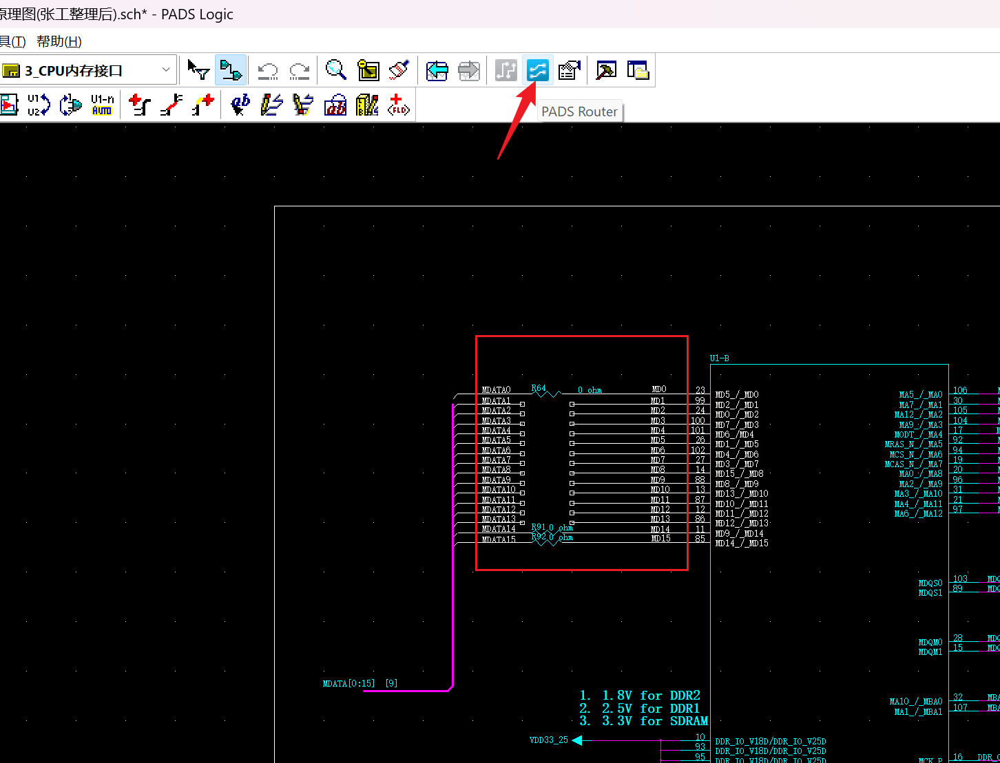

选中网络，切换到router中

 

2. 创建电器网络

在router中右键操作

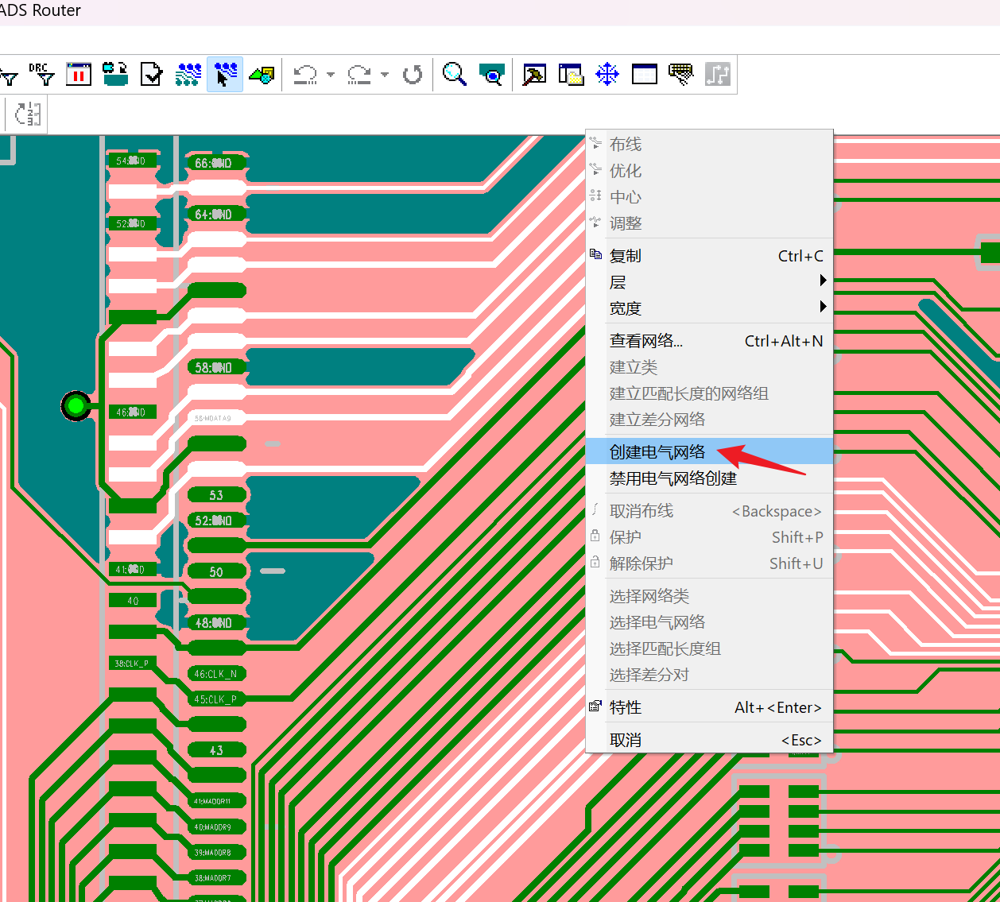

 

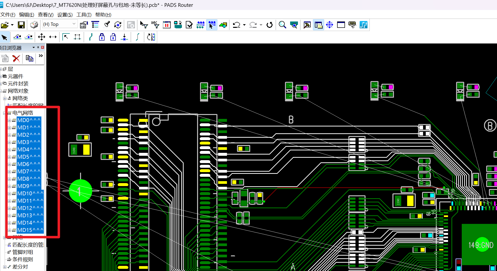

 

3. 查看电气网络长度

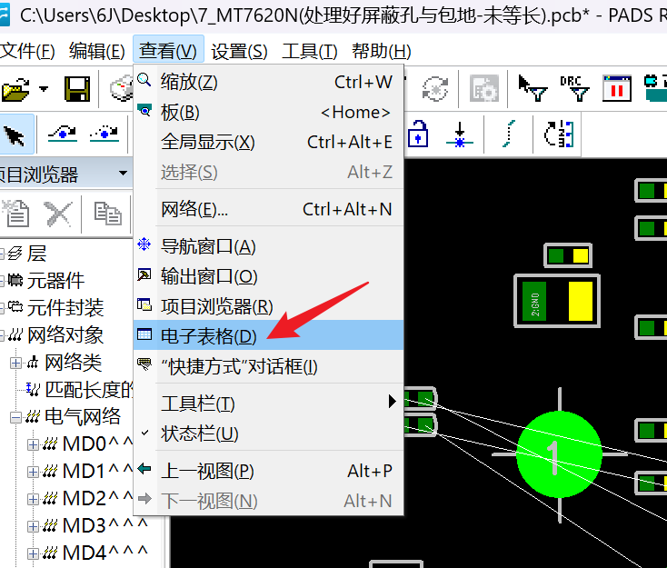

 

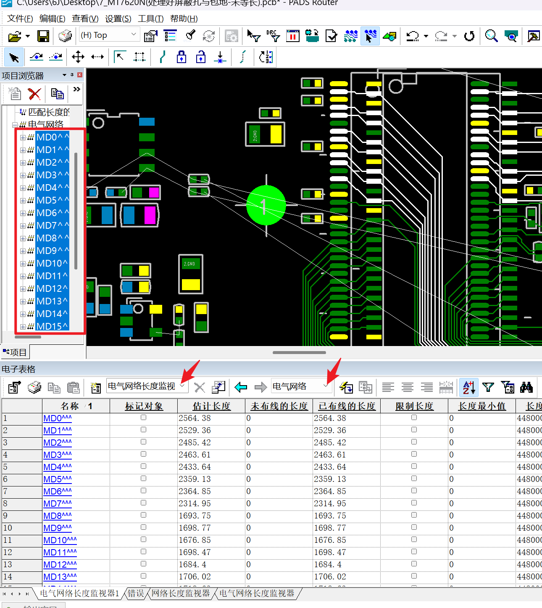

 

4. 计算合适的电气网络长度

==***误差控制在200mil左右***==

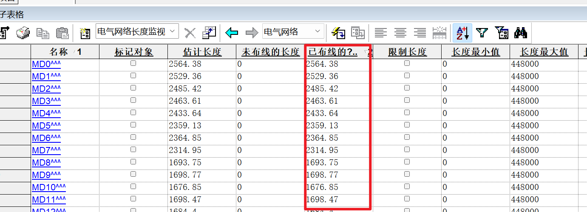

右击-特性

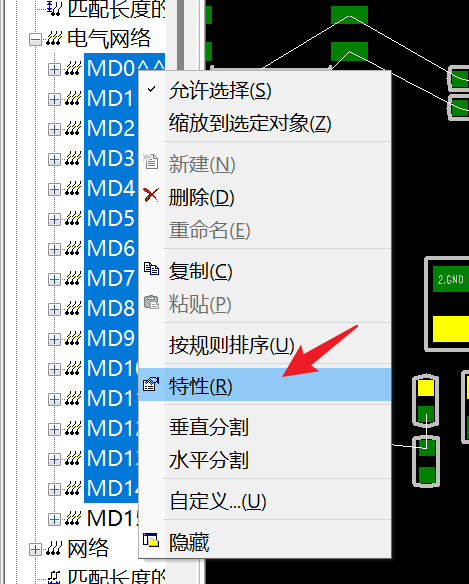

限制长度

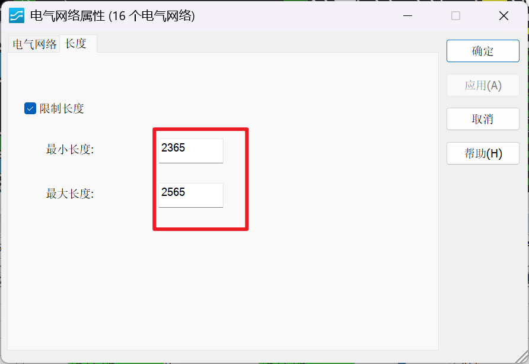

 

绿色长度合格，黄色不合格

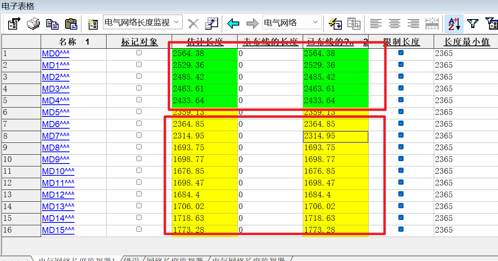

 

5. 调整电气网络长度

显示长度监视器

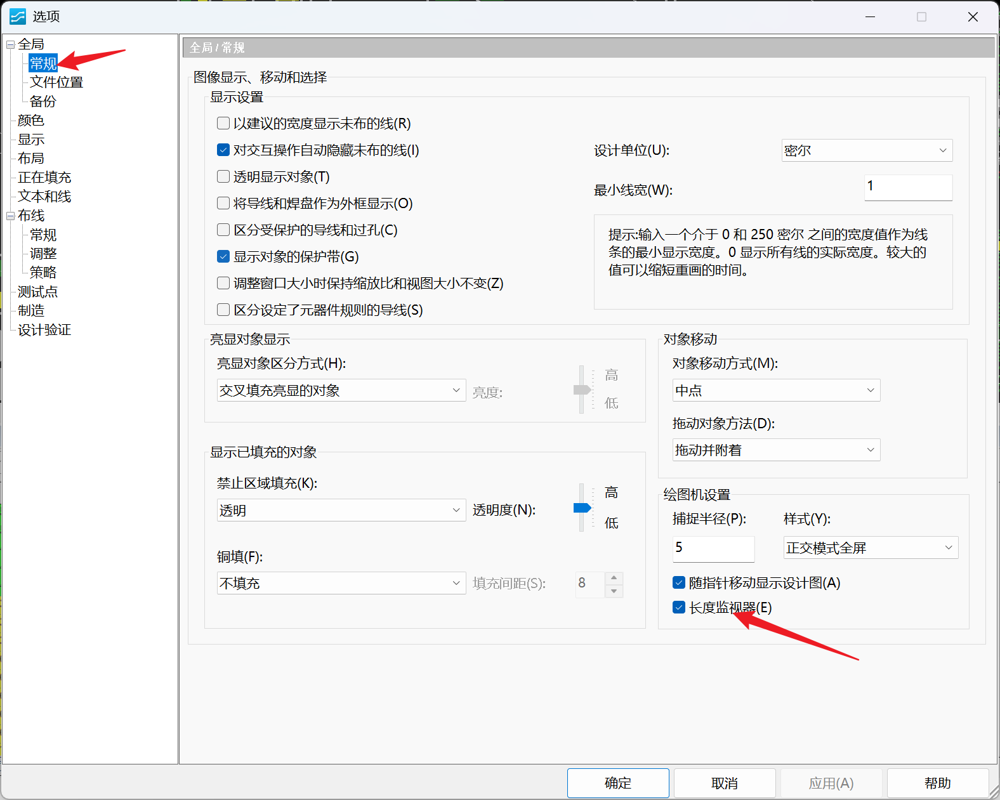

 

F3拉线-右击需要调整的网络

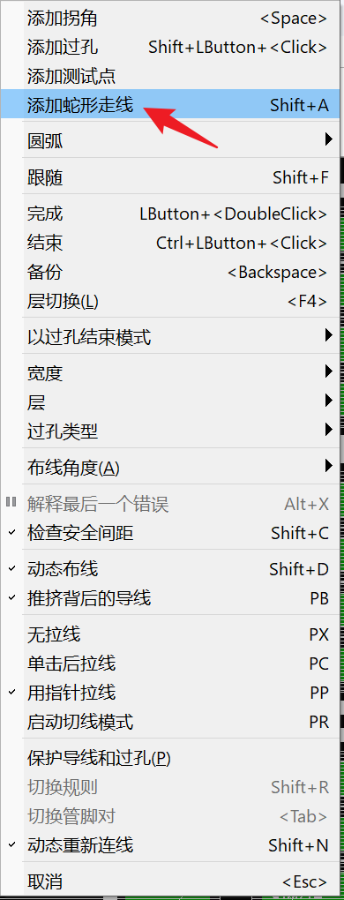

6. 开始拉蛇形线

精细化设置

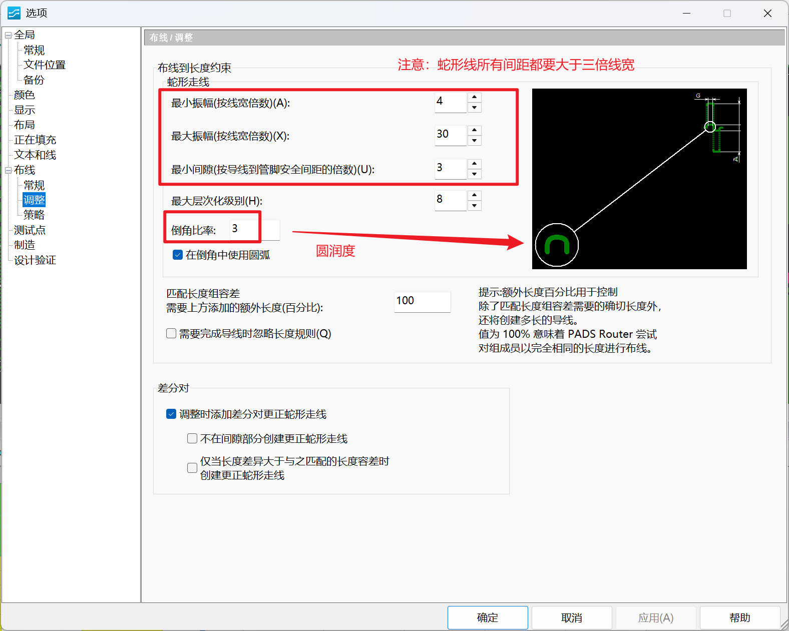

 

#### 方法二

分段设置统一长度

1. 建立匹配长度的网络组

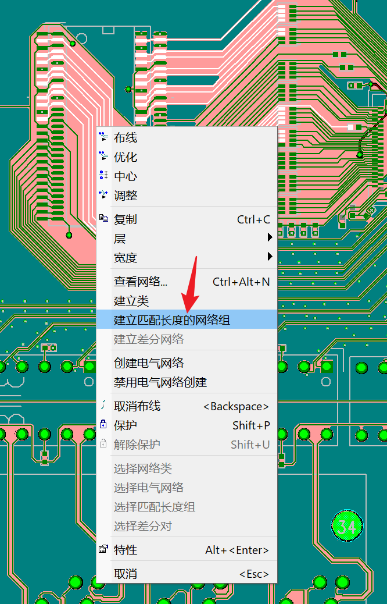

通过电子表格查看线长后，右击网络组限制长度

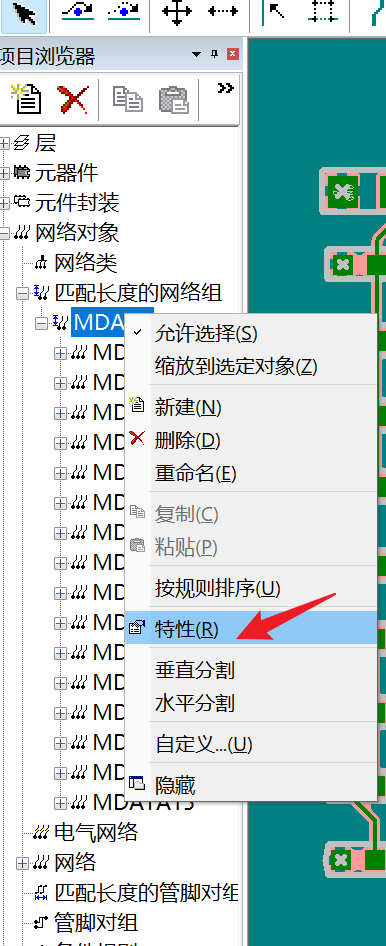

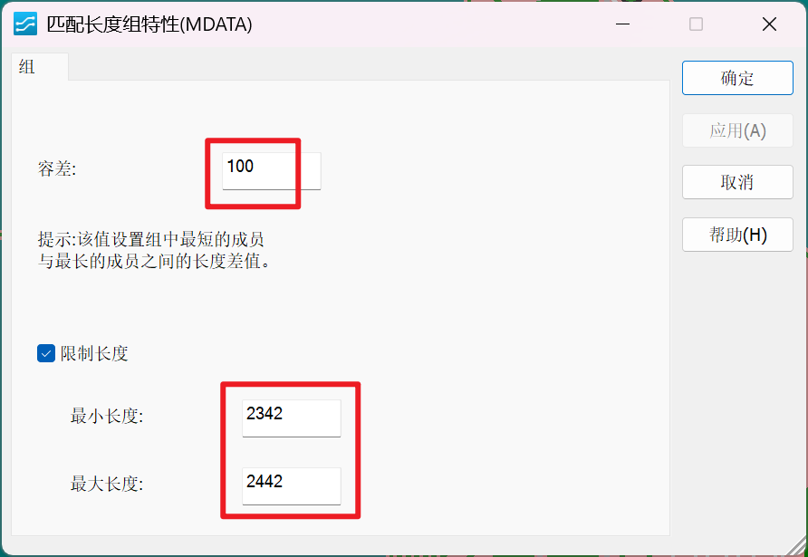

开始拉蛇形线步骤