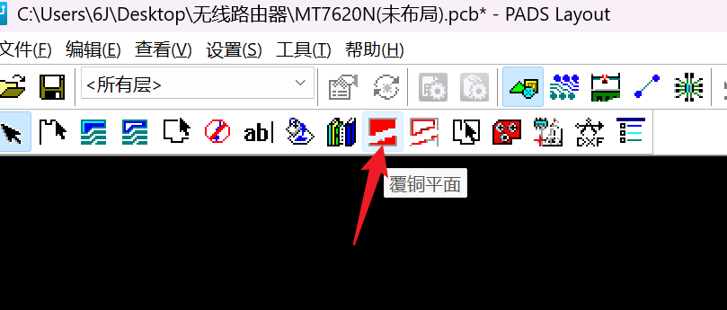
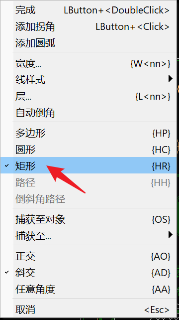
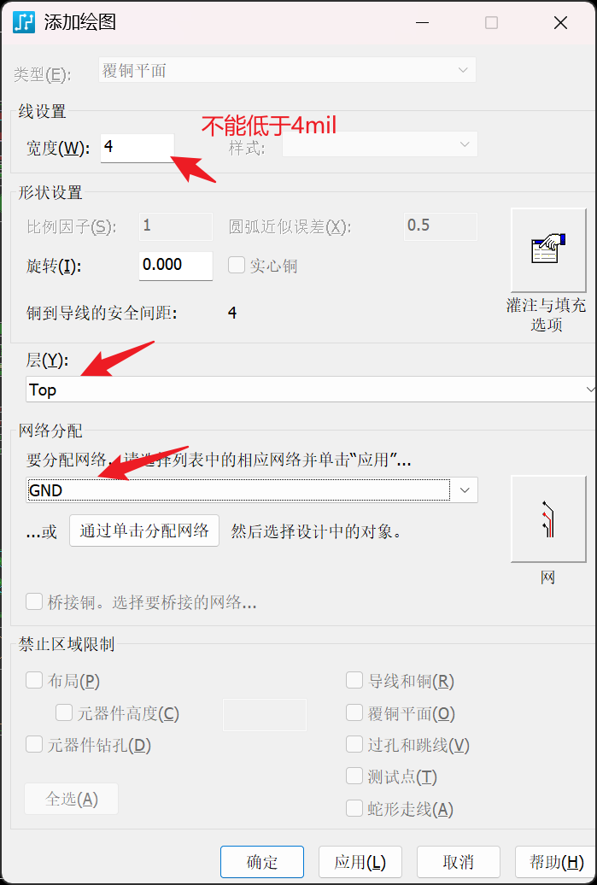
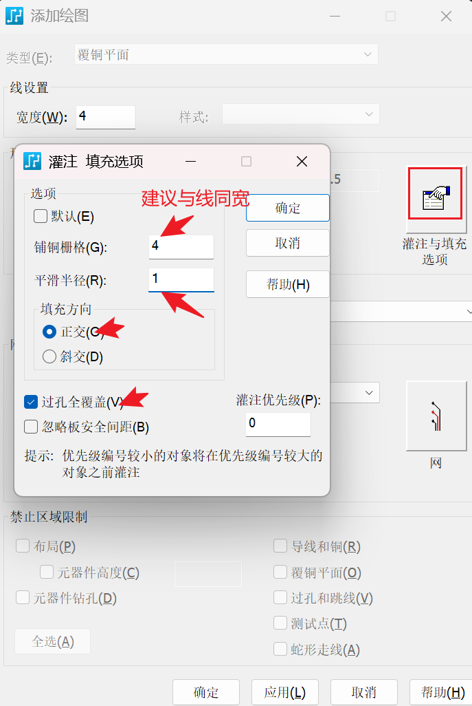
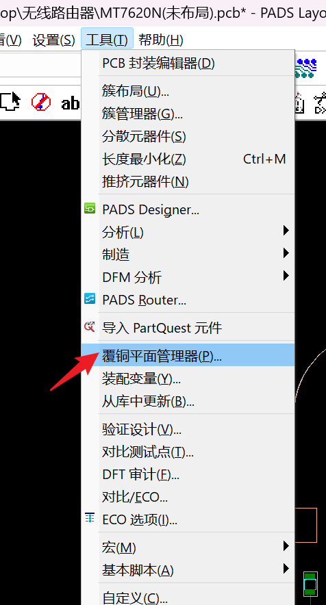
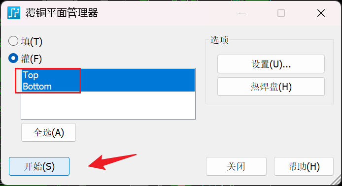
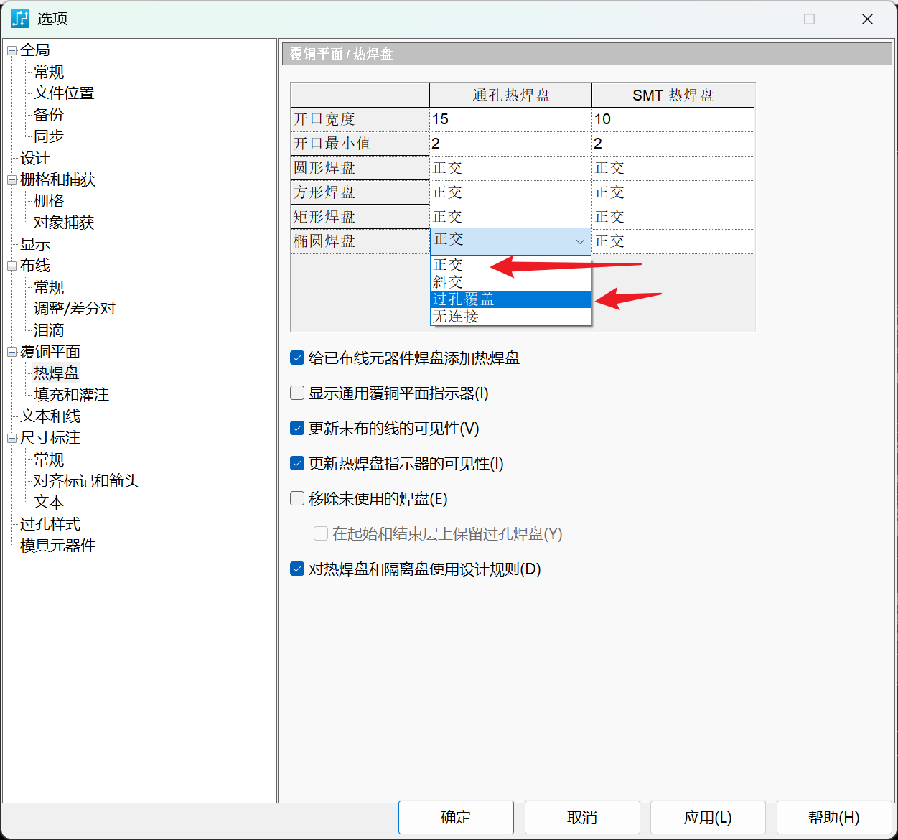
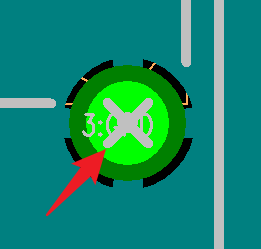
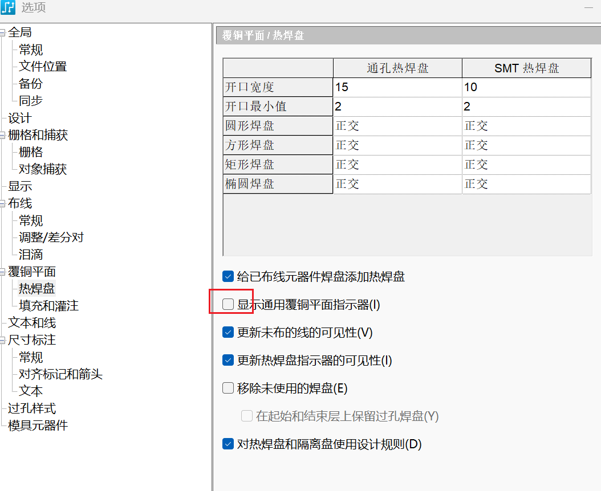

#### layout中操作

1. 覆铜平面

选中矩形

 

2. 绘图

灌注与填充选项

 

其他层也是类似操作

超过两层时，需要注意‘灌注优先级’

 

3. 覆铜平面管理器

 

4. 灌铜

 

5. 打孔

GND铜箔打孔注意事项：

- 靠近焊盘打孔（电流最短路径）
- 打孔连接所有分散的GND铜箔
- 不要打到其他网络中

 

6. 设置热焊盘类型
   
   

7. 去掉焊盘覆铜标识
   
    
   
   

