## 基本概念

<br/>

- 将模拟信号转换为数字信号

- 工作方式
  - 并联比较型
    
    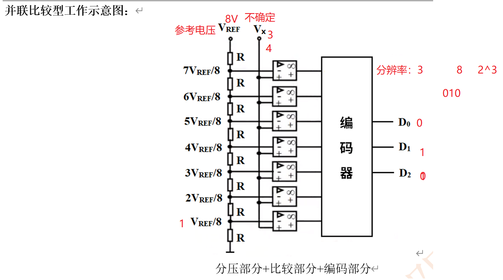
  - **逐次逼近型**
    
    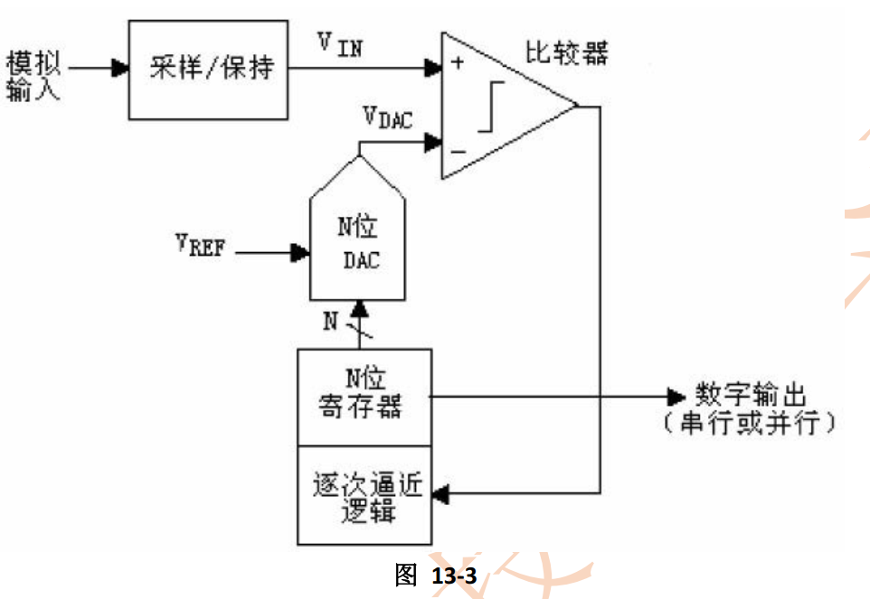
- 主要参数
  - 精度：8bit、10bit、12bit、14bit、16bit
  - 分辨率（量化位数）：3.3V ，12位，4096份，0.805mV
  - 16个外部通道，3个内部通道
  - 转换方式：4个注入转换通道、16个规则转换通道

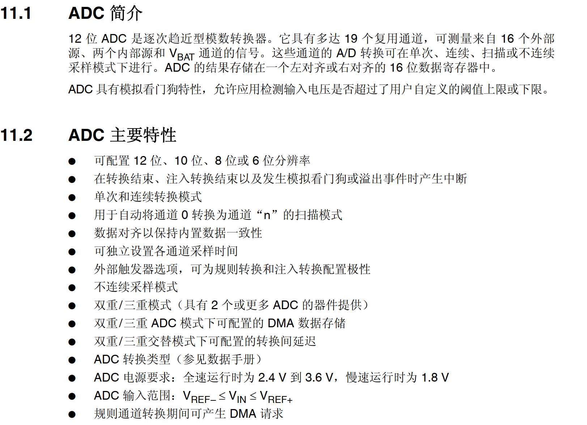

<br/>

<br/>

## 框图

<br/>

### 0x01、ADC框图

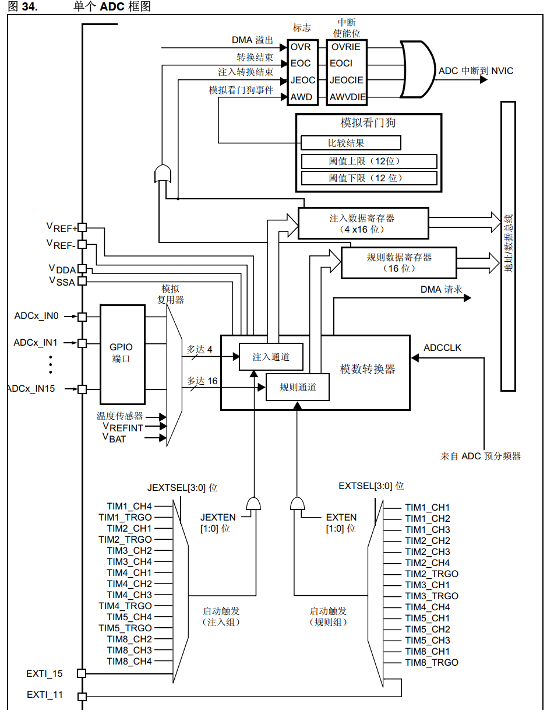

<br/>

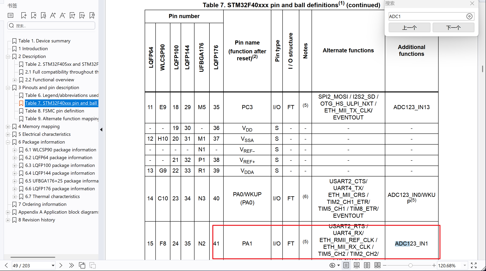

<br/>

<br/>

## 功能

### 0x01、ADC_CR1分辨率

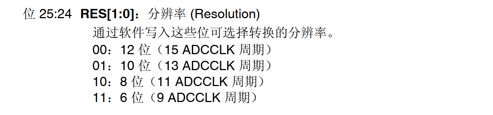

<br/>

### 0x02、时钟

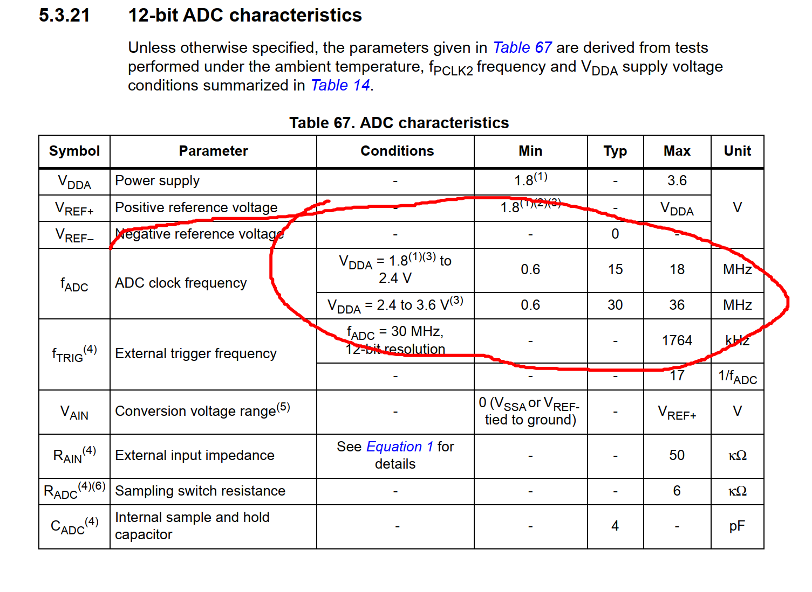

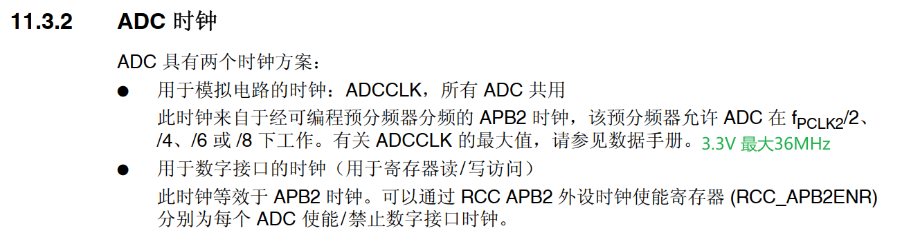

### 0x03、ADC_SQR1通道选择

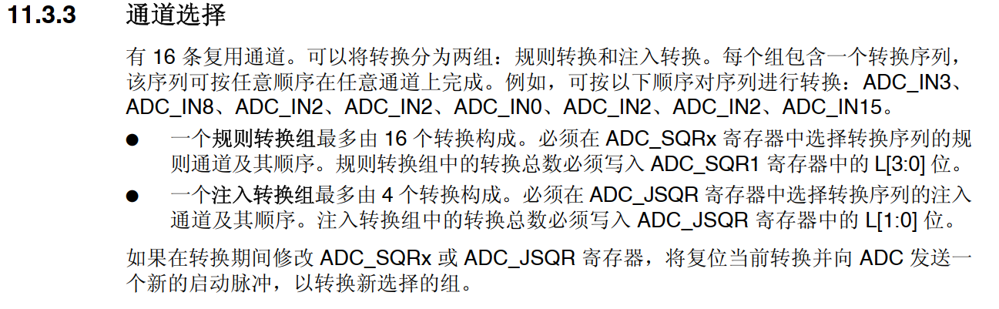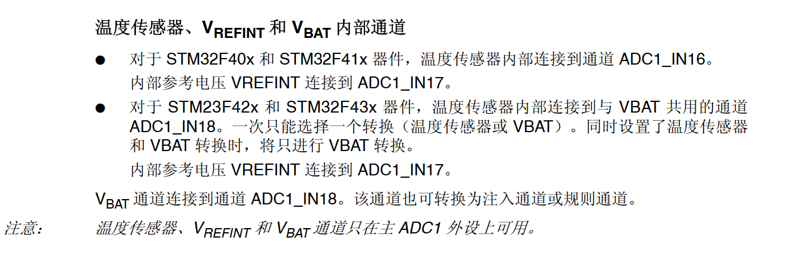

<br/>

**配置步骤**

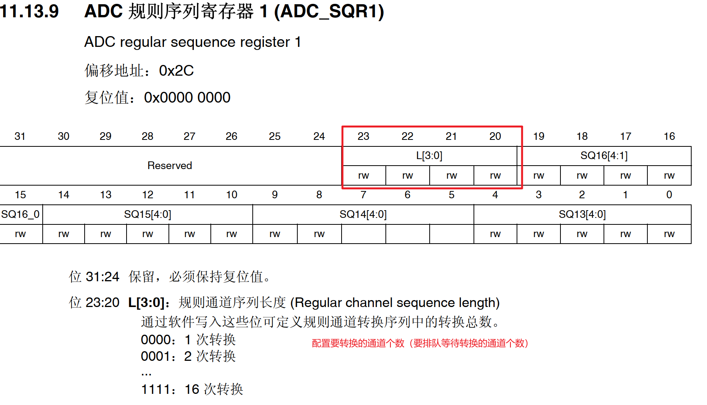

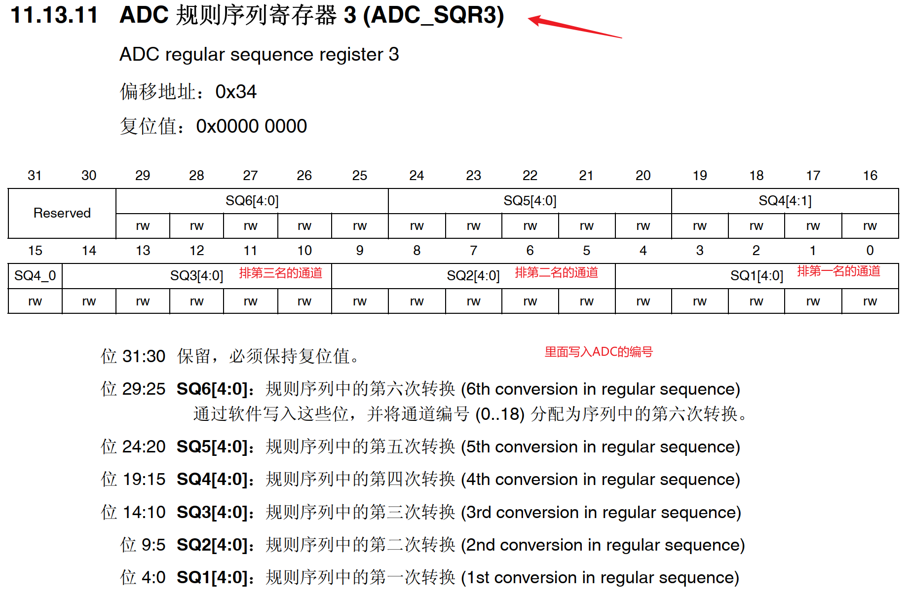

图例是规则通道的选择寄存器，注入通道的寄存器配置方法同上。

<br/>

### 0x04、ADC_CR2连续转换控制

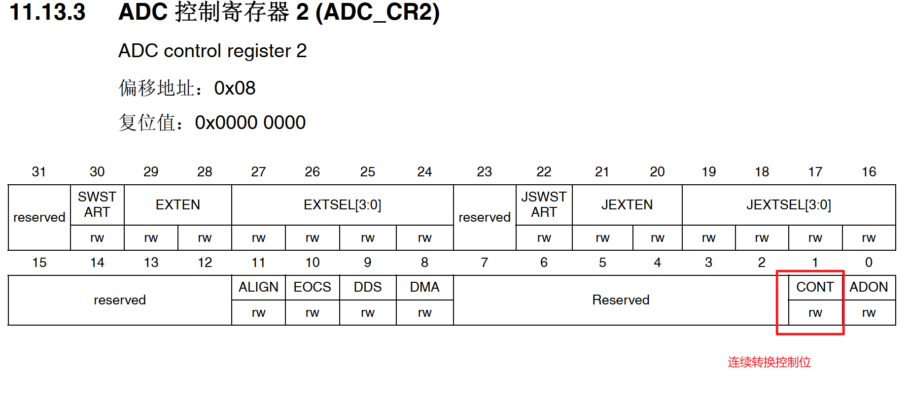

使用`单次转换`可控性更好，使用SWSTART开始转换一次。

<br/>

### 0x05、ADC_CR1扫描模式

多通道排队转换时开启扫描模式，`单次转换`需要配合这个

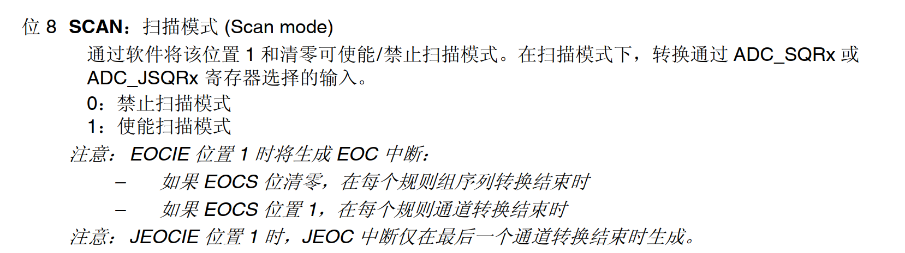

<br/>

### 0x06、ADC_CR2转换结束

**转换结束标志**

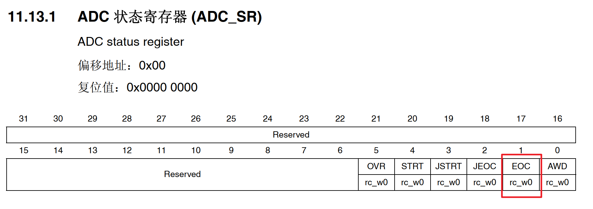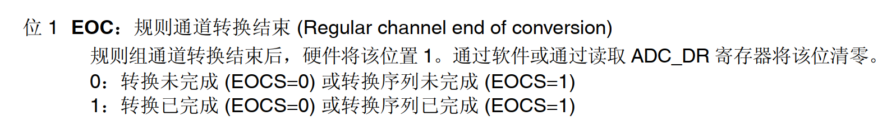

<br/>

**转换结束配置位**

因为规则转换寄存器只有一个，因此当有多个排队时想要获得每个转换的数据就需要配置为1（或者使用DMA就无需配1），单个转换无需排队时就配置为0

多通道排队时：1

单通道时：0

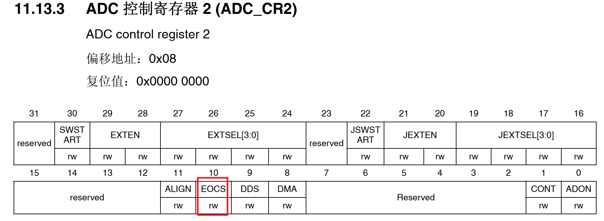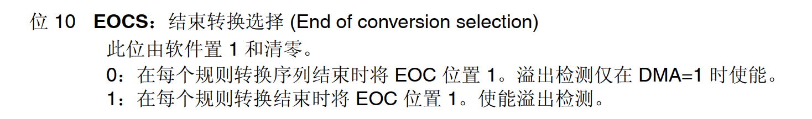

<br/>

### 0x07、ADC_CR2对齐

一般选择右对齐

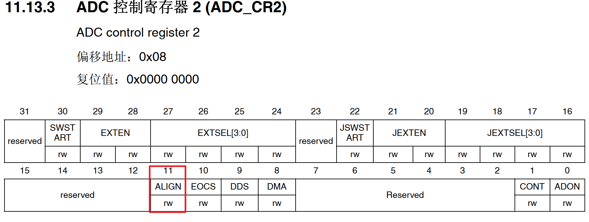

### 0x08、ADC_SMPR采样时间

对应18个可配置的ADC；SMP4对应通道4（PA4）

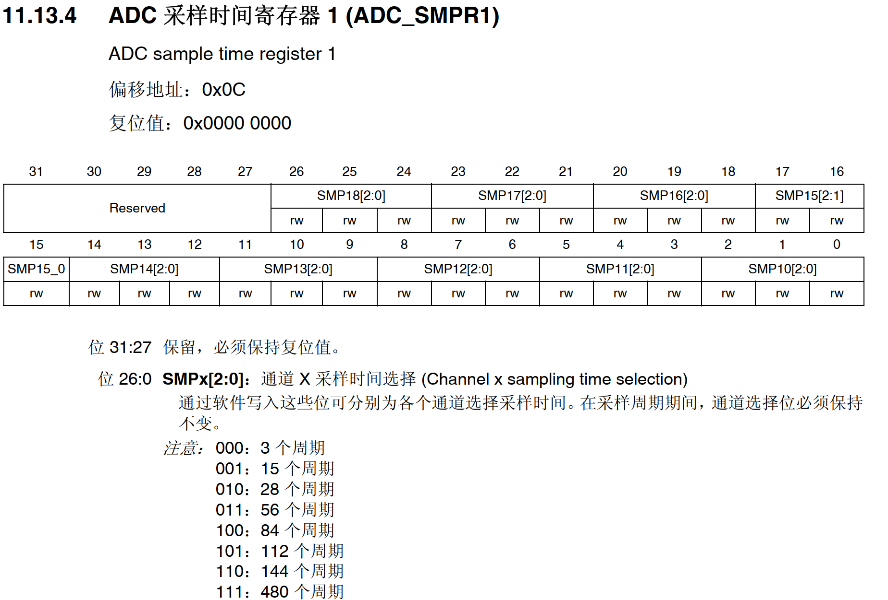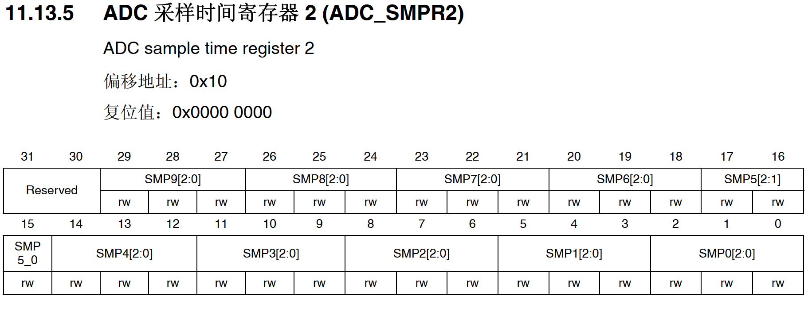

<br/>

### 0x09、温度传感

配置通道

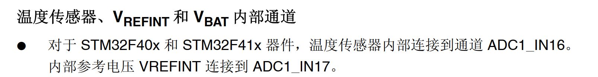

<br/>

<br/>

<br/>

<br/>

<br/>

## 示例代码

<br/>

```c_cpp
void ADC_Init(void)
{
    //打开时钟；GPIOA、ADC1
    RCC->AHB1ENR |= (0X1<<0);
    RCC->APB2ENR |= (0x1<<8);
    
    //配置GPIOA模拟输入
    GPIOA->MODER |= (0x3<<8);

    //配置ADC功能
    ADC1->CR1 &= ~(0x3<<24); //分辨率12位
    ADC1->CR1 &= ~(0x1<<8); //扫描模式
    ADC1->CR2 &= ~(0x1<<11);//数据右对齐
    ADC1->CR2 &= ~(0x1<<1);//单次转换
    ADC1->SMPR2 &= 0x7<<12;//通道4采样时间480个周期
    
    ADC1->SQR1 &= ~(0xf<<20);  //规则序列通道
    ADC1->SQR3 |= (0x4<<0);    //PA4

    ADC->CCR = ADC->CCR & ~(0x3<<16) | (1<<16); //4分频
    //开启ADC1
    ADC1->CR2 |= (0x1<<0);

}

u32 GET_ADC_Proportion(void)
{
    // 开始转换
    ADC1->CR2 |= (0x1 << 30);

    while (!(ADC1->SR & 0x1 << 1));

    u32 data = ADC1->DR;
    data = 100 - (data / 4096.0 * 100); //注意浮点数自动转换
    return data;
}
```