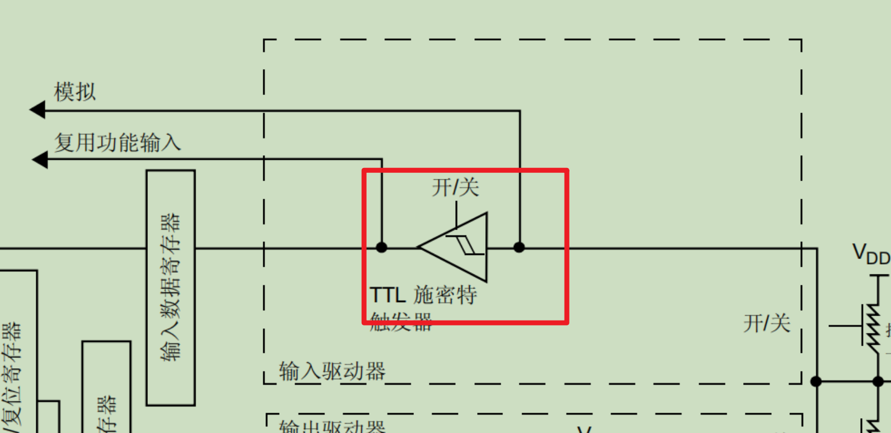

施密特触发器：用于**脉冲整型**

<br/>

## 一、输入

<br/>

- 通用输入（操作输入数据寄存器）

> 电流直接到内核

- 复用输入

> 电流经过片上外设再到内核

- ADC模拟输入

> 电流经过ADC转换再到内核

#### 总结

①上下拉的作用：保持电平到高电平或低电平

<br/>

## 二、输出

<br/>

- 通用（操作输出数据寄存器）
  - 置位/复位寄存器
  - 输出数据寄存器（常用）
- 复用输出
- DAC模拟输出

#### 总结

①输出原则：对寄存器写0或1

②输出类型：

	a 推挽输出：IO口可以输出高电平，也可以输出低电平

	b 开漏输出：IO口只能输出低电平

③上下拉的作用：

	a 放大电信号

	b 降低功耗

## 三、高低电平

### **1. 上拉（Pull-up）**

**定义**：通过一个电阻（通常4.7kΩ~10kΩ）将信号引脚连接到电源（VCC），使其在无外部驱动时保持高电平（逻辑1）。  

#### **工作原理**

- **默认状态**：当外部无驱动（如开关断开、传感器未激活）时，电流通过上拉电阻流向引脚，使其稳定在VCC（高电平）。
- **驱动状态**：当外部电路主动拉低（如开关闭合、传感器输出低电平），电流会绕过上拉电阻直接流向GND，引脚变为低电平。

#### **典型应用**

- **按键电路**：按键未按下时，引脚通过上拉电阻保持高电平；按下时直接接地，变为低电平。
- **I²C总线**：SDA和SCL线通常需要上拉电阻，确保空闲时为高电平。
- **未使用的MCU输入引脚**：防止浮空导致误触发。

**电路示例**：

```
VCC
|
[R] (上拉电阻，如10kΩ)
|
Pin —— 开关 —— GND
```

- **开关断开**：Pin = VCC（高电平）  
- **开关闭合**：Pin = GND（低电平）

---

### **2. 下拉（Pull-down）**

**定义**：通过一个电阻（通常4.7kΩ~10kΩ）将信号引脚连接到地（GND），使其在无外部驱动时保持低电平（逻辑0）。  

#### **工作原理**

- **默认状态**：当外部无驱动时，电流通过下拉电阻流向GND，引脚稳定在低电平。
- **驱动状态**：当外部电路主动拉高（如开关闭合、传感器输出高电平），电流绕过下拉电阻直接流向VCC，引脚变为高电平。

#### **典型应用**

- **数字信号输入**：确保无信号时引脚为低电平，避免噪声干扰。
- **复位电路**：某些MCU的复位引脚需要下拉电阻，防止误复位。
- **三态逻辑控制**：防止总线浮空导致误操作。

**电路示例**：

```
Pin —— 开关 —— VCC
|
[R] (下拉电阻，如10kΩ)
|
GND
```

- **开关断开**：Pin = GND（低电平）  
- **开关闭合**：Pin = VCC（高电平）

---

#### ** 上拉 vs. 下拉对比**

|特性|上拉（Pull-up）|下拉（Pull-down）|
|--|--|--|
|**默认电平**|高电平（VCC）|低电平（GND）|
|**电阻连接**|引脚 → VCC|引脚 → GND|
|**适用场景**|按键、I²C、未用输入引脚|复位电路、数字输入防干扰|
|**驱动方式**|外部拉低（接地）生效|外部拉高（接VCC）生效|

---

#### **为什么需要上拉/下拉？**

- **防止浮空（Floating）**：未连接的引脚可能受噪声影响，导致逻辑错误或MCU误判。
- **提高抗干扰能力**：确保信号在无驱动时保持确定状态。
- **符合数字电路要求**：TTL/CMOS逻辑需要明确的高/低电平，不能处于中间电压。

---

#### **如何选择电阻值？**

- **典型值**：4.7kΩ~10kΩ（平衡功耗与驱动能力）
- **太大（如100kΩ）**：抗噪声能力变差，易受干扰。
- **太小（如1kΩ）**：功耗增加，可能影响驱动能力。

---

#### **总结**

- **上拉电阻**：让引脚默认保持高电平，适合按键、I²C等场景。
- **下拉电阻**：让引脚默认保持低电平，适合复位、数字输入防干扰。
- **关键作用**：避免浮空，提高电路可靠性。

**实际应用时，应根据具体电路需求选择合适的方式！**

<br/>

### 3. 保持

需要一个恒定电压做参考，不能使用悬空的引脚，原因如下

电压引脚浮空（未连接）时不能当作低电平使用，主要原因如下：

---

#### **不确定的电平状态**

- 浮空引脚处于**高阻抗状态**，没有明确的电流路径，其电压由环境噪声、寄生电容/电感等随机因素决定，可能产生**不稳定的中间电平**（非高非低）。
- 数字电路依赖明确的逻辑电平（如TTL标准：低电平≤0.8V，高电平≥2.0V），浮空电压可能落在禁止区（0.8V~2.0V），导致逻辑误判。

---

#### **噪声敏感性与误触发**

- 浮空引脚如同“天线”，易耦合电磁干扰（如电源噪声、射频信号），可能被误触发为高电平或振荡状态，导致电路功能异常。

---

####  **CMOS器件的特殊风险**

- **CMOS输入阻抗极高**（约GΩ级），浮空时微小漏电流即可积累电荷，使引脚电压缓慢漂移，甚至导致内部MOS管同时导通，引发**闩锁效应**（Latch-up）或功耗激增。

---

#### **设计规范与可靠性**

- 行业标准（如IEEE）要求数字输入必须明确偏置，避免浮空。可靠的设计应通过**下拉电阻**（如10kΩ）或内部弱上拉/下拉（若MCU支持）固定电平。

---

#### 解决方案

- **外接下拉电阻**：强制拉低电平（常用1kΩ~10kΩ）。
- **启用内部上拉/下拉**：部分MCU支持软件配置。
- **硬件设计优化**：确保所有输入引脚有确定电平（如未使用的引脚接固定电平）。

---

**总结**：浮空引脚的电平不可预测，可能导致逻辑错误、噪声干扰甚至硬件损坏，必须通过外部或内部电路固定其状态。

<br/>

### 三、下载方式


#### 1、SWD

只需两个IO口

#### 2、JTAG

需要5个IO口

#### 3、注意事项

有时在不知情的条件下改变了上图5个IO口的状态，导致无法下载调试程序。需要在下载时按下复位键。


