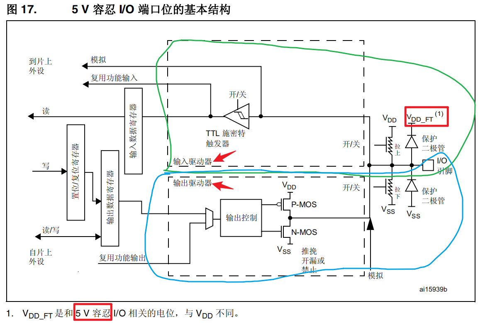

## 寄存器结构

<br/>

#### 0x01、GPIOx_MODER 端口模式

配置`输入`或`输出`

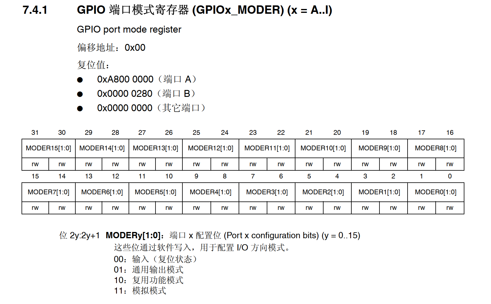

```c_cpp
GPIOA->MODER = GPIOA->MODER & ~(0xf<<18) | 0xa<<18; // GPIOA9复用模式
```

<br/>

#### 0x02、GPIOx_OTYPER 端口输出类型

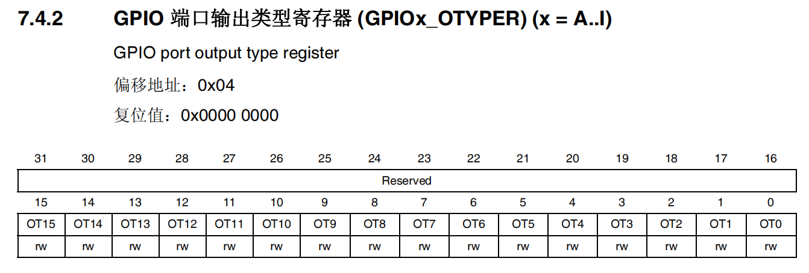

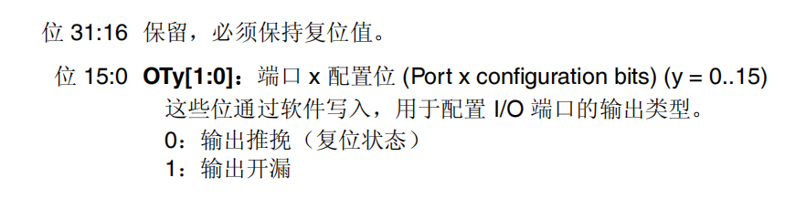

```c_cpp
GPIOA->OTYPER &= ~(0x3<<9);            // 推挽输出，同时配置两个IO口
```

<br/>

#### 0x03、GPIOx_OSPEEDR 端口输出速度

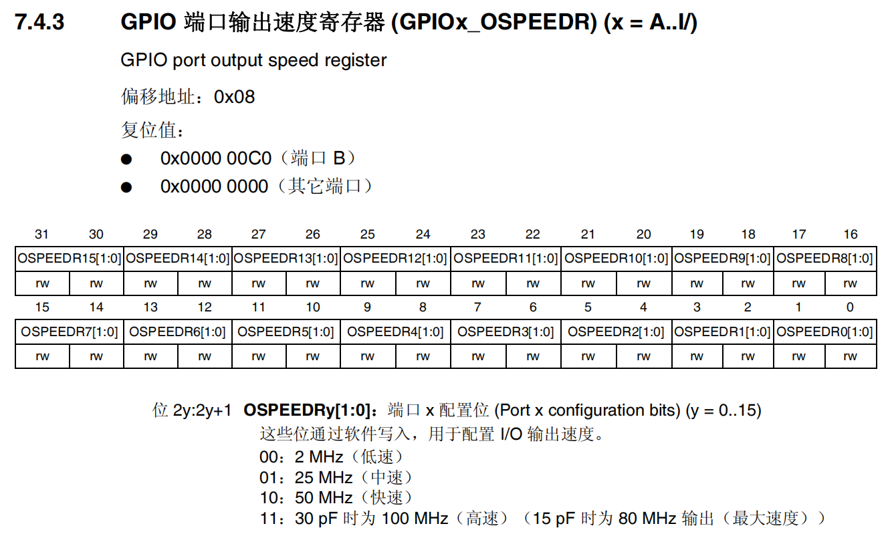

```c_cpp
GPIOA->OSPEEDR = GPIOA->OSPEEDR & ~(0xf<<18) | 0xa<<18;  //配置为 高速，同时配置了两个口
```

<br/>

#### 0x04、GPIOx_PUPDR 端口上下拉

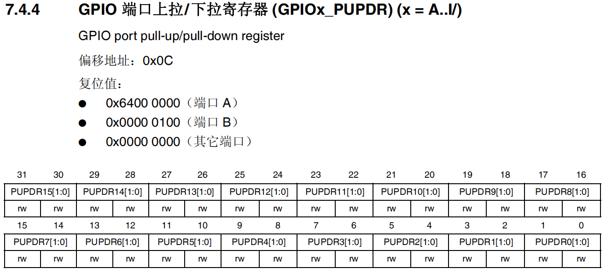

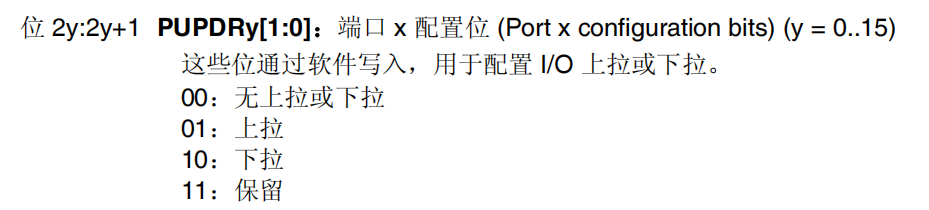

```c_cpp
GPIOC->PUPDR &= ~(0xff << (2 * 4));     //同时配置4个口为无上下拉
```

<br/>

#### 0x05、GPIOx_IDR 输入数据

只在端口模式为`输入`模式时使用

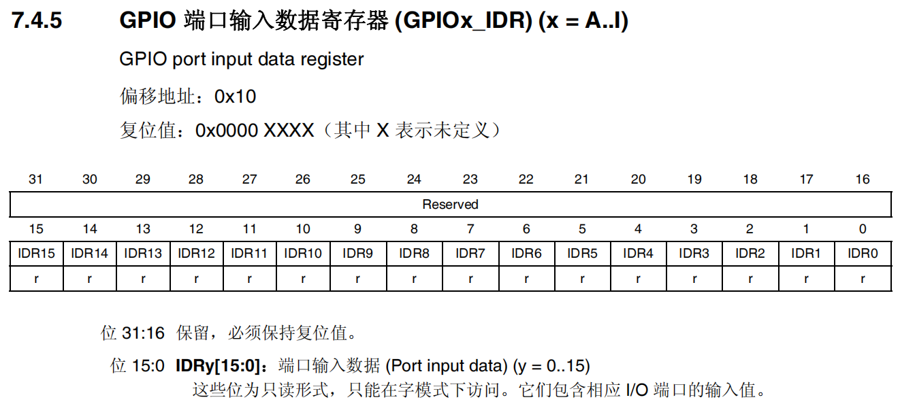

```c_cpp
#define FIRE_War !(GPIOA->IDR & GPIO_IDR_IDR_4)   //通常用宏定义的方式来读取值，这里用到了内核库函数里的宏定义作偏移位
```

<br/>

#### 0x06、GPIOx_ODR 输出数据

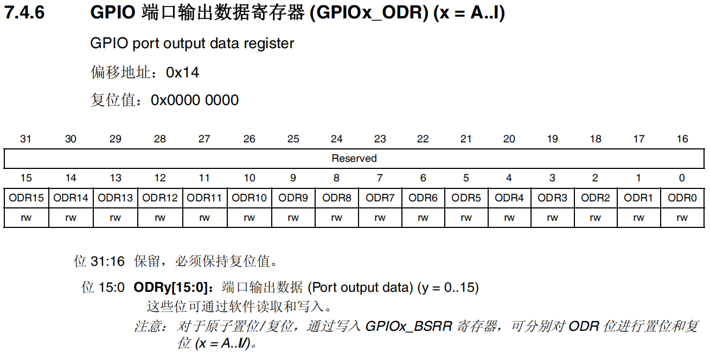

```c_cpp
#define LED4_FZ     GPIOC->ODR ^= (1 << 7)     //这里也使用宏定义来操作输出高低电平，异或，用来反转该位
```

<br/>

#### 0x07、GPIOx_AFRL 复用功能低位寄存器

低位可以复用的外设如下，4位控制一个

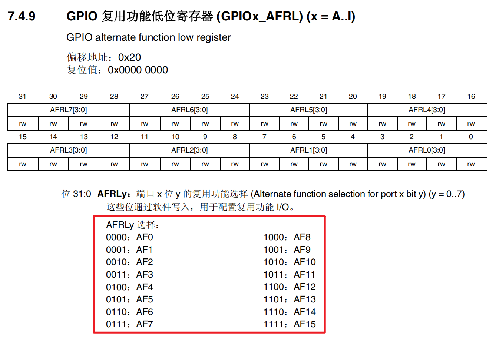

```c_cpp
GPIOA->AFR[0] = GPIOA->AFR[0] & ~(0xff<<4) | 0x77<<4;    //低位复用USART1
```

**复用地址属性是一个数组，引用时注意！！！**

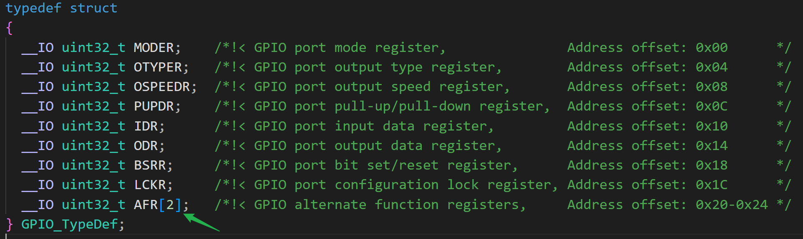

**高低位复用的外设选择！！！**

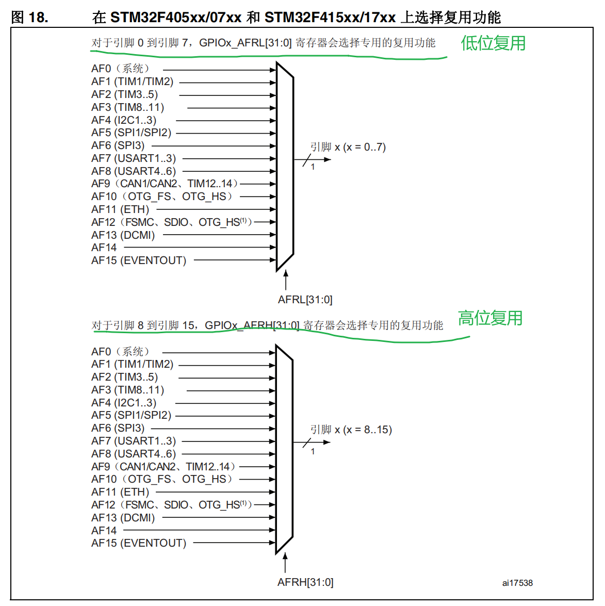

<br/>

#### 0x08、FPIOx_AFRH 复用功能高位寄存器

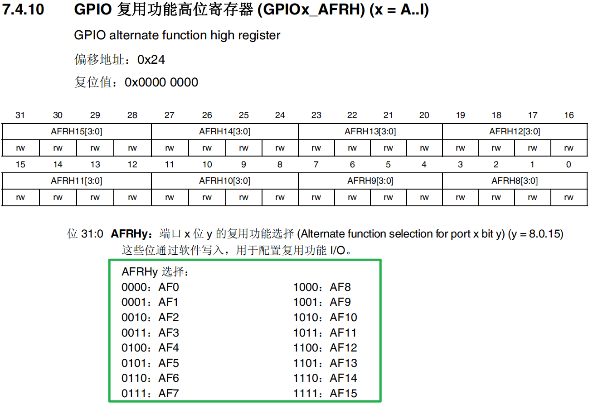

```c_cpp
GPIOA->AFR[1] = GPIOA->AFR[1] & ~(0xff<<4) | 0x77<<4;    //高位复用USART1
```

或者查询芯片数据手册

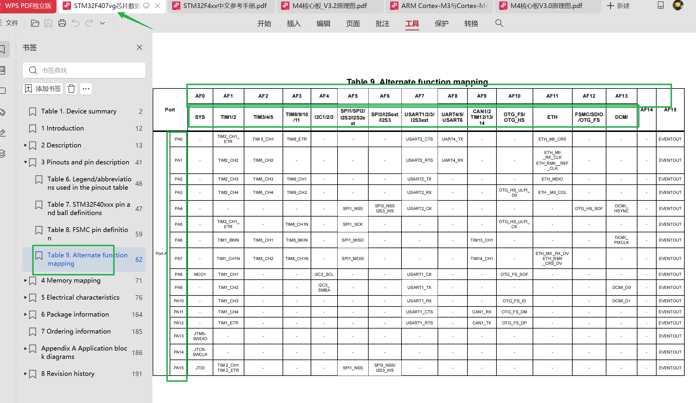
