## 简略介绍

### 1、两根线通信线

- SCL：时钟线
- SDA：数据线

<br/>

### 2、通信方式

- 同步
- 串行
- 半双工

<br/>

### 3、应答机制

<br/>

一主多从、多主多从

<br/>

### 4、IIC速率模式

模式向下兼容

- 标准模式：100kbit/s
- 快速模式：400kbit/s
- 高速模式：3.4Mbit/s

<br/>

### 5、通信配置方式

- 硬件操作
  
  复用IO口，操作寄存器：高效、稳定，IO口固定，不方便移植
- 软件操作
  
  IO口模拟：灵活、方便移植，IO口不固定，稳定性不如硬件IIC，会看时序图，配置开漏输出

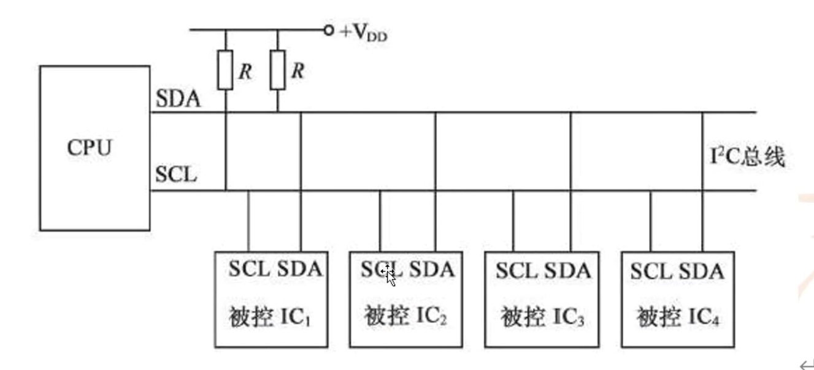

① 开漏输出无法输出高电平，需要外接电源上拉电阻获得基准电压。

② 总线连接多个从设备，通过从设备的硬件地址单独通信

③ 从设备最大个数由总线上的最大电容400pf限制(各设备自身的寄生电容)

<br/>

**注意点：**

开漏输出ODR=1时，引脚处于浮空状态(高阻态)，引脚的状态由外部决定

避免总线浮空

避免短路风险

避免总线冲突

SDA双向性

<br/>

### 6、器件地址

设备地址图

7位硬件地址，1位标志位

前4位厂家固定地址，中3位硬件编号有开发人员设定，最后1位读写标志位

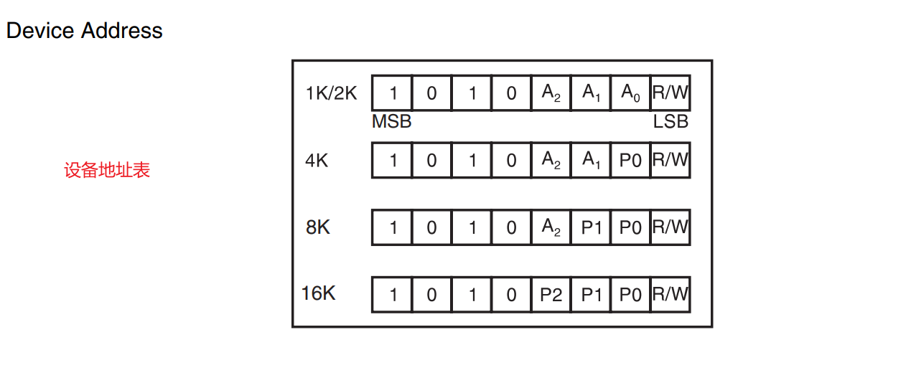

<br/>

### 7、时序规则

SCL高电平时SDA不能变，此时只能读数据，在SCL低电平时SDA可以变更电平，此时可以写数据。

<br/>

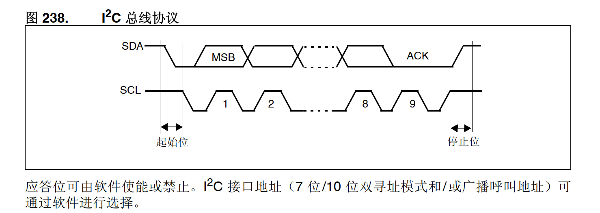

**起始条件**

- SCL高电平时 ，SDA高变低电平（下降沿）
  
  注意：① 时钟线是高电平的时候，不能乱动数据线，不然会产生起始信号或停止信号
  
            ② 只有在确定需要起始信号或停止信号时，才能操作数据线
  
            ③ 所以在想发送起始或结束信号之前，应先主动拉低时钟线。为了安全性，起始信号发送之后，也应该主动拉低时钟线。停止信号后面不需要，因为产生完停止信号后两根线都是高电平，就回到了初始化时的空闲状态
  
            ④ 在发送起始或停止信号前主动拉低时钟线，是为了防止外部信号干扰到数据线，产生意外的起始或停止信号。

**发送数据条件**

- SCL高电平期间，SDA不变，SCL低电平期间，SDA可变更电平
- SDA：高电平4.7us，低电平4us
- SCL：高电平4us，低电平4.7us

**应答条件**

- SCL高电平，SDA不变
- SDA可以是低电平，表示确认应答，或者是高电平，表示非确认应答
- SDA需要在SCL变成高电平之前保持应答状态，如果在SCL变高之后变更电平状态就相当于变成了起始或停止信号了
  
  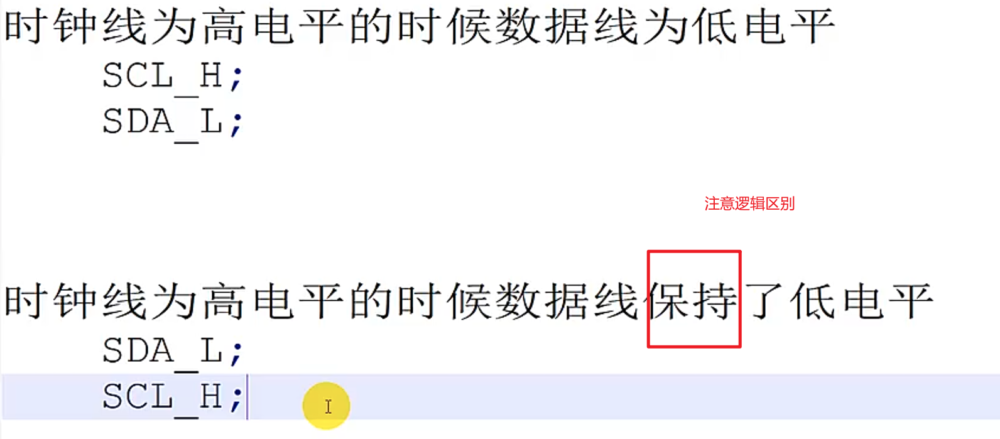
  
  注意：
  
  ① 主机发送数据后，是由从机的IIC控制器来应答的，这个时候电平是从机控制的，主机此时只读取SDA的电平状态来判断是否发送成功。
  
   ② 主机读取数据时的SDA电平是由从机来控制的，接收一个字节数据后，需要主动控制SDA电平来响应从机，应答表示继续读后面的数据，非应答表示不继续读取。

**停止条件**

- SCL高电平时，SDA由低变高，产生上升沿
- SDA：高4.7us
- SCL：低4.7us

<br/>

总结：① SCL高电平时数据线电平不能有任何变更，否则就会产生起始或停止等功能信号

          ② 在产生起始或停止或应答等功能信号之前，都应该先拉低SCL来保证安全，之后再产生需要的信号

          ② SCL低电平时写数据，SCL高电平时读数据

		  ③ 注意高低电平与上升沿下降沿的区别，SPI通信时实际是看上升下降沿。

<br/>

<br/>

### 8、标准IIC驱动代码

```c_cpp
// 初始化；空闲状态
void IIC_Init(void)
{
	// 时钟使能
	RCC->AHB1ENR |= RCC_AHB1ENR_GPIOBEN;
	// GPIO口初始化 PB6(SCL) PB7(SDA)
	GPIOB->MODER = GPIOB->MODER & ~(0xf << 12) | (0x5 << 12);
	// 开漏输出
	GPIOB->OTYPER |= (0x3 << 6);
	// 输出速率：高速
	GPIOB->OSPEEDR |= (0xf << 12);
	//浮空
	GPIOB->PUPDR &= ~(0xf<<12);

	// SCL高电平
	// SDA高电平
	SCL_H;
	SDA_H;
}

// 起始信号段
void IIC_Start(void)
{
	// 安全考虑，先拉低SCL
	SCL_L;
	// 再拉高数据线，为了下一步产生下降沿
	SDA_H;

	// 开始生成起始信号
	// SCL高电平
	SCL_H;
	SYSTICK_Delay_us(5);
	// SDA拉低
	SDA_L;
	SYSTICK_Delay_us(5);

	// 起始信号在上面已完成，为了防干扰，这里再手动拉低SCL
	SCL_L;
}

// 主机发送一个字节
u8 IIC_Send_Byte(u8 byte)
{
	for (u8 i = 0; i < 8; i++)
	{
		// SCL低电平时主机才可以发送
		SCL_L;
		SYSTICK_Delay_us(5);
		(byte & (0x80 >> i)) ? SDA_H : SDA_L;
		SYSTICK_Delay_us(5);
		// 帮从机拉高SCL，从机才能读取这位数据
		SCL_H;
		SYSTICK_Delay_us(5);
	}
	// 发完之后拉低SCL为安全状态
	SCL_L;
	return IIC_Read_Ack();
}

// 主机读取一个字节函数
u8 IIC_Read_Byte(u8 ack)
{
	u8 data = 0x0;
	// 先拉低SCL，再释放SDA，将SDA交给从机控制
	SCL_L;
	SDA_H;

	// 接收数据
	for (u8 i = 0; i < 8; i++)
	{
		// 帮从机拉低SCL让他发一位数据过来
		SCL_L;
		SYSTICK_Delay_us(5);
		// 从机发完一位后，SCL拉高时主机可读取
		SCL_H;
		SYSTICK_Delay_us(5);
		data |= (SDA_R?1:0) << (7-i);
	}
	// 拉低SCL为安全状态
	SCL_L;

	IIC_Send_Ack(ack);
	return data;
}

// 接收应答信号，将应答信号返回
// 接收到从机的应答信号表示发送数据成功
// 接收到从机的非应答信号表示发送数据失败
u8 IIC_Read_Ack(void)
{
	u8 ack;

	// SCL安全状态
	SCL_L;
	// 在读取从机的信号之前需要先释放SDA，让从机来控制SDA，
	// 因为SDA的IO口是配置的开漏输出，置1就相当于释放了电平控制
	SDA_H;

	// 因为IIC协议规则是发送数据信号时需要SCL低电平状态
	// 而从机无法掌控SCL的电平控制，所以这里需要帮助从机拉低来让从机发送数据
	// 虽然这个拉低的动作在上面已经做了，但是这里为了代码逻辑的完整就先写出来
	SCL_L;
	SYSTICK_Delay_us(5);
	// 拉高SCL开始读取从机发送的数据
	SCL_H;
	SYSTICK_Delay_us(5);
	ack = SDA_R;
	// 安全操作，拉低SCL
	SCL_L;

	return ack;
}

// 发送应答/非应答信号函数
void IIC_Send_Ack(u8 ack)
{
	// 应答信号电平由接收端来控制，发送端读取这个状态来判断是否发送成功
	// SCL高电平时，SDA保持低电平：应答
	// SCL低电平时，SDA保持高电平：非应答

	// 先拉低SCL保证操作安全并完整
	SCL_L;
	SYSTICK_Delay_us(5);
	// 通过参数判断给应答或非应答信号
	ack ? SDA_H : SDA_L;
	SYSTICK_Delay_us(5);
	// 拉高SCL产生信号，并帮助从机来读取信号
	SCL_H;
	SYSTICK_Delay_us(5);

	// 信号产生之后的安全操作拉低SCL，防止意外干扰
	SCL_L;
}

// 停止通信
void IIC_Stop(void)
{
	// 在发停止信号前拉低SCL防止SDA被干扰产生意外情况
	SCL_L;
	// 拉低SDA，为了产生上升沿
	SDA_L;

	// 开始产生停止信号
	// SCL高电平
	SCL_H;
	SYSTICK_Delay_us(5);
	// SDA上升沿
	SDA_H;
	SYSTICK_Delay_us(5);

}

```

<br/>

## 器件通信

<br/>

**器件开发步骤：**

① 拿到硬件

② 看说明书

③ 看示例代码

<br/>

**如何快速看说明书：**

① 看特点介绍

② 看引脚

③ 看如何控制

<br/>

**程序设计：**

① 设计哪些函数

<br/>

### 1、AT24C01A芯片：EEPROM

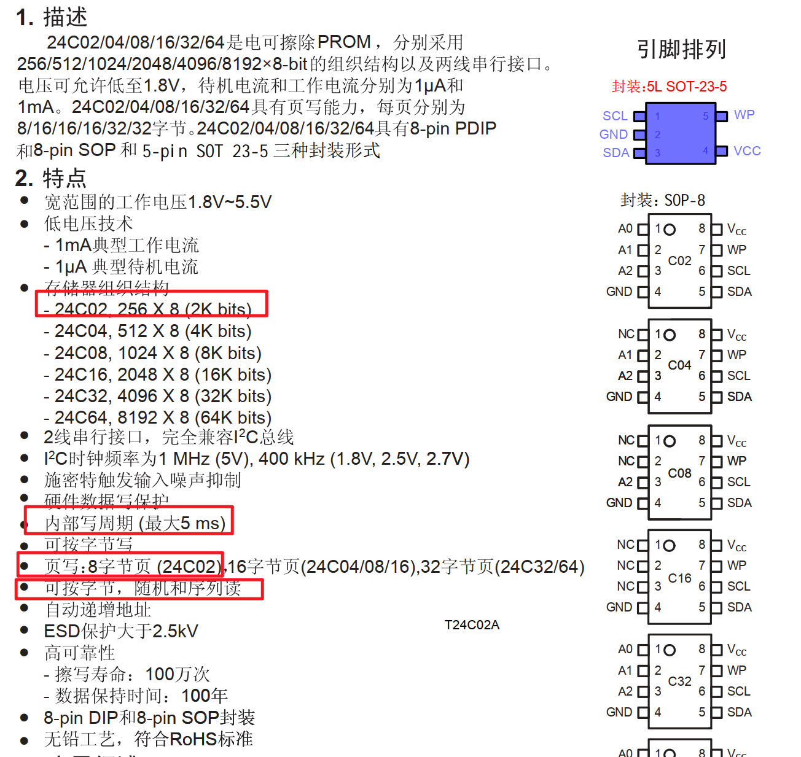

### 2、属性说明

写周期：发送完字节后先放在缓冲区，需要延时5ms给它时间写入指定地址内

页写：指定页地址，可以一次发送8个字节

随机读：指定一个地址去读取内容

序列读：从头开始顺序读取

<br/>

### 3、引脚说明

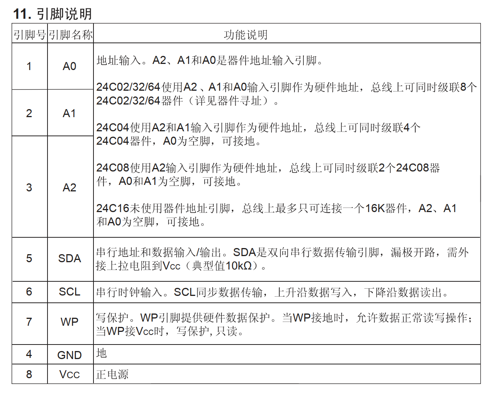

<br/>

### 4、地址

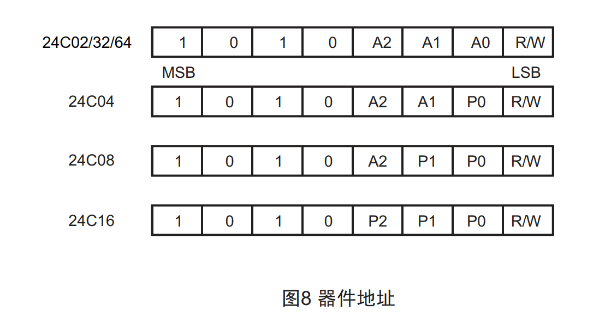

<br/>

<br/>

### 5、写数据

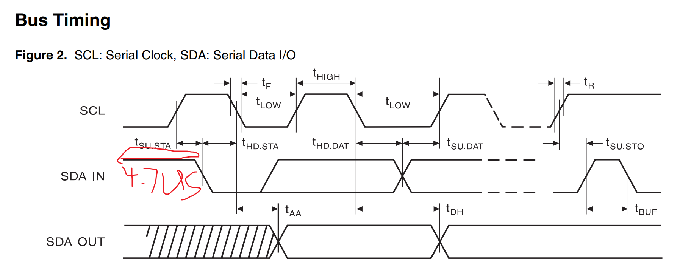

- 写入一个字节数据

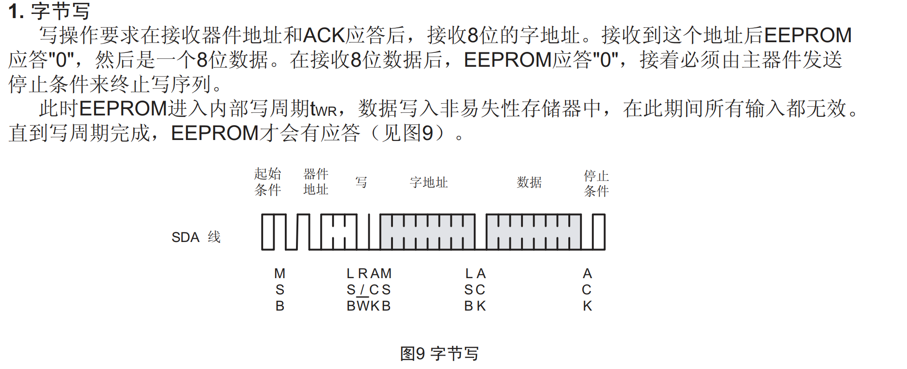

- 写一页数据

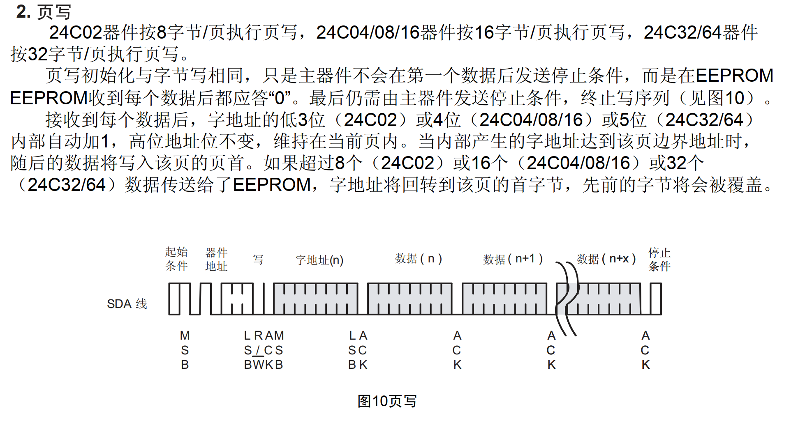

<br/>

<br/>

### 6、读数据

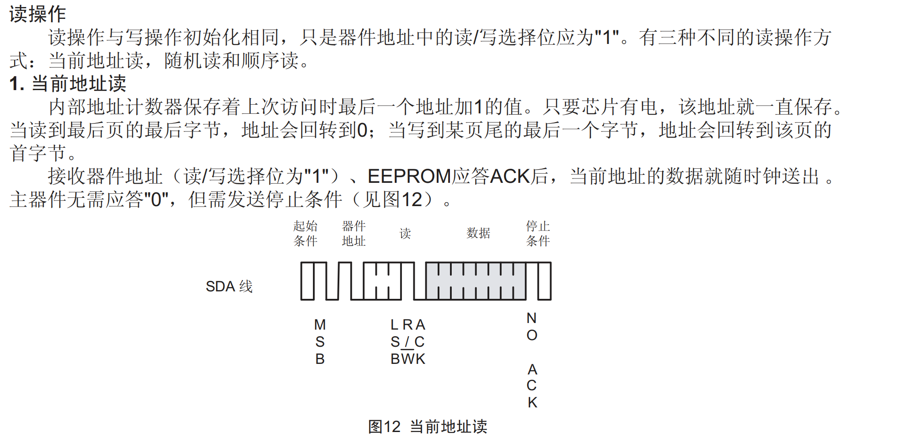

<br/>

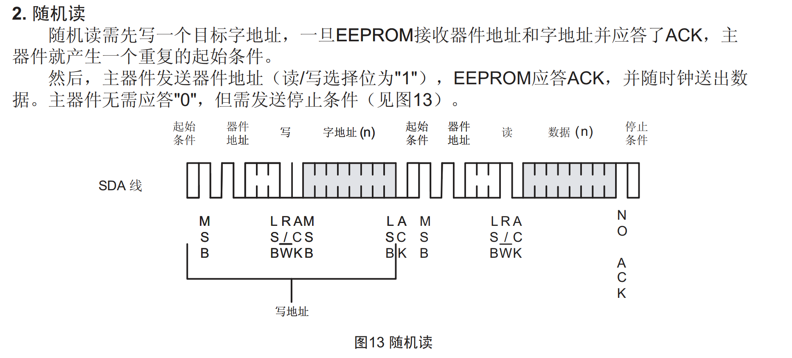

<br/>

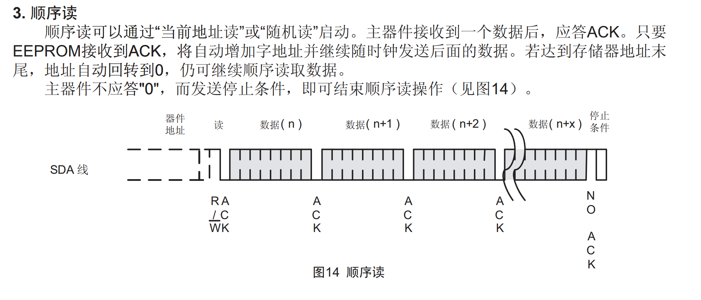