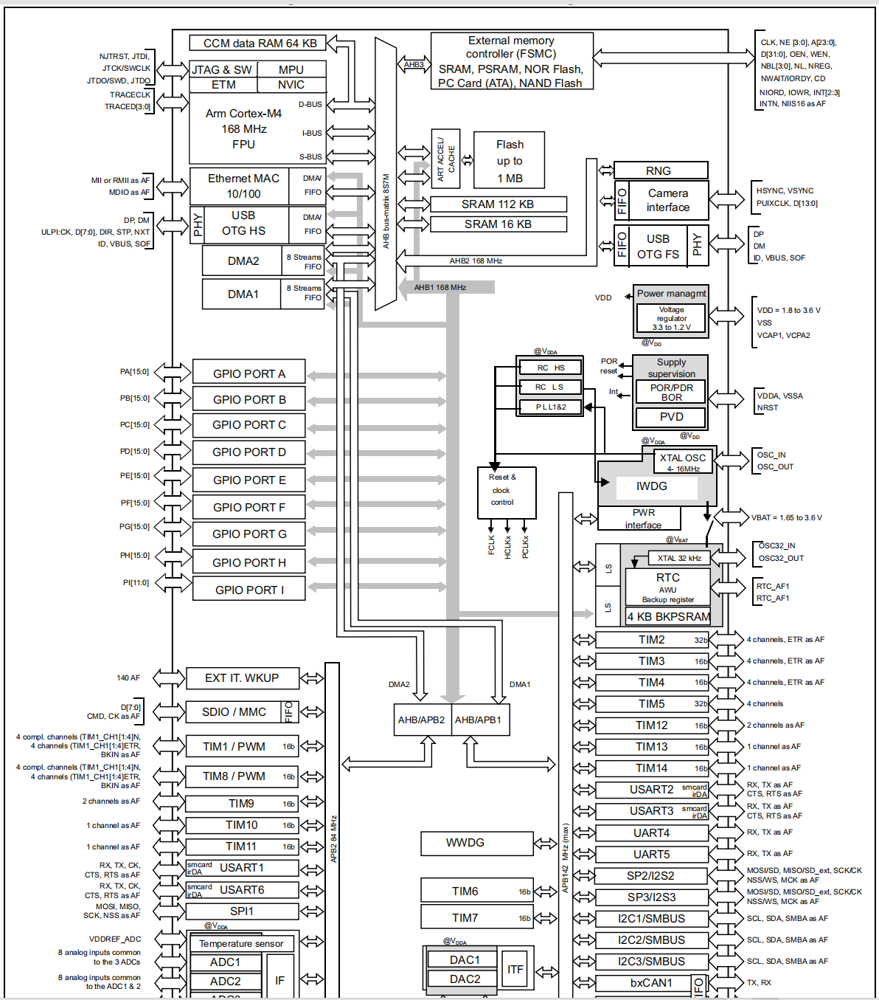

### STM32F407VGT6

MCU（微控制器单元）的片上外设和片外外设根据应用场景和型号不同有所差异，以下是典型分类及示例：

---

### **一、MCU片上外设（集成在芯片内部）**

1. **通用输入/输出（GPIO）**  
   - 基本数字引脚，可配置为输入或输出。
2. **定时器/计数器（Timer/Counter）**  
   - 用于PWM生成、事件计时、中断触发等（如基本定时器、高级定时器）。
3. **串行通信接口**  
   - **UART/USART**：异步串口通信（如RS-232）。  
   - **SPI**：高速同步串行通信（用于Flash、传感器等）。  
   - **I2C**：两线制同步通信（连接EEPROM、RTC等）。  
   - **CAN**：汽车/工业用控制器局域网。  
   - **USB**：支持主机/设备模式（如STM32的USB OTG）。
4. **模拟外设**  
   - **ADC**（模数转换器）：采集模拟信号（如温度传感器）。  
   - **DAC**（数模转换器）：输出模拟电压。  
   - **比较器**：模拟信号比较。
5. **专用功能模块**  
   - **DMA**（直接内存访问）：减轻CPU负担，高速数据传输。  
   - **看门狗定时器**（WDT）：防程序跑飞。  
   - **RTC**（实时时钟）：带日历功能的计时。  
   - **加密模块**（如AES、TRNG）：安全应用。
6. **其他**  
   - **电机控制PWM**（如高级定时器驱动BLDC）。  
   - **LCD控制器**：驱动段码屏或TFT。  
   - **电容触摸感应**（如STM32的Touch Sensing）。

---

### **二、片外外设（需外部连接）**

1. **存储设备**  
   - **Flash/EEPROM**（如AT24Cxx系列）。  
   - **SD卡/TF卡**：通过SPI或SDIO接口扩展存储。
2. **传感器**  
   - **环境类**：温湿度（DHT11）、气压（BMP280）、光照（BH1750）。  
   - **运动类**：加速度计（MPU6050）、陀螺仪。  
   - **生物类**：心率传感器（MAX30102）。
3. **显示设备**  
   - **OLED/LCD屏**（如SSD1306驱动的I2C OLED）。  
   - **LED/点阵屏**：通过GPIO或移位寄存器（如74HC595）控制。
4. **通信模块**  
   - **无线**：Wi-Fi（ESP8266）、蓝牙（HC-05）、LoRa（SX1276）。  
   - **有线**：以太网（ENC28J60）、RS-485（MAX485芯片）。
5. **执行机构**  
   - **电机**：直流电机（通过H桥驱动）、步进电机（如A4988驱动）。  
   - **继电器**：控制高电压设备。
6. **输入设备**  
   - **按键/键盘**：矩阵键盘或独立按键。  
   - **触摸屏**：电阻式或电容式。
7. **电源管理**  
   - **LDO/DC-DC**：如AMS1117稳压芯片。  
   - **电池管理**（如TP4056充电IC）。
8. **其他扩展**  
   - **FPGA/CPLD**：复杂逻辑扩展。  
   - **音频编解码器**（如VS1053播放MP3）。

---

### **三、选型注意事项**

- **片上资源**：根据需求选择集成度高的MCU（如需要CAN则选内置CAN控制器型号）。  
- **接口匹配**：确保片外设备与MCU接口兼容（如I2C电平、SPI速率）。  
- **功耗与成本**：低功耗场景可选内置ADC的MCU，避免外部分立元件。

例如，STM32F4系列集成了USB OTG、DCMI摄像头接口，而ESP32则内置Wi-Fi/蓝牙，适合物联网应用。