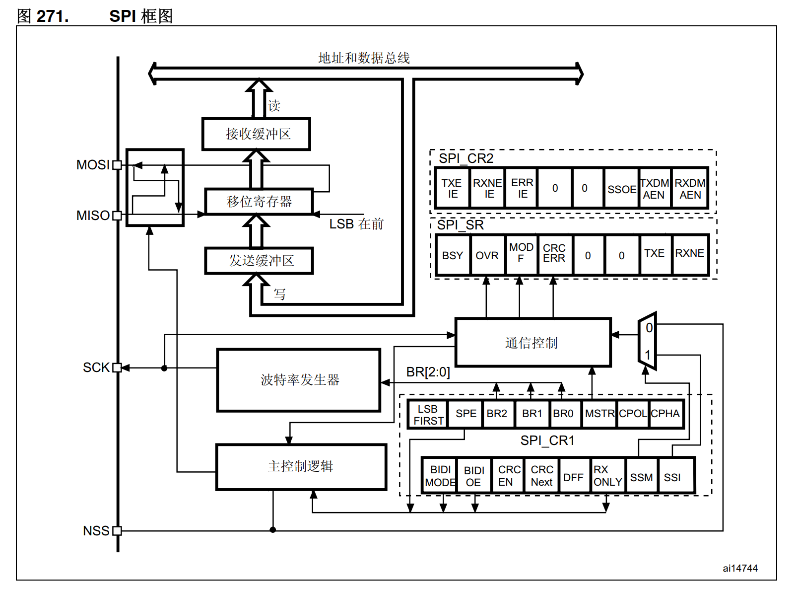

## 一、基础特性


**通信方式：**同步、串行、全双工

<br/>

**4线制：**① SCL 时钟线

            ② CS 片选线，低电平有效

            ③ MOSI 主机输出

            ④ MISO 主机输入

<br/>

**通信过程：**片选拉低 -- 数据位传输 -- 片选拉高

<br/>

**特点：**① 数据位 8/16 ，取决于从机支持

          ② 数据顺序  MSB或LSB先发取决于从机支持

<br/>

**时钟极性(CPOL)：**空闲时候时钟线电平状态，低电平0 或 高电平1

**时钟相位(CPHA)：**0 时钟线在第一个跳变沿时数据线可以读，第二个跳变沿时可以发

                 1 时钟线在第一个跳变沿时数据线可以发，第二个跳变沿时可以读

<br/>


<br/>

## 二、SPI外设框图



注意：SPI要能通信需要NSS高电平或寄存器的SSI/SSM位为1；

<br/>

## 三、配置寄存器

<br/>

### SPI_CR1控制寄存器

<br/>


注意：根据从机接口频率配置BR分频

<br/>

### SPI_CR2控制寄存器


注意：FRF帧格式一般配置0，主要看从器件要求

<br/>

### SPI_SR状态寄存器


<br/>

### SPI_DR数据寄存器


<br/>

### SPI_I2SCFGR配置寄存器


<br/>

## 四、使用示例

<br/>

### 1、查找SPI引脚


<br/>

### 2、代码示例

```c_cpp
void SPI_Init(void)
{

    // 1、时钟使能;
    RCC->AHB1ENR |= RCC_AHB1ENR_GPIOAEN;
    // 2、GPIO模式配置、类型配置、速度配置、上下拉配置
    GPIOA->MODER = GPIOA->MODER & ~((0x3 << 10) | (0x3 << 12) | (0x3 << 14)) | ((0x2 << 10) | (0x2 << 12) | (0x2 << 14));
    GPIOA->OTYPER &= ~(0x1 << 5 | 0x1 << 7);
    GPIOA->OSPEEDR = GPIOA->OSPEEDR & ~((0x3 << 10) | (0x3 << 14)) | ((0x2 << 10) | (0x2 << 14));
    GPIOA->PUPDR &= ~(0x3f << 10);
    // 3、GPIO复用功能配置
    GPIOA->AFR[0] = GPIOA->AFR[0] & ~((0xf << 20) | (0xf << 24) | (0xf << 28)) | ((0x5 << 20) | (0x5 << 24) | (0x5 << 28));
    // 4、SPI配置; 时钟使能
    RCC->APB2ENR |= RCC_APB2ENR_SPI1EN;
    // 5、控制器CR1; CR2
    SPI1->CR1 &= ~(0x1 << 15); // 双线单向
    SPI1->CR1 &= ~(0x1 << 11); // 8位数据帧
    SPI1->CR1 &= ~(0x1 << 10); // 全双工
    SPI1->CR1 |= (0x1 << 9);   // SSM 替换NSS引脚功能
    SPI1->CR1 |= (0x1 << 8);   // SSI 替换NSS引脚功能
    SPI1->CR1 &= ~(0x1 << 7);  // MSB 先发高位
    SPI1->CR1 &= ~(0x7 << 3);  // SPI1总线桥频率84，但SPI1最大42，这里2分频
    SPI1->CR1 |= (0x1 << 2);   // 主模式
    SPI1->CR1 &= ~(0x3 << 0);  // 时钟极性0、时钟相位0
    // 6、SPI1使能
    SPI1->CR1 |= (0x1 << 6);
}

u8 SPI_Write_Read_Byte(u8 data)
{
    u8 val;
    // 1.等待发送数据完成
    while (!(SPI1->SR << 1))
        ;
    // 2.将要发送的数据给DR
    SPI1->DR = data;
    // 3.等待接收完成
    while (SPI1->SR << 0)
        ;
    // 4.将DR数据赋值并返回
    val = SPI1->DR;
    return val;
}
```

<br/>

<br/>

## 五、SPI器件W25Q64

<br/>

**特点：**

① Flash类型存储芯片

② 内存大小8MByte

③ 标准SPI协议，支持(0,0) 和(1,1)模式 MSB

④ 手动擦除数据(写数据前要先擦除空间)

⑤ 不允许跨页写

<br/>

**内存划分：**块、扇区、页

① 128块，每块16扇区

② 一扇区16页

③ 一页有256字节

<br/>

**绝对地址**

识别大小：`8MByte`=`8388607Byte`

十六进制最大地址：`0x7fffff`  24位地址

分散识别：0x`7f` 块 `f` 扇区 `f` 页 `ff` 字节

<br/>

**存储特性：**

① 只能写入0，不能写入1。默认擦除后都是1。

② 写数据前必须擦除。（擦除最小单位是扇区）

③ 如果要写入的位置都是1，就可以不用擦除。

<br/>

### 1、W25Q64的寄存器


初始化时写入取消保护值：`0x00`

<br/>

### 2、操作指令


通过发送指定数据来发送指令

- 写使能指令：`0x06`


- 读状态指令：`0x05`


- 写状态寄存器指令：`0x01`


- 读数据指令：`0x03`


<br/>

- 页编程指令(写数据)：`0x02`


<br/>

- 扇区擦除指令：`0x20`


<br/>

- 块区擦除指令：`0xd8`


<br/>

- 芯片擦除：`0xc7`


<br/>

### 3、示例代码

```c_cpp
/**
 * @brief 初始化W25Q64存储器
 *        CS线-->PB14
 */
void FLASH_Init(void)
{
    // SPI协议外设初始化
    SPI_Init();
    // 片选线初始化
    RCC->AHB1ENR |= (0x1 << 1);   // 时钟使能
    GPIOB->MODER &= ~(0x3 << 28); // 通用输出
    GPIOB->MODER |= (0x1 << 28);
    GPIOB->OTYPER &= ~(0x1 << 14);  // 推挽输出
    GPIOB->OSPEEDR &= ~(0x3 << 28); // 快速
    GPIOB->OSPEEDR = (0x2 << 28);
    GPIOB->PUPDR &= ~(0x3 << 28); // 无上下拉
    W25Q64_CS_H;                  // 默认高电平，不可操作存储器
    // 配置解除写保护
    FLASH_Write_Sta(0x00);
}


/**
 * @brief 写使能
 *
 */
void FLASH_Write_en(void)
{
    // 拉低片选线；可操作
    W25Q64_CS_L;
    // 发送写使能指令
    SPI_WR_Byte(0x06);
    // 拉高片选线；不可操作
    W25Q64_CS_H;
}

/**
 * @brief 读状态寄存器
 *
 * @return u8
 */
u8 FLASH_Read_Sta(void)
{
    u8 val;
    // 拉低片选线；可操作
    W25Q64_CS_L;
    // 发送读状态寄存器指令0x05
    SPI_WR_Byte(0x05);
    // 等W25Q64识别指令后才可以接收
    val = SPI_WR_Byte(0xff);
    // 拉低片选线；不可操作
    W25Q64_CS_H;
    return val;
}

/**
 * @brief 将状态控制寄存器置零，解除写保护
 *
 * @param data
 */
void FLASH_Write_Sta(u8 data)
{
    // 写使能
    FLASH_Write_en();
    // 片选拉低
    W25Q64_CS_L;
    // 发送写寄存器指令
    SPI_WR_Byte(0x01);
    // 发送配置数据
    SPI_WR_Byte(0x00);
    // 拉高片选
    W25Q64_CS_H;
    // 等待BUSY位变0
    while (FLASH_Read_Sta() & 1 << 0)
        ;
}
```
