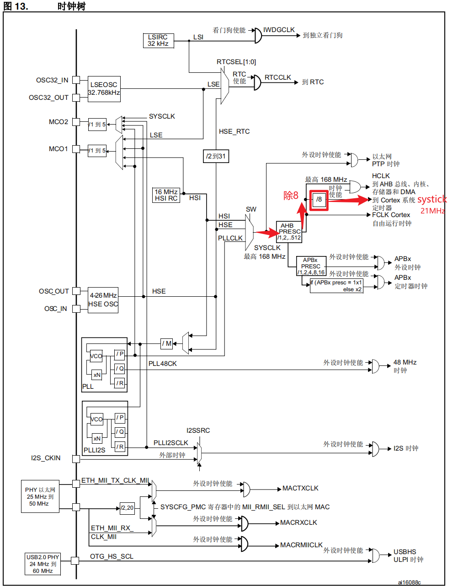
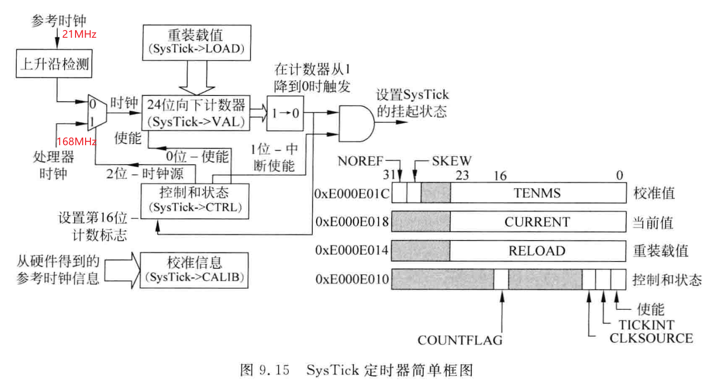
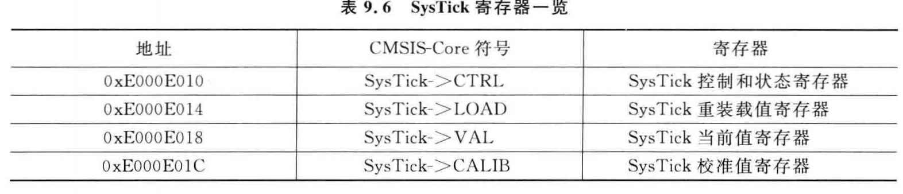
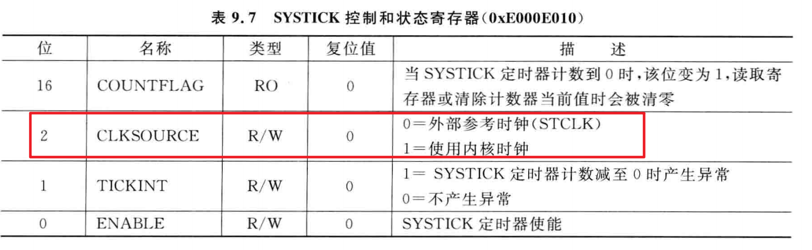
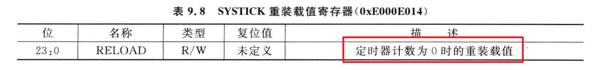
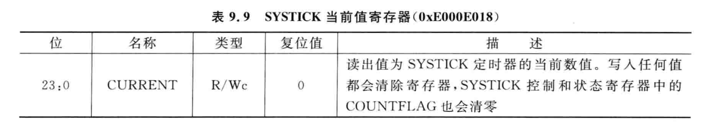
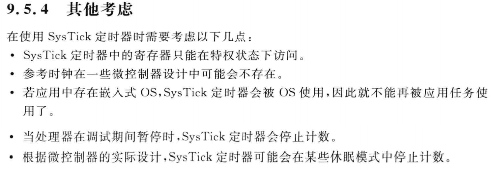

## 一、systick系统滴答时钟

<br/>

### 0x01、基本概念

定时器本质

①、有规律的计数

②、计数速度可控

③、依赖时钟频率

原理：通过时钟源频率，得出每秒计数次数

<br/>

## 二、框图

<br/>

【STM32F4xx中文参考手册】时钟树



<br/>

【ARM Cortex-M3与Cortex-M4权威指南】原理图



- 重装载值
  
  就是一个预设计数值，比如1000，如果计一个数是1us，那么计1000个数就是1ms
- 24位向下计数器
  
  就是从预设值减到0，24位最大值是16777216
- 控制和状态
  
  计数完成的状态存在这个寄存器里
  
  <br/>

### 0x01、时钟源选择

<br/>

#### ① 168MHz

最大计数us：168000000/s=168000/ms=168/us

计时最大值：16777216/168=99ms

<br/>

#### ② 21MHz

最大计数us：21000000/s=21000/ms=21/us

计时最大值：16777216/21=798ms

<br/>

### 0x02、寄存器

<br/>

- SysTick寄存器



<br/>

- 时钟源寄存器



<br/>

- 重装载值寄存器

1000个数是从999开始计数，因为包含了0



<br/>

- 当前值寄存器



<br/>

<br/>

## 三、配置使用

<br/>

### 1、时钟源选择

### 2、写入重载值

### 3、清空当前寄存器

### 4、使能计数器

### 5、等待计数完成

### 6、关闭定时器

<br/>

**示例代码：**

```c_cpp
void SYSTICK_Delay_us(u32 us)
{

    // 时钟源选择
    SysTick->CTRL &= ~(0x1 << 2);             // 控制寄状态寄存器的2号位  外部时钟 21MHz  最大计时 798ms
    // 写入重载值
    SysTick->LOAD = 21 * us - 1;           // 通过延时时间计算出重载值
    // 清空当前值寄存器
    SysTick->VAL = 0xff;                       // 随便写一个值到当前值寄存器
    // 使能计数器
    SysTick->CTRL |= 0x1 << 0;                // 控制及状态寄存器的0号位
    // 等待计数器计数完成
    while (!(SysTick->CTRL & (0x1 << 16)));   // 控制及状态寄存器的16号位
    // 关闭计时器
    SysTick->CTRL &= ~(0x1 << 0);             // 控制及状态寄存器的0号位

}
```

<br/>

**注意事项：**



<br/>

<br/>

## 四、定时中断

<br/>

### 0x01、配置步骤

<br/>

① NVIC控制器配置

优先级分组

计算编码值

设置具体中断源

<br/>

② 系统滴答定时器配置

时钟源选择

重载值寄存器

当前值清零

使能计数器

中断使能

<br/>

### 0x02、示例

注意：

① 定时器不需要关闭；

② 同时只能使用一种方式定时，不能即作延时使用又作中断使用

③ 标准库stm32f4xx_it.c中空实现了SysTick的中断服务函数，重新现实时需要注释掉

```c_cpp
void NVIC_SYSTICK_Config(u32 ms)
{
    //优先级分组
    //计算编码值
    //设置具体中断源
    NVIC_SetPriority(SysTick_IRQn, NVIC_EncodePriority(5,2,2));
    NVIC_EnableIRQ(SysTick_IRQn);
    //时钟源选择
    //重载值寄存器
    //当前值清零
    SysTick->CTRL &= ~(0x1 << 2);
    SysTick->LOAD = 21 * 1000 * ms - 1;
    SysTick->VAL = 0xff; 
    //中断使能
    SysTick->CTRL |= 0x1 << 1;
    //使能计数器
    SysTick->CTRL |= 0x1 << 0;
}

void SysTick_Handler(void)
{
    if((SysTick->CTRL&(1<<16)))
    {
        //复位
        SysTick->VAL = 0xff; 
        //事件
        printf("nvic for systick\r\n");
    }
}
```
