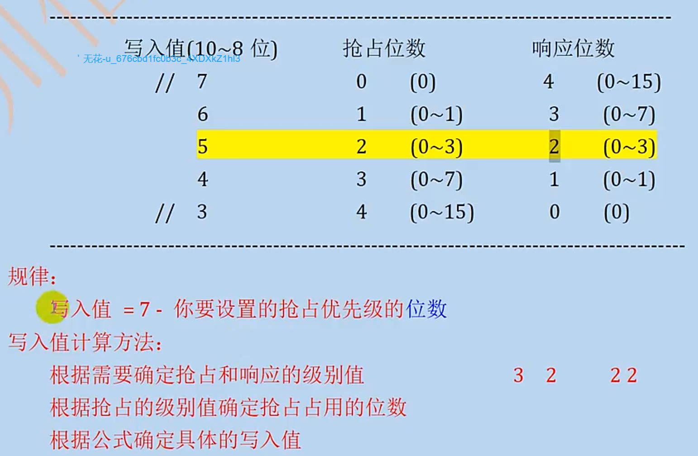

## 一、基本理解

### 1、中断机制

相当于一个监控机制，例如监控一个寄存器位单元的变化，符合条件后，被动触发一个执行单元；

这个监控不同于普通while(1)循环，由**NVIC**控制器管理，不阻塞main函数运行。类似消息队列的解耦功能。

严谨版：

> 例如串口接收中断的过程，串口DR寄存器收到数据后置位，如果这时候该寄存器的接收使能寄存器是开启状态，那么该串口会给NVIC控制器发送一个紧急中断事件，NVIC控制器收到后会拉起cpu执行该紧急事件，处理串口接收数据。

<br/>

### 2、中断优先级

 	**① 抢占优先级**：设置优先级寄存器对应的值

	**② 响应优先级**：设置优先级寄存器对应的值

	**③ 自然优先级**：固定的，顺序执行

	*说明：优先级的级别值越小，优先级越高*；① > ② > ③

	中断嵌套：一个中断执行时，又来了一个更高优先级的中断；此时会暂停前面的中断，执行优先级高的中断；（只有抢占式支持）

### 3、中断控制

- NVIC控制器：
  
  ① 接收紧急事件
  
  ② 处理优先级
  
  ③ 执行优先级最高的紧急事件

<br/>

注意：① 终端服务函数中不要有大量延时

          ② 不要出现Systick，因为NVIC依赖Systick

## 二、配置中断

中断源为顶层配置，以下为细分配置。 



上图为总结配置图；抢占级别值和响应级别值一起只能占4个比特位。

<br/>

### 1、优先级

	**① 配置优先级分组**：

			a、一个中断源只需要配置一次分组

			b、分组寄存器的配置位置是第8~10比特位所在位置

<br/>

	**② 配置优先级别值**：有几个需要中断的执行单元，就需要配置几次级别值

<br/>

### 2、函数配置

	**① 配置分组**

```c_cpp
// 参数：分组写入值 7、6、5、4、3
void NVIC_SetPriorityGrouping(uint32_t PriorityGroup);   //
```

	注：一个工程只需要一个中断分组

<br/>

	**② 计算优先级值编码**

```c_cpp
// 参数1：分组值    参数2：抢占优先级别值     参数3：响应优先级值   
// 返回：设定后的编码值，用来赋值给需要的外设寄存器配置中断使能
uint32_t NVIC_EncodePriority (uint32_t PriorityGroup, uint32_t PreemptPriority, uint32_t SubPriority);
```

<br/>

	**③ 配置优先级值编码和对应的通道**

```c_cpp
// 参数1：通道值，在头文件的IRQn_Type结构体里面    参数2：上一步计算的编码
void NVIC_SetPriority(IRQn_Type IRQn, uint32_t priority);
```

<br/>

	④ 使能中断通道

```c_cpp
// 参数1：通道值，在头文件的IRQn_Type结构体里面
void NVIC_EnableIRQ(IRQn_Type IRQn);
```

	或则查看中文文档找到中断编号对照表


<br/>

## 三、使用中断

<br/>

1、串口中断启动函数

```c_cpp
// 在启动文件汇编代码里找
void USART1_IRQHandler(void);
```

<br/>

2、串口接收数据代码示例

```c_cpp
// 串口初始化
void USART1_Init(u32 num)
{
    // GPIOA PA9 PA10
    RCC->AHB1ENR |= 0x1 << 0;                                   // 使能GPIOA时钟
    RCC->APB2ENR |= 0x1 << 4;                                   // 使能USART1时钟
    GPIOA->MODER = GPIOA->MODER & ~(0xf << 18) | 0xa << 18;     // GPIOA9/10复用模式
    GPIOA->OTYPER &= ~(0x3 << 9);                               // 推挽输出
    GPIOA->OSPEEDR = GPIOA->OSPEEDR & ~(0xf << 18) | 0xa << 18; // 配置为 高速
    GPIOA->AFR[1] = GPIOA->AFR[1] & ~(0xff << 4) | 0x77 << 4;   // 高位复用USART1
    // USART1
    USART1->CR1 &= ~(0x1 << 15);  // 16倍采样
    USART1->BRR = 84000000 / num; // 计算得到的波特率
    USART1->CR1 &= ~(0x1 << 12);  // 字长8
    USART1->CR1 &= ~(0x1 << 10);  // 不启用校验位
    USART1->CR2 &= ~(0x3 << 12);  // 1个停止位
    USART1->CR1 |= (0x3 << 2);    // 使能发送器和接收器
    USART1->CR1 |= (0x1 << 13);   // 使能USART1
}
```

```c_cpp
//中断使能
void USART1_NVIC_Config(void)
{
    USART1->CR1 |= (0x1 << 5);               // 接收中断使能
    USART1->CR1 |= (0x1 << 4);               // 端口空闲使能
    u32 code = NVIC_EncodePriority(5, 1, 1); // NVIC中断优先级配置
    NVIC_SetPriority(USART1_IRQn, code);     // 配置中断通道
    NVIC_EnableIRQ(USART1_IRQn);             // 使能中断通道
}
```

```c_cpp
//中断服务函数；中断的入口
void USART1_IRQHandler(void)
{
    // USART1中断读取
    if (USART1->SR & (0x1 << 5))
    {
        // 读取状态位复位；通过读取DR清零
        USART1_Rev.str[USART1_Rev.len] = USART1->DR;
        USART1_Rev.len++;
    }
    // 空闲中断
    if (USART1->SR & (0x01 << 4))
    {
        // 先复位
        USART1->SR;
        USART1->DR;
        // 紧急事件
        // 将数据发送出去
        printf("%s\n", USART1_Rev.str);
        
        USART2_SendStr(USART1_Rev.str);
        
        // 将数据复位
        USART1_Rev = (NVIC_USART_Rev_ch){{0}, 0};
    }
}
```
