## USART寄存器

### 0x01、框图

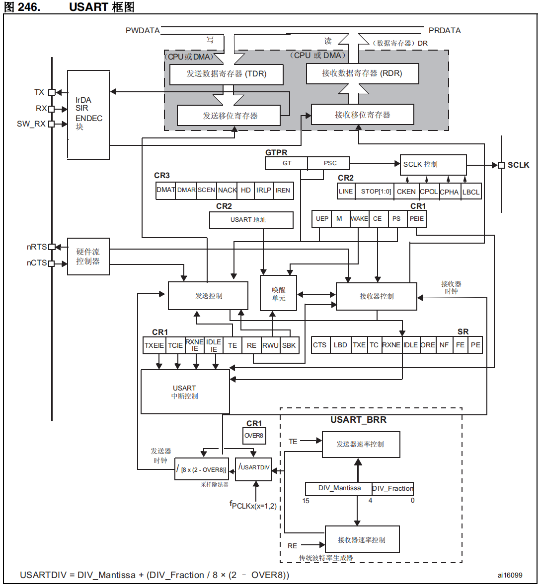

<br/>

<br/>

### 0x02、字长

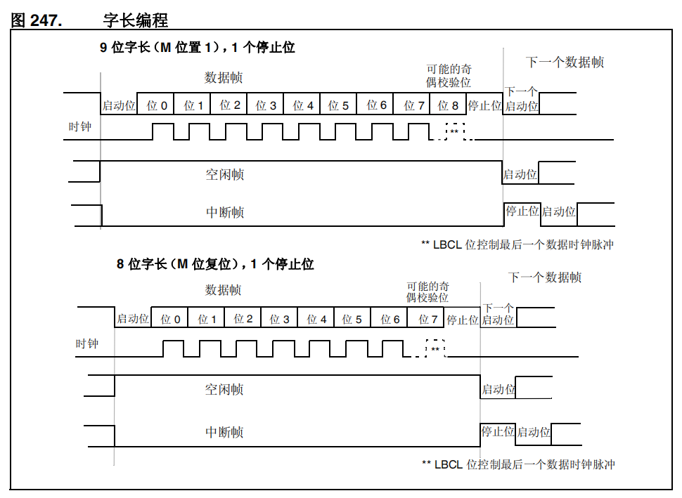

<br/>

<br/>

### 0x03、SR状态寄存器

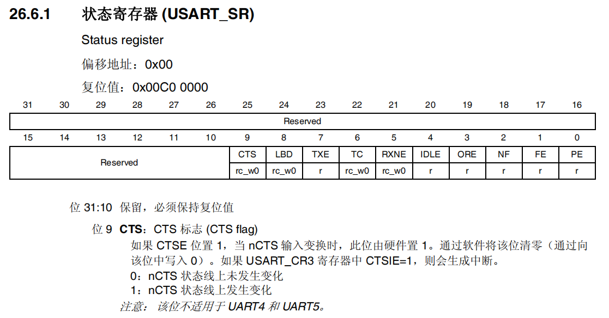

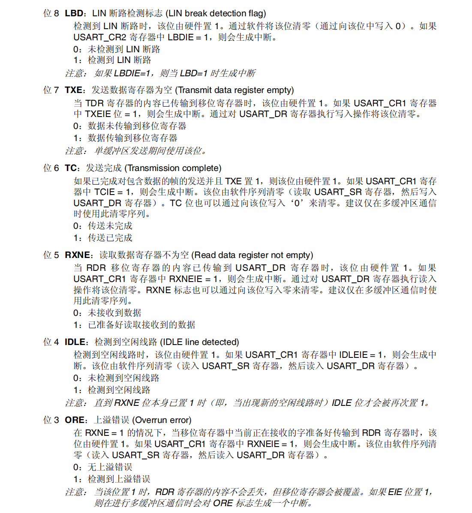

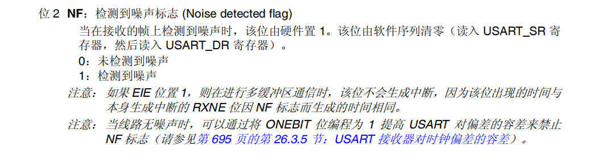

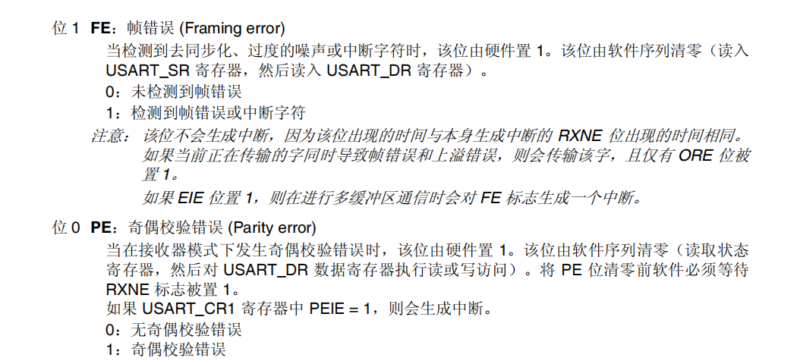

<br/>

<br/>

### 0x04、DR状态寄存器

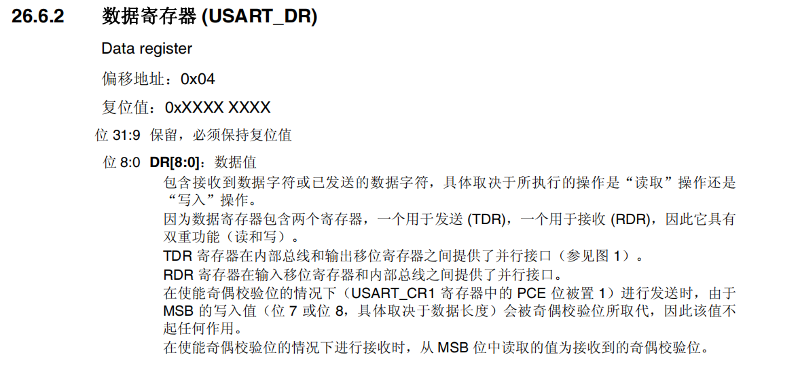

<br/>

<br/>

### 0x05、波特率寄存器

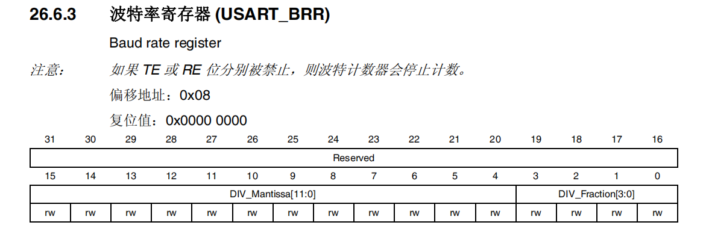

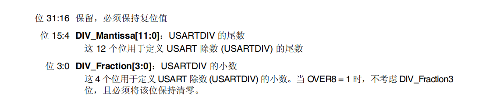

<br/>

<br/>

### 0x06、控制寄存器1

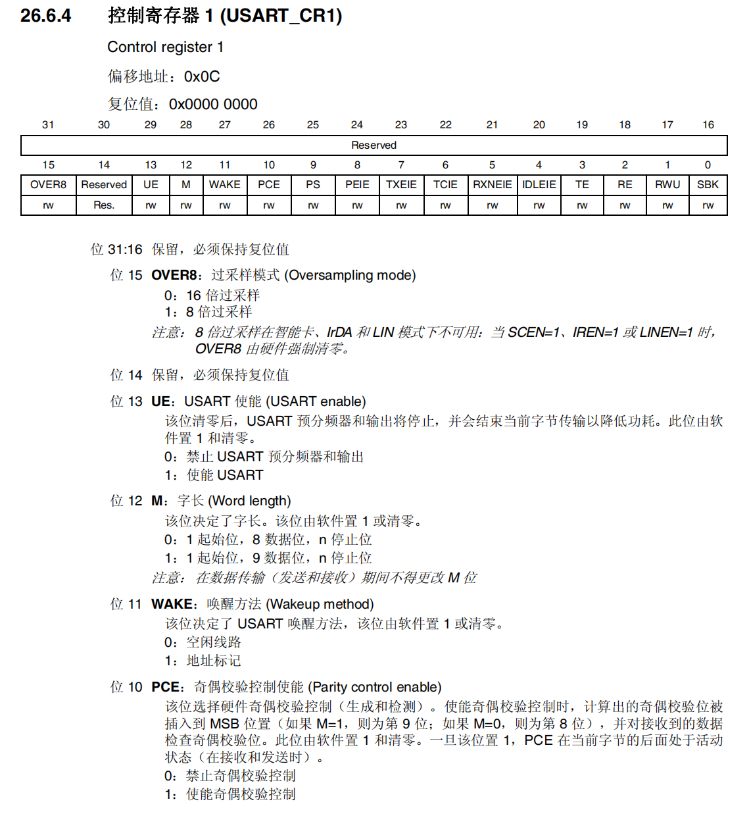

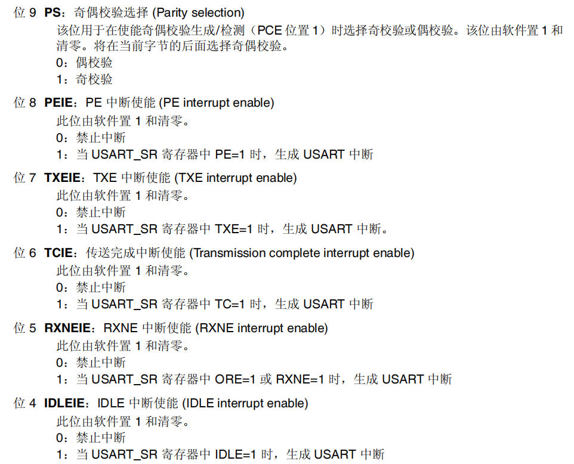

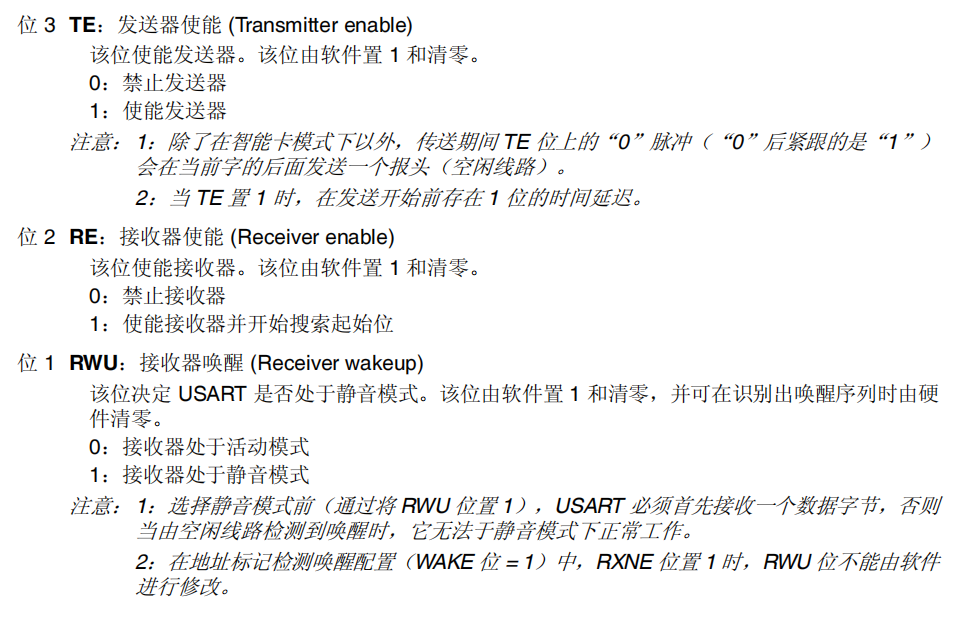

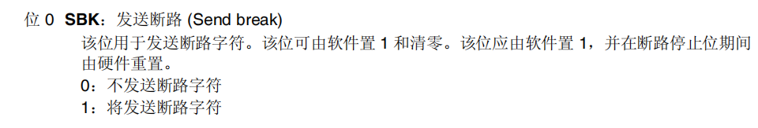

<br/>

<br/>

### 0x07、控制寄存器2

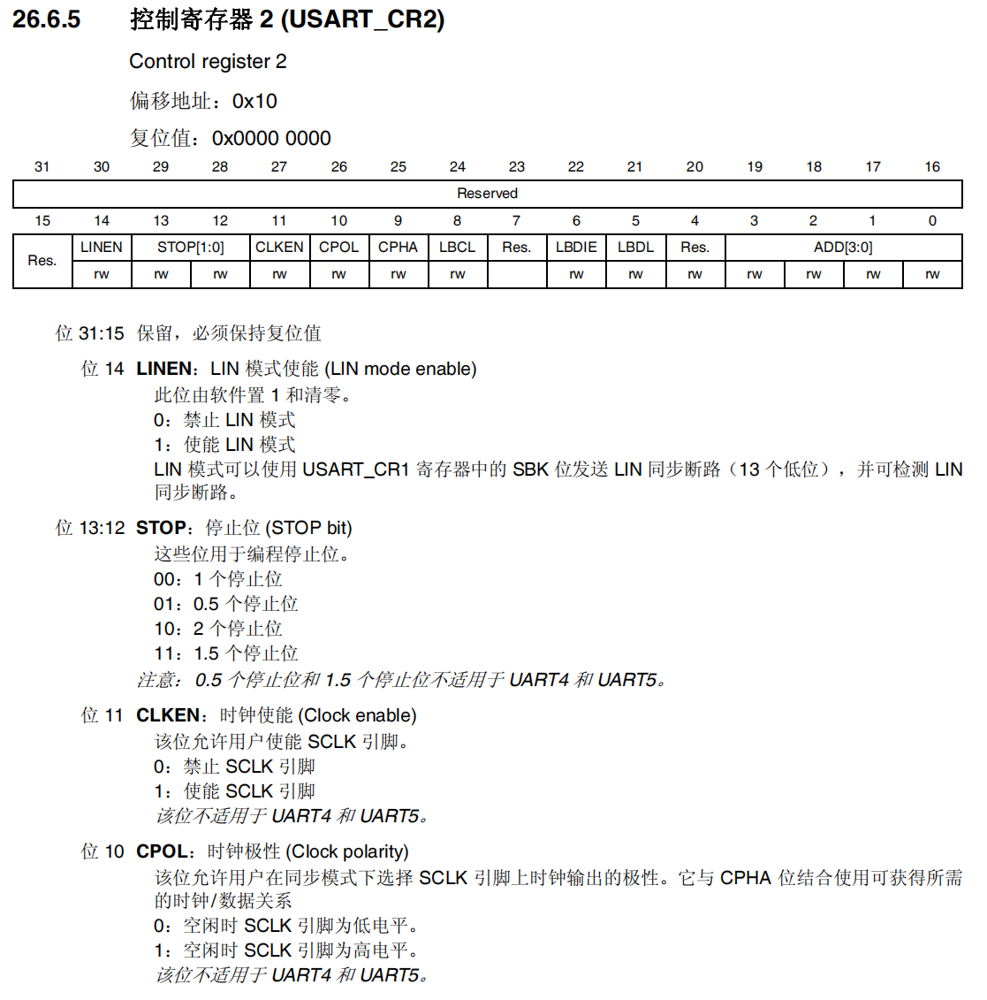

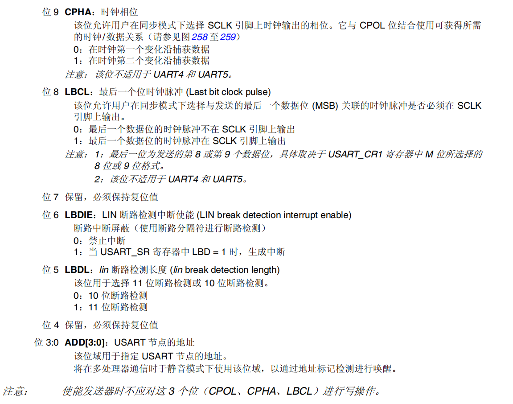

<br/>

### 0x08、波特率计算

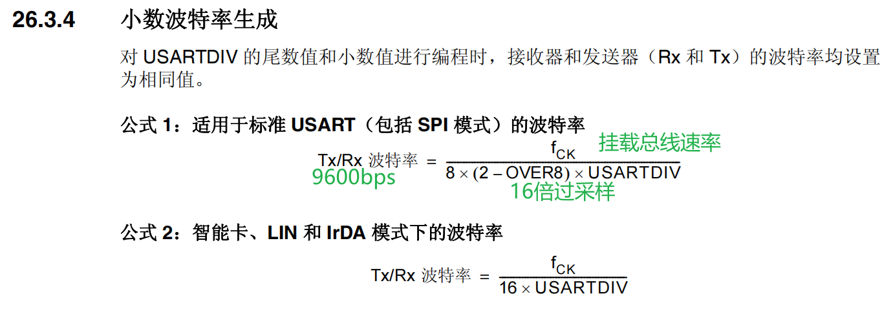

计算出波特率DIV：`USARTDIV = FCK/(8*(2-OVER8)*波特率)`

```c_cpp
float usart1div = 84000000.0/(16*baud);
u32 Mantissa = (u32)usart1div;//整数部分
u32 Fraction = (u32)((usart1div - Mantissa)*16);
USART1->BRR = (Mantissa<<4)|Fraction;
```

**简化公式**

> 波特率写入值 = FCK / 波特率            //适用16倍采样率
> 
> 波特率写入值 = FCK / 波特率 * 2       //适用8倍采样率

<br/>

<br/>

## 配置使用步骤

<br/>

### 0x01、使能/波特率/协议配置

GPIO：包含两个IO口，一个发送一个接收。复用模式

USART：波特率、过采样、字长、停止位、奇偶校验、数据位

```c_cpp
//打开时钟
RCC->AHB1ENR |= (1<<0);
RCC->APB2ENR |= (1<<4);
//配置GPIO
GPIOA->MODER &= ~(0xf<<18);
GPIOA->MODER |= (0xa<<18);
//推挽
GPIOA->OTYPER &= ~(0x3<<9);
//快速模式
GPIOA->OSPEEDR &= ~(0xf<<18);
GPIOA->OSPEEDR |= (0xa<<18);
//选择复用为USART1
GPIOA->AFR[1] &= ~(0xff<<4);
GPIOA->AFR[1] |= (0x77<<4);

//-----------------------------------------------------

//USART1
float usart1div = 84000000.0/(16*baud);
u32 Mantissa = (u32)usart1div;//整数部分
u32 Fraction = (u32)((usart1div - Mantissa)*16);
USART1->CR1 &= ~(1<<15);//16倍过采样

USART1->BRR = (Mantissa<<4)|Fraction;
USART1->CR1 &= ~(1<<12); //字长8
USART1->CR1 &= ~(1<<10);//不启用校验位
USART1->CR2 &= ~(0x3<<12);//1个停止位
USART1->CR1 |= (0x3<<2);//使能发送器和接收器
USART1->CR1 |= (0x1<<13);//使能USART1
```

<br/>

### 0x02、读取与写入寄存器

操作USART串口的`SR`与`DR`

```c_cpp
// USART1接收一个字符
u8 USART1_RecvChar(void)
{
    while (!(USART1->SR & 1 << 5))
        ;
    return USART1->DR;
}

// USART2发送一个字符
void USART2_SendChar(u8 data)
{
    while (!(USART2->SR & 1 << 6))
        ;
    USART2->DR = data;
}
```
