## 一、TIM6、TIM7主要特性

<br/>

<br/>

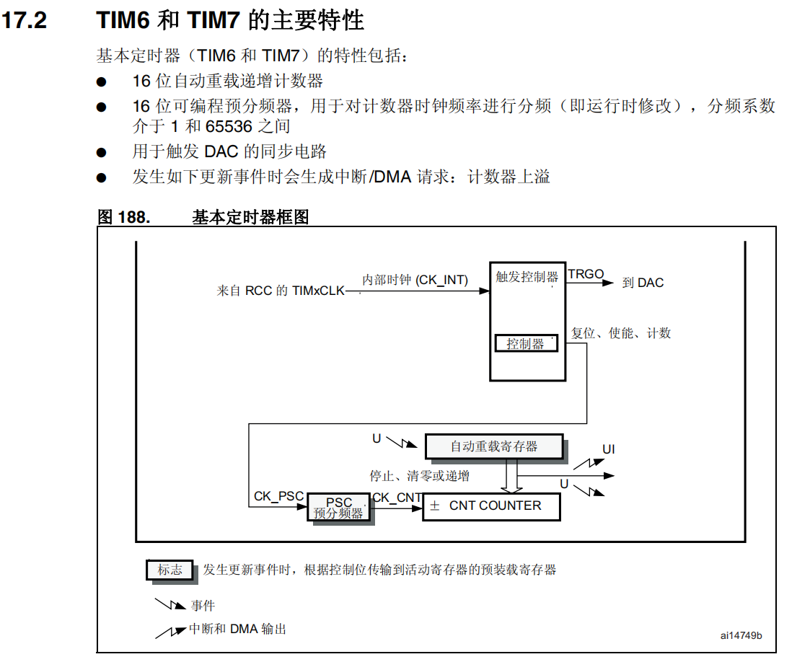

<br/>

①、基本定时器一般用作延时和定时中断

②、16未递增计数器最多65535

③、16位分频值介于1~65536之间

<br/>

### 分频计算

- 微秒级

	分频值  84      计数速度：1MHz       1000/ms一毫秒计一千个数          1/us一微秒计一个数        65536/1=65536us

    分频值  42      计数速度：2MHz       2000/ms一毫秒计两千个数          2/us一微秒计两个数        65536/2=32768us

		需要注意：当使用微秒级计数时，最好分频42，一微秒计两个数，如果只有一个数会卡死，因为无法递增。

- 毫秒级

    分频值  8400      计数速度：10000Hz    10/ms一毫秒计十个数         无法计微秒，数值无法为小数       65536/10=6553ms

<br/>

### 时钟树

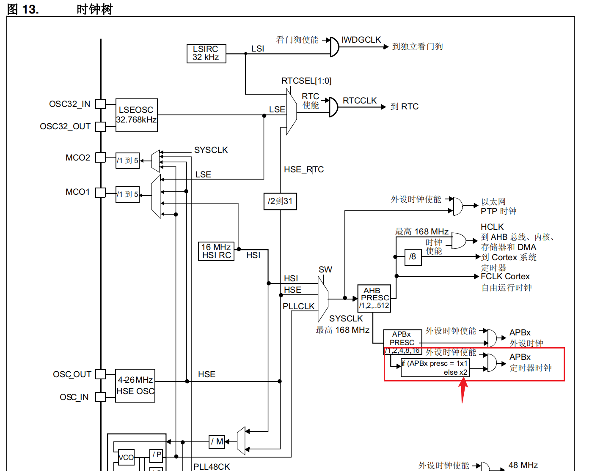

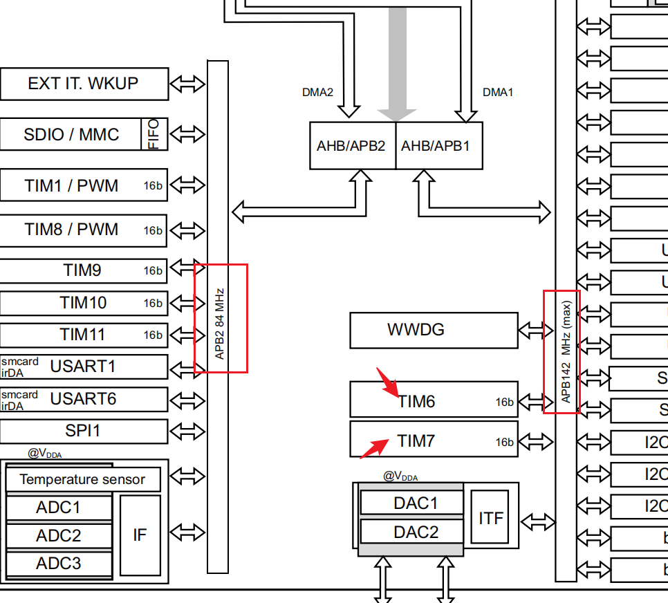

<br/>

**注意点：**经过分频后，给到定时器的需要乘2，APB1桥的频率是总线分频后的频率，所以给到定时器的时钟需要 x2。其他外设的时钟给多少就是多少。

<br/>

## 二、寄存器

<br/>

### TIMx_EGR影子寄存器

作用：

①、真正作用的计数值是用的影子寄存器中的值

②、影子寄存器用来保护计数周期防止被外部程序打乱（比如计数到一半时，外部突然往重载寄存器中覆写了一个新的计数值，它将不会生效）

③、发生计数器更新时，计数值才会被自动写入影子寄存器（认为产生一次更新事件后生效）

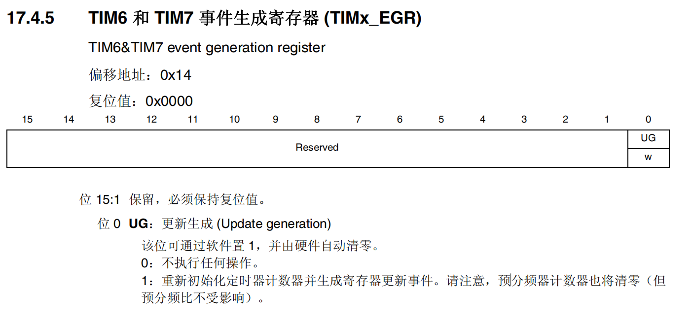

<br/>

<br/>

### TIMx_CR1控制寄存器

位7是影子寄存器的开关，通常情况下打开

位2是产生中断的条件

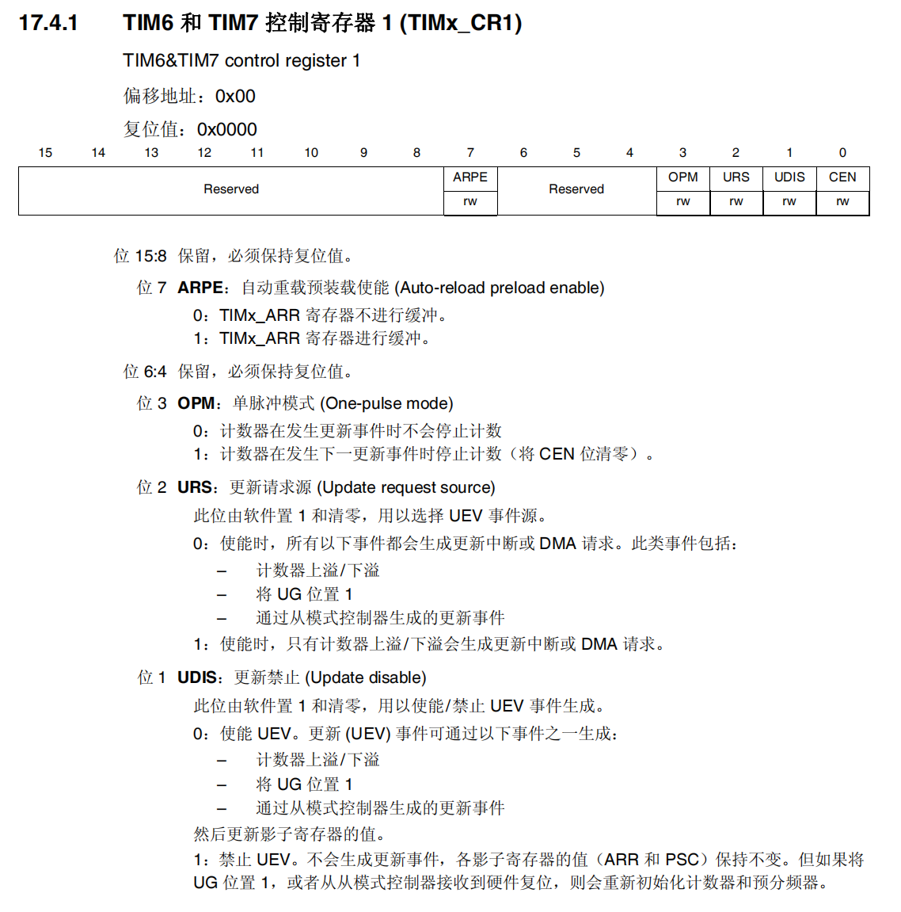

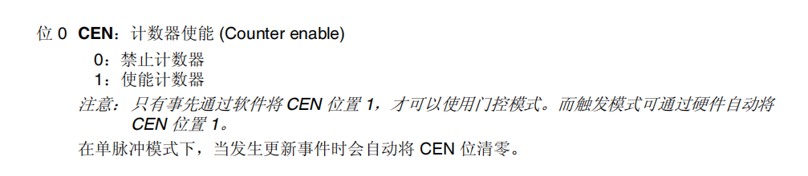

<br/>

### TIMx_DIER中断使能寄存器

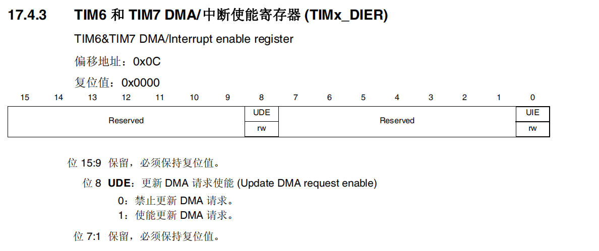


<br/>

### TIMx_SR状态寄存器

写0清零

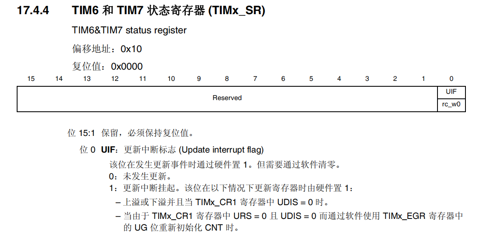

<br/>

### TIMx_CNT计数器

相当于SysTick中的VAL

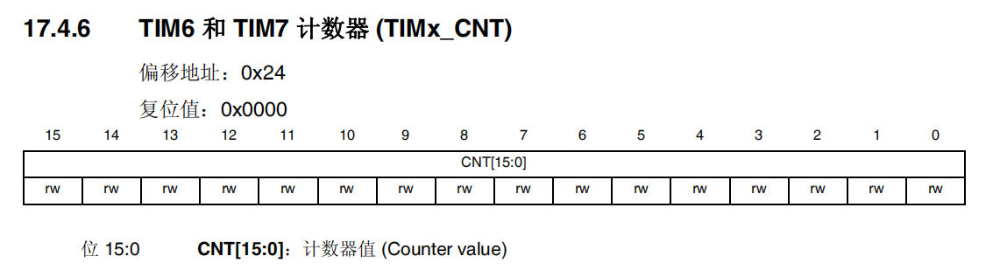

<br/>

### TIMx_PSC预分频寄存器

<br/>

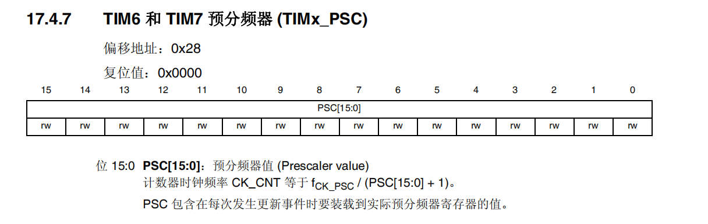

<br/>

### TIMx_ARR自动重载寄存器

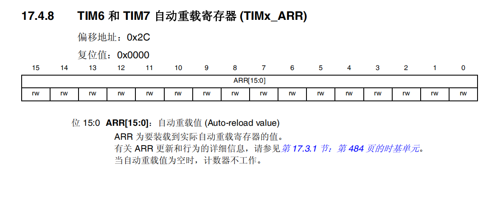

<br/>

## 三、配置

<br/>

### 0x01、使用步骤

**延时代码**

①、开时钟

②、设置分频

③、设置重载值

④、人为产生更新事件

⑤、清除计数完成标志位

⑥、使能定时器

⑦、等待计数完成

⑧、关闭定时器

<br/>

示例代码

```c_cpp
//毫秒级；微秒级注意使用42分频就可以
void TIM6_DELAY_ms(u32 ms)
{
    RCC->APB1ENR |= (1 << 4);       // 时钟使能
    TIM6->CR1 |= 1 << 7;            // 配置TIM6缓存（开启影子寄存器）
    TIM6->CR1 |= 1 << 3;            // 开启单脉冲；这个位还有停止计数的功能
    TIM6->CR1 &= ~(1 << 1);         // 允许更新事件产生
    TIM6->PSC = 8400 - 1;           // 毫秒级分频
    TIM6->ARR = ms * 10 - 1;        // 设置重载计数值
    TIM6->EGR |= 1 << 0;            // 手动产生更新事件
    TIM6->SR &= ~(1 << 0);          // 清除更新标志位
    TIM6->CR1 |= 1 << 0;            // 使能计数器
    while (!(TIM6->SR & 1 << 0));   // 等待计数完成
}
```

<br/>

### 0x02、定时中断

<br/>

```c_cpp
//TIM7定时中断配置
void TIM7_NVIC_CONFIG_DELAY_ms(u32 ms)
{
    RCC->APB1ENR |= (1 << 5); // 时钟使能
    TIM7->CR1 |= 1 << 7;      // 配置TIM7缓存（开启影子寄存器）
    TIM7->CR1 &= ~(1 << 3);   // 关闭单脉冲，不自动停止计数
    TIM7->CR1 |= 1 << 2;      // 上溢时更新中断
    TIM7->CR1 &= ~(1 << 1);   // 允许更新事件产生

    TIM7->PSC = 8400 - 1;     // 豪秒级分频
    TIM7->ARR = ms * 10 - 1; // 设置重载计数值
    TIM7->EGR |= 1 << 0;    // 手动产生更新事件
    TIM7->SR &= ~(1 << 0);  // 清除更新标志位

    NVIC_SetPriority(TIM7_IRQn, NVIC_EncodePriority(5, 1, 1)); // 配置中断
    NVIC_EnableIRQ(TIM7_IRQn);                                 // 使能中断通道

    TIM7->DIER |= 1 << 0; // 使能TIM7中断位
    TIM7->CR1 |= 1 << 0;  // 使能计数器
}

//中断服务函数
void TIM7_IRQHandler(void)
{
    if (TIM7->SR & 1 << 0)
    {
        //清除标志位
        TIM7->SR &= ~(1<<0);
        //紧急事件
        printf("TIM7_NVIC \r\n");
    }
}
```
