## 一、EXTI定义

### 0x01、EXTI外部中断事件控制器

① 片外外设主动触发的中断。

② GPIO口电平发生变化，EXTI控制器就可以产生中断信号给NVIC控制器

③ EXTI控制器相当于一个监控，监控IO口电平变化。

<br/>

### 0x02、使用场景

①、外部中断按键 PA0（开机按键、唤醒按键）

②、记录脉冲个数

③、检测设备挂载情况（传感器）

<br/>

### 0x03、区别

示例对比（STM32场景）

- 中断触发：GPIO引脚上升沿触发中断，CPU读取传感器数据并处理。

- 事件触发：同一GPIO上升沿直接触发DMA，将ADC数据搬运到内存，全程无CPU干预。

总结：对于IO口外部电平需要及时感知时，就需要使用EXTI监控IO口

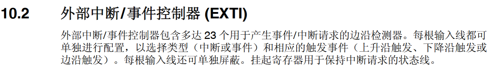

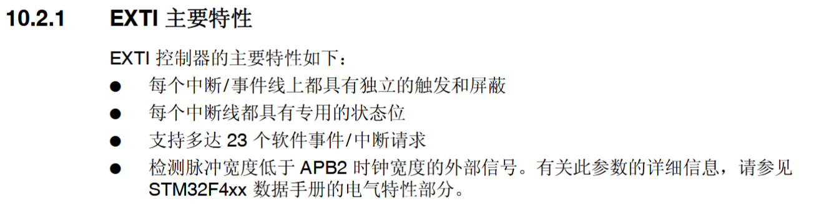

23根独立的线，0~22

## 二、框图

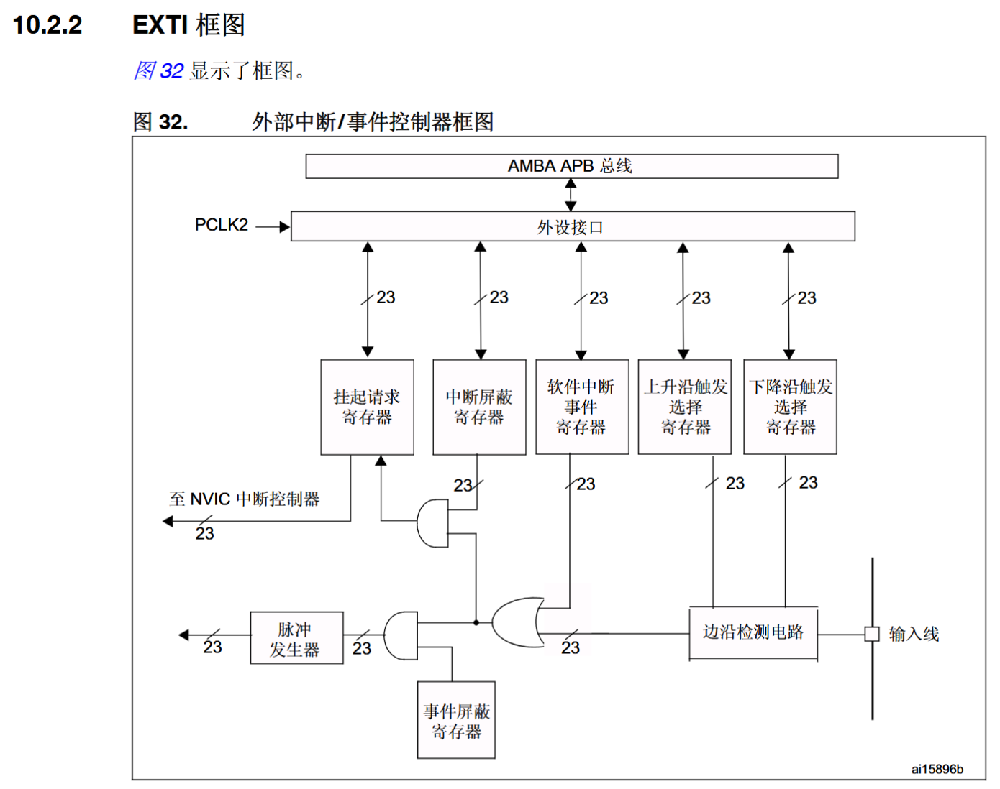

### 0x01、SYSCFG_EXTICR1寄存器映射

外部端口映射，多选一。组对组

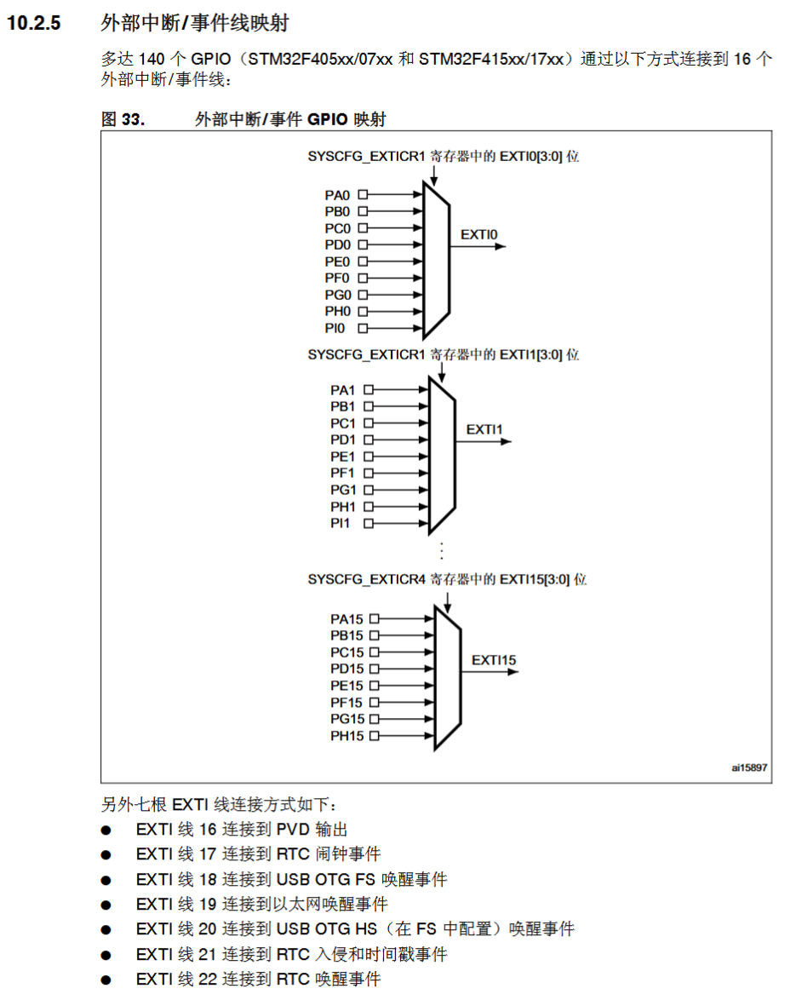

SYSCFG_EXTICR1寄存器

SYSCFG_EXTICR2

SYSCFG_EXTICR3

SYSCFG_EXTICR4

一起16根线

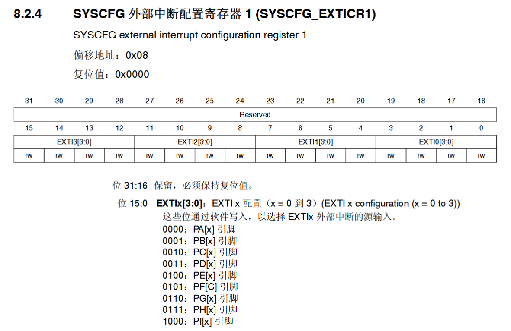

时钟

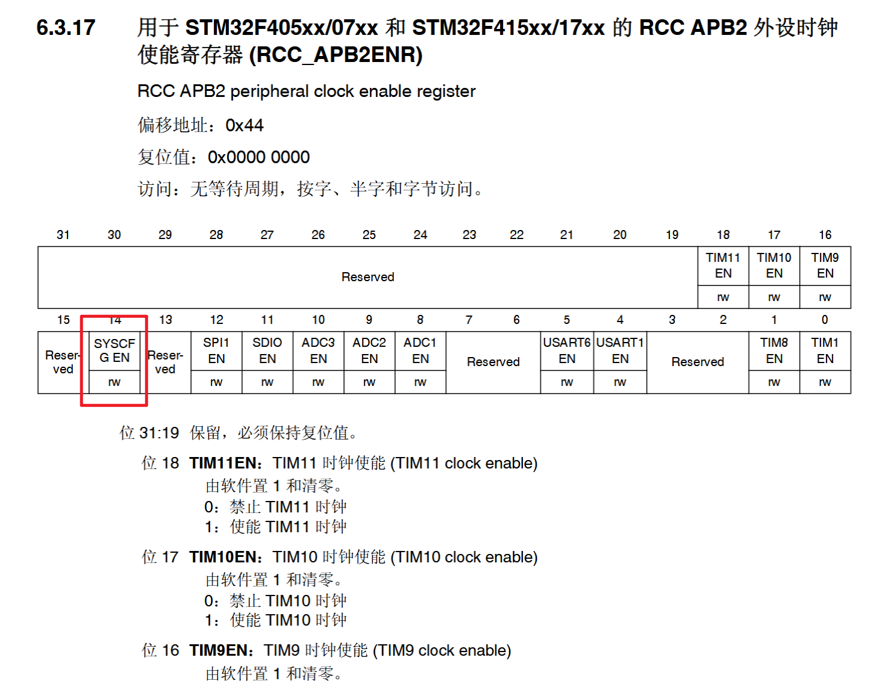

<br/>

### 0x02、EXTI_IMR中断屏蔽寄存器

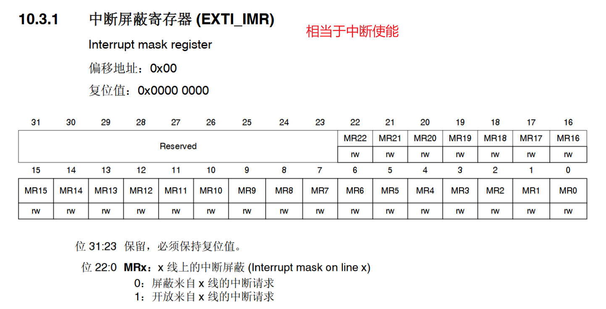

<br/>

**MR0~MR15对应GPIO口的0~15，下列寄存器同理。**

<br/>

<br/>

### 0x03、EXTI_RTSR上升沿寄存器

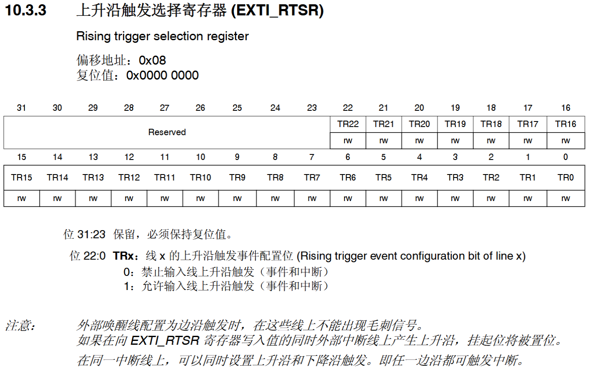

<br/>

### 0x04、EXTI_FTSR下降沿寄存器

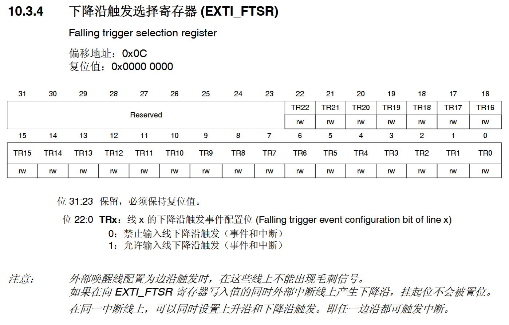

<br/>

### 0x05、EXTI_PR挂起寄存器

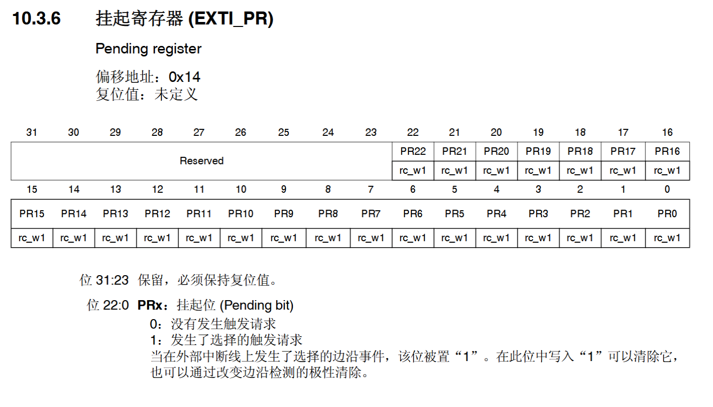

通过判断这个寄存器对应位的值，来决定执行中断函数，使用后清除

<br/>

## 三、配置使用

<br/>

### 0x1、配置步骤

<br/>

① 初始化配置

- GPIO时钟、模式、上下拉、速率

② EXTI控制器

- SYSCFG_EXTICR1控制器时钟使能、配置映射、中断屏蔽、上升沿或下降沿

③ NVIC控制器

- 优先级分组、计算优先级编码、设置通断通道、使能通道

④ 写中断服务

- 实现中断服务函数、控制中断条件(EXTI_PR)

<br/>

### 0x02、实例代码

#### 初始化

```c_cpp
void EXTI_Init(void)
{
    // GPIO时钟、模式、上下拉、速率
    RCC->AHB1ENR |= RCC_AHB1ENR_GPIOEEN;
    GPIOE->MODER &= ~(GPIO_MODER_MODER2);
    GPIOE->OSPEEDR = GPIOE->OSPEEDR & ~(GPIO_OSPEEDER_OSPEEDR2) | (GPIO_OSPEEDER_OSPEEDR2_0);
    GPIOE->PUPDR &= ~(GPIO_PUPDR_PUPDR2);
    // SYSCFG_EXTICR1控制器时钟使能、配置映射、中断屏蔽、上升沿或下降沿
    RCC->APB2ENR |= RCC_APB2ENR_SYSCFGEN;
    SYSCFG->EXTICR[0] = SYSCFG->EXTICR[0] & ~(0x0f00) | SYSCFG_EXTICR1_EXTI2_PE;
    EXTI->IMR |= EXTI_IMR_MR2;
    EXTI->RTSR |= EXTI_RTSR_TR2;
    EXTI->FTSR |= EXTI_FTSR_TR2;
    // 优先级分组、计算优先级编码、设置通断通道、使能通道
    NVIC_SetPriority(EXTI2_IRQn, NVIC_EncodePriority(5,2,2));
    NVIC_EnableIRQ(EXTI2_IRQn);
}
```

<br/>

#### 外部中断服务函数

```c_cpp
// EXTI外部中断服务函数
void EXTI2_IRQHandler(void)
{
    static u8 flag = 0x1;

    static u32 count = 0x0;
    //判断中断服务逻辑
    if(EXTI->PR & EXTI_PR_PR2)
    {
        //清除标志
        EXTI->PR |= EXTI_PR_PR2;
        //中断后的执行逻辑
        
    }
}
```

<br/>

<br/>

## 四、软件中断

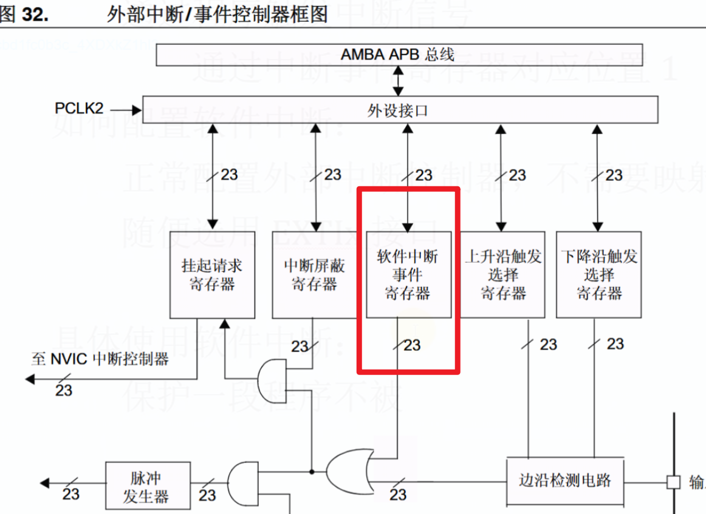

<br/>

- 什么是软件中断
  - 通过程序触发中断信号
  - 将中断事件寄存器对应为置1
- 如何配置
  - 正常配置外部中断控制器，不需要映射IO口
  - 随便选用EXITx接口
- 软件中断的作用
  - 保护一段程序不被其他中断打断。(前提是优先级要较高，才能将软件中断里的逻辑执行完)
