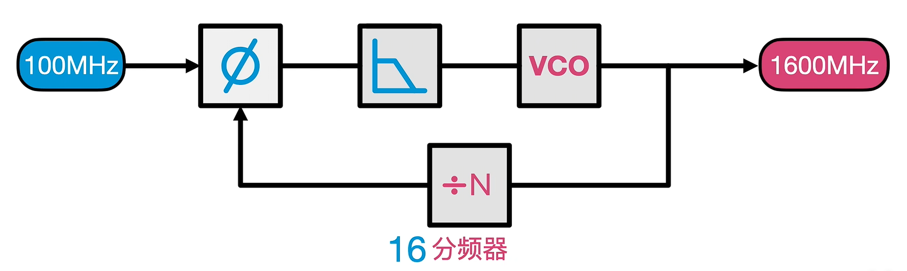

 

 

### 锁相环

 

#### 1. 鉴相器

将f1时钟脉冲与f2反馈的时钟脉冲进行比较后输出一个电压

#### 2. 低通滤波器

过滤波形，让电频保持相对平稳

#### 3. 压控振荡器

给不同电压，会输出相应的脉冲(可以理解为压电效应的反向利用)

 

 

总结：① 最终输出时钟是直接用高频振荡器，晶振只是矫正参考用

          ② 评率调整阶段：开始是100M输入100M输出，那么经过降频器后就是100/16M，然后鉴相器就会开足马力拉高倍频，直到1600M，经过降频器后才能和原来的100M相等

          ③ MCU更改时钟设置后需要一个稳定时间
