## 一、概述

<br/>

### 0x01、IWDG独立看门狗

- 自由运行递减计数器（12位的计数器，0xfff）最大4096个数值递减
- 始终由独立RC振荡提供时钟（在待机和停止模式运行）
- 递减计数器值到达0x000时产生复位（看门狗已激活状态下）

结论：初始化时从0xfff递减到0x000，到0x000时会触发看门狗函数。如果不想立马执行，就需要在递减到0x000之前重新设置递减值。俗称“喂狗”。

<br/>

### 0x02、WWDG窗口看门狗

可编程的自由运行递减计数器（7 位，计数的最大值128）

- 复位条件
  - 当递减计数器值小于 0x40（下窗口值） 时复位（如果看门狗已激活）
  - 在窗口之外重载递减计数器时复位（如果看门狗已激活）

- 提前唤醒中断 (EWI)：当递减计数器等于 0x40 时触发（如果已使能且看门狗已激活）

<br/>

### 0x03、区别

|功能|IWDG（独立看门狗）|WWDG（窗口看门狗）|
|--|--|--|
|时钟源|LSI:32KHz|APB1:42MHz  (可分频)|
|复位条件|计数器计到0|T[6]清零 和 大于窗口值喂狗|
|中断|没有|提前唤醒中断 (EWI)|

<br/>

<br/>

## 二、框图

### 0x01、看门狗时钟

- 独立看门狗

32kHz时钟，通常不太稳定，有时快有时慢，但是对于独立看门狗来说影响不大。

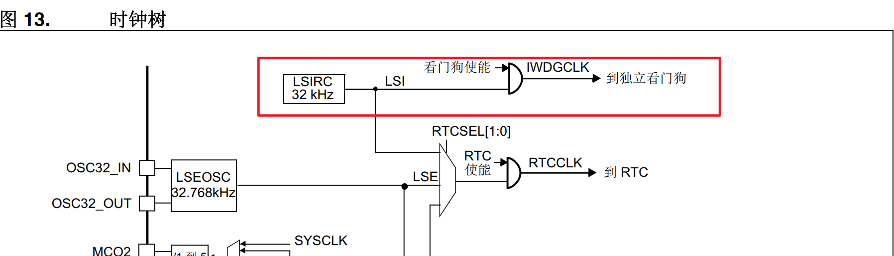

- 窗口看门狗

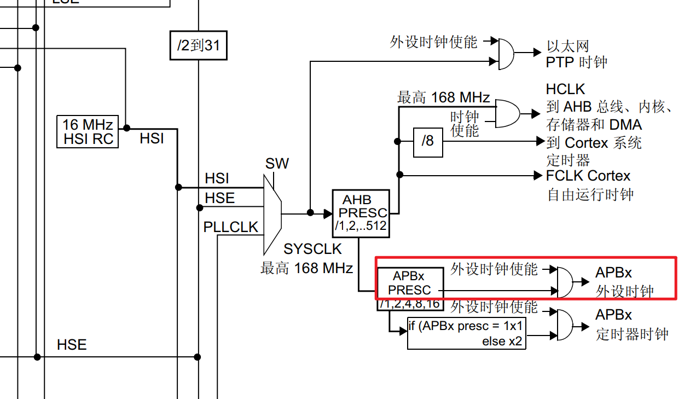

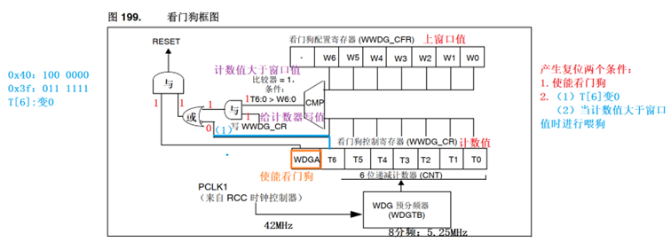

- 时钟使能

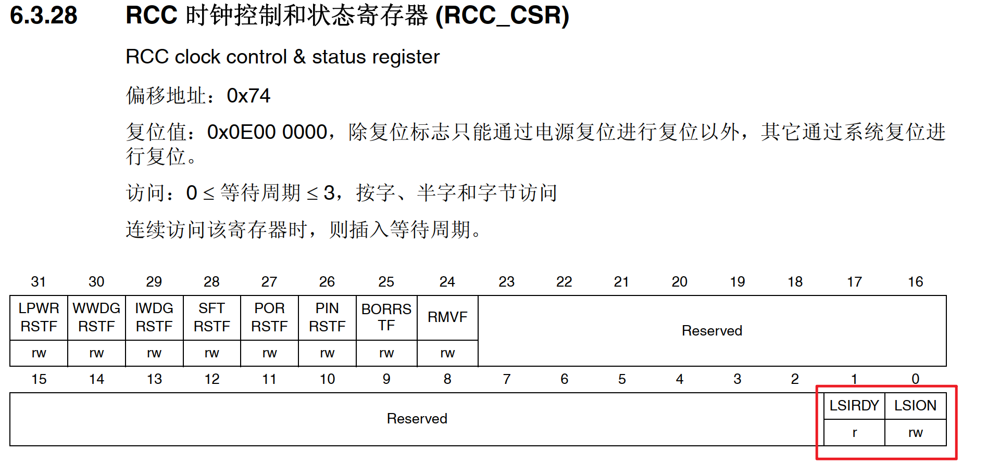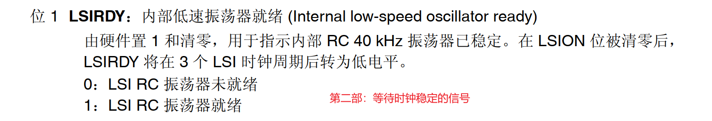

<br/>

### 0x02、运行时框图

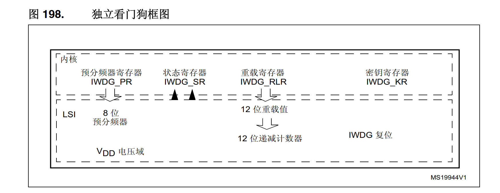

<br/>

<br/>

### 0x03、寄存器

- 独立看门狗

总结步骤：

<br/>

①、写入`0x5555`解除寄存器只读

②、写入`0xcccc`启动计数器

③、写入`0xaaaa`喂狗，更新重载值

注意：一旦启动看门狗就无法关闭

**关键字寄存器**

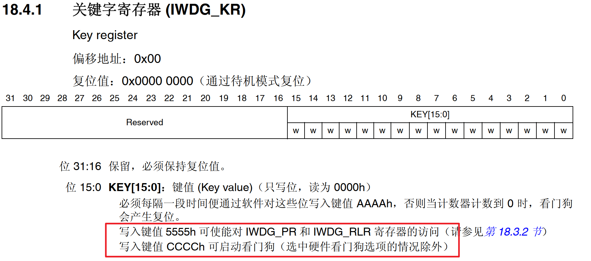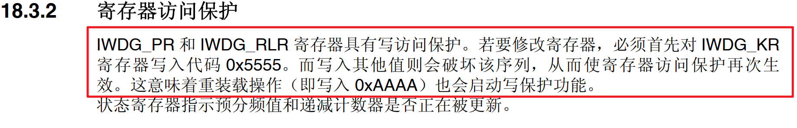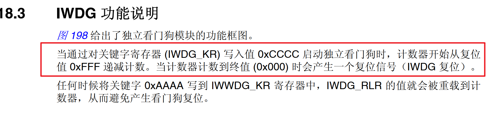

<br/>

**分频寄存器**

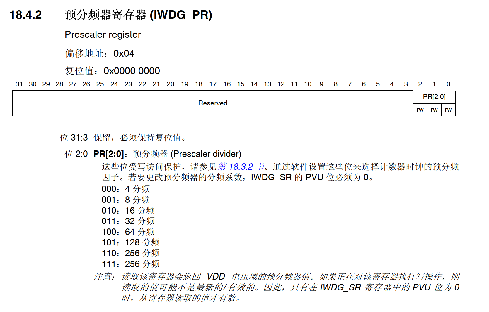

**重载值寄存器**

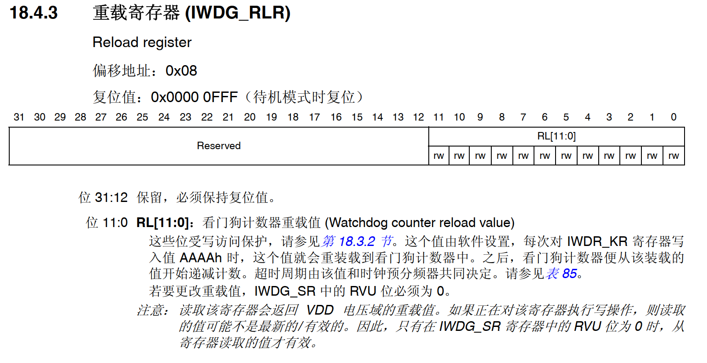

<br/>

窗口看门狗控制寄存器

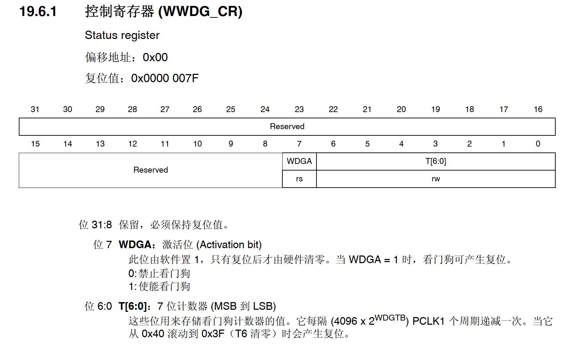

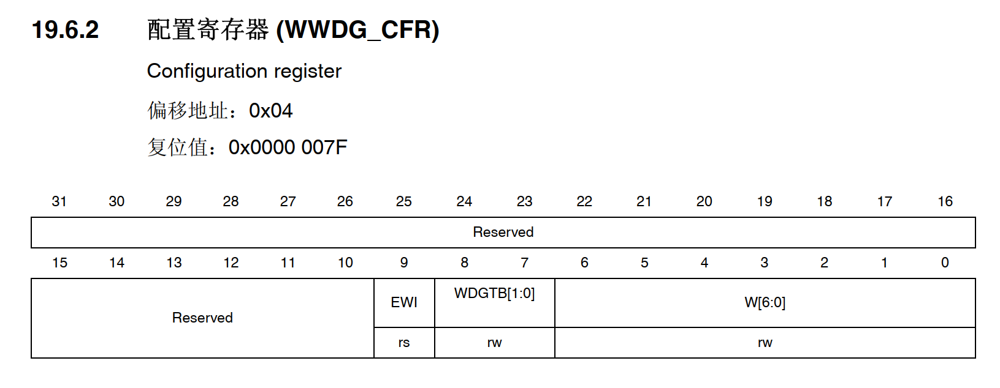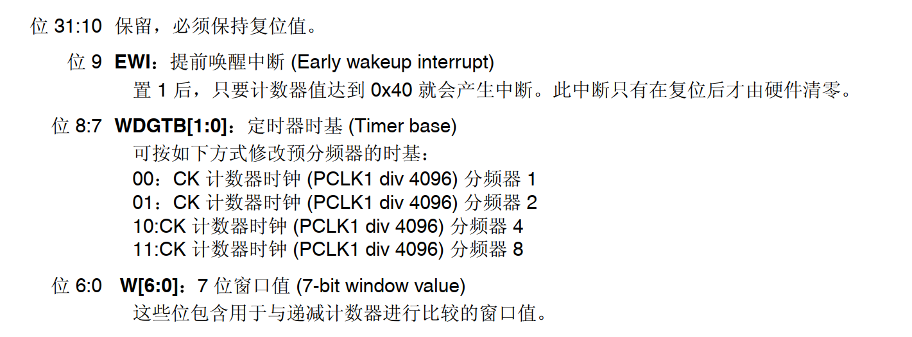

<br/>

窗口看门狗状态寄存器SR

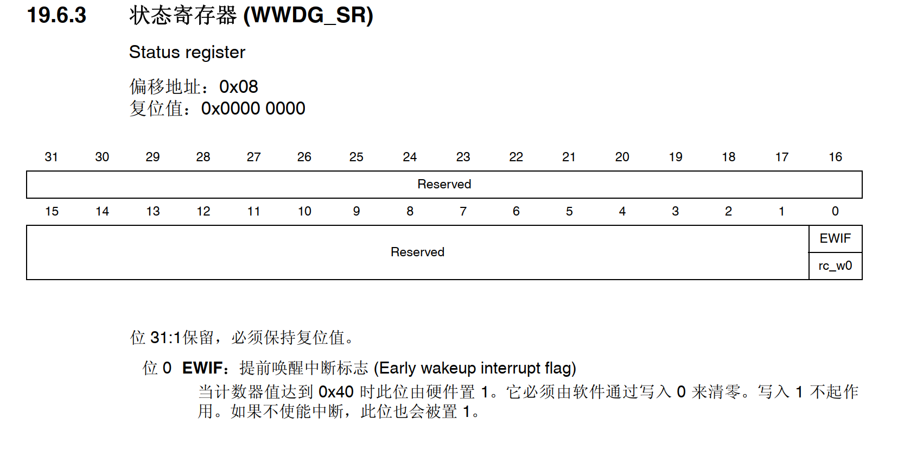

<br/>

## 三、配置使用步骤

### 0x01、独立看门狗

① 时钟源配置

② 解除寄存器保护

③ 设置分频

④ 设置重载值

⑤ 启动看门狗

⑥ 阶段性喂狗

<br/>

代码示例

```c_cpp
//初始化独立看门狗
void IWDG_Init(void)
{
	IWDG->KR = 0x5555;//取消写保护
	IWDG->PR =0x3;  //32分频，计一个数时间1ms
	IWDG->RLR = 0XFF0;//计数周期为4080ms
	IWDG->KR = 0xCCCC;//启动看门狗
}

//喂狗; 可以用定时中断来喂狗，这里只是演示
void Feed_Dog(void)
{
	IWDG->KR = 0xAAAA;
	printf("已喂狗\r\n");
}

```

<br/>

### 0x02、窗口看门狗

思路：
① 打开时钟
② 配置WWDG
     8分频    设置窗口值   使能提前唤醒中断   计数器初始值（默认0X7F） 清除标志位 
③ NVIC
④ 开启WWDG

<br/>

```c_cpp
//初始化窗口看门狗
void WWDG_Init(void)
{
	//打开时钟
	RCC->APB1ENR |= (1<<11);
	WWDG->CFR |= (0x3<<7);//8分频
	WWDG->CFR |= (0x70<<0);//设置窗口值
	WWDG->CFR |= (1<<9);//使能提前唤醒中断
	WWDG->SR &= ~(1<<0);//清除中断标志位
	
	NVIC_SetPriority(WWDG_IRQn,NVIC_EncodePriority(5,1,1));
	NVIC_EnableIRQ(WWDG_IRQn);
	
	WWDG->CR = 0xff;//设置初始值并使能看门狗
}

//中断服务函数
void WWDG_IRQHandler(void)
{
	if(WWDG->SR&(1<<0))
	{
		WWDG->CR = 0xff;//设置初始值并使能看门狗
		WWDG->SR &= ~(1<<0);//清除中断标志位
		printf("1\r\n");
	}
}

```
