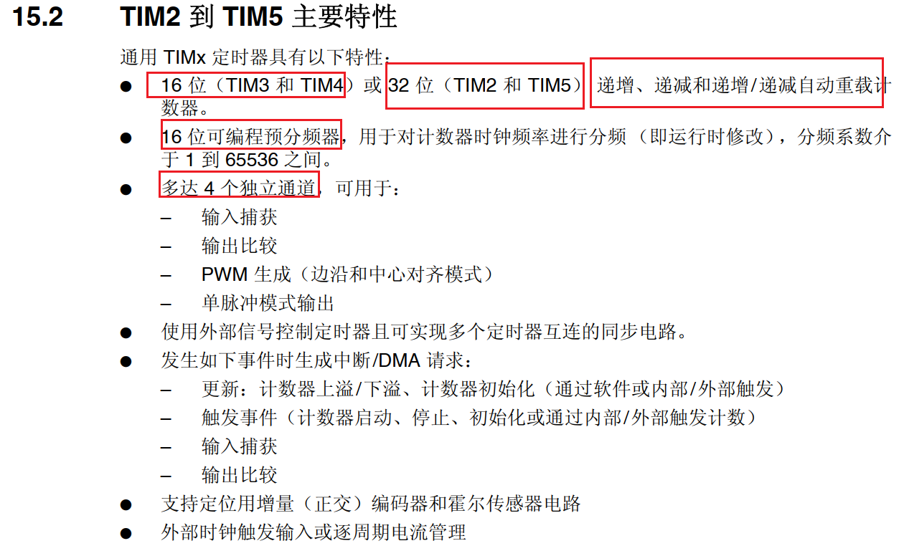
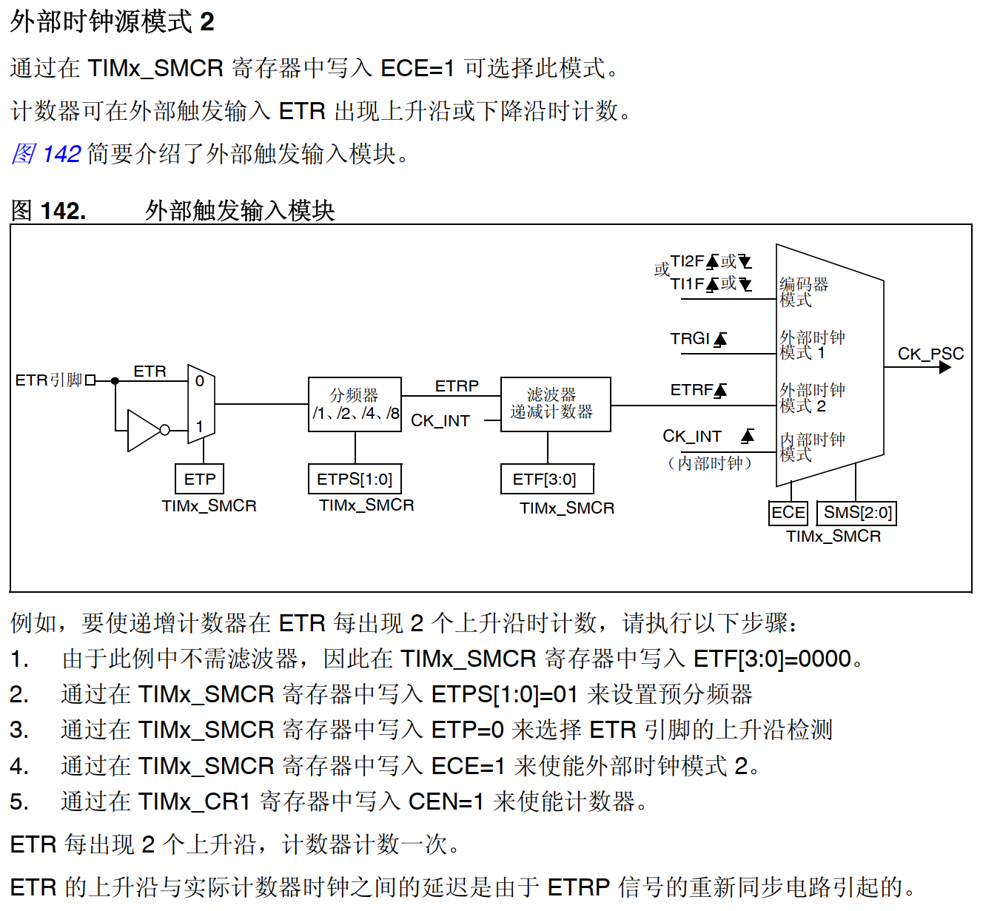

**通用定时器特性**

- 输入捕获
- 输出比较
- 完全独立

 

 

## TIM2~TIM5

 

### 0x01、基础特性

- 4个通道
- 16位分频器
- 自动重载计数器（16位：TIM3 TIM4）（32位：TIM2 TIM5）

 

### 0x02、框图 寄存器

 

 

 

 

 

### 0x03、时钟信号

 

- 内部时钟
  
  

- 外部时钟模式1

- 外部时钟模式2

 

### 0x04、如何选择时钟源

 

**通常情况下都默认使用内部时钟**

 

- 使用内部时钟
  
   
  
  
  
  

- 使用外部1

- 使用外部2

 

 

### 0x05、时钟信号滤波

只有外部时钟信号才需要滤波步骤（输入捕获）

输出比较时CKD配置为00，因为后面步骤还有分频，这里的分频针对ETR外部时钟

 

### 0x06、外部时钟1的信号源

 

#### a、信号源种类

- ITRx（定时器级联）
- TI1F_ED（输入捕获通道1不经过滤波）
- TI1FP1（输入捕获通道1经过滤波）
- TI2FP2（输入捕获通道2经过滤波）
- ETRF（外部时钟模式2的信号）

#### b、信号源配置

#### c、时钟信号级联配置

 

 

### 0x07、输出比较

通常指的是PWM，高低电平的周期时间比例

#### TIMxCR1控制寄存器1

注意：①CKD时钟分频是针对外部输入ETR时分频滤波使用（输入捕获）

          ②常规情况配置使用缓存，保证完整性（在计数中途不被程序写入覆盖）

 

 

#### TIMx_SMCR从模式控制寄存器

 

 

 

#### TIMx_CCMR1捕获/比较模式寄存器1

 

#### TIMxCCER捕获/比较使能寄存器

 

#### TIMxPSC预分频器

 

#### TIMxARR自动重载寄存器

 

#### TIMx捕获/比较寄存器1

 

#### TIMx时间生成寄存器

 

#### 配置步骤示例

1. 配置CR1寄存器的分频
   1. 捕获模式时默认配置
   2. 比较模式时由于是外部输入源，需要滤波和分频以提高采样率
2. 

 

 

 

#### PWM模式

 

 

 

 

## TIM9、TIM12

 

### 0x01、基本特性

- 两个通道
- 16位自动重载计数器
- 16位分频器

 

### 0x02、框图 寄存器

 

 

 

 

 

 

## TIM10、TIM11、TIM13、TIM14

 

### 0x01、基本特性

- 一个通道

 

### 0x02、框图

