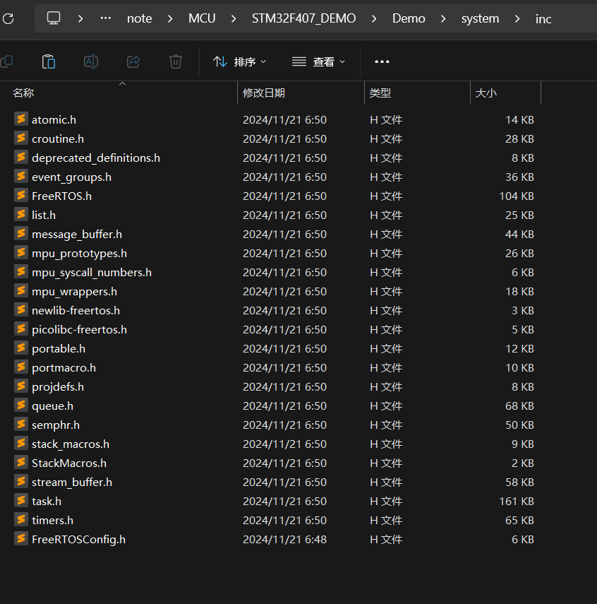

4种状态：① 运行态

               ② 就绪态

               ③ 阻塞态

               ④ 挂起态

<br/>

常用功能：时间标志组、软件定时器、信号量、消息队列

<br/>

### 1、系统文件移植




<br/>


替换成


```c_cpp
#if defined(__ICCARM__) || defined(__CC_ARM) || defined(__GUNC__)
	#include <stdint.h>
	extern uint32_t SystemCoreClock;
#endif
```

<br/>


```c_cpp
#define vPortSVCHandler SVC_Handler    //系统异常调用，执行第一个任务时要用到
#define xPortPendSVHandler PendSV_Handler     //任务切换关键中断函数PendSV
#define INCLUDE_xTaskGetSchedulerState 1   //开启任务调度器状态获取的开关
//根据是否引入stm32f1xx_it.c中断文件或自己实现了中断来决定SysTick_Handler的去留
```

- 其他错误


```c_cpp
#define configUSE_MALLOC_FAILED_HOOK 0   // 关闭钩子
#define configUSE_IDLE_HOOK          0   // 关闭空闲钩子
#define configUSE_TICK_HOOK          0   // 关闭节拍钩子
#define configCHECK_FOR_STACK_OVERFLOW 0 // 关闭栈溢出检查

// 空闲任务钩子；低功耗模式、看门狗喂狗
void vApplicationIdleHook(void);   
// 系统节拍钩子；高精度定时统计
void vApplicationTickHook(void);      
// 栈溢出钩子记录溢出任务名、系统复位
void vApplicationStackOverflowHook(TaskHandle_t xTask, char *pcTaskName); 
```

实现

```c_cpp
//空闲任务钩子
void vApplicationIdleHook(void) {
    // 此处添加后台任务（如喂看门狗、低功耗模式）
    // 注意：禁止调用阻塞函数（如 vTaskDelay）[10,14](@ref)
}

//系统节拍钩子
void vApplicationTickHook(void) {
    // 在每个系统时钟中断调用（1ms一次）
    // 保持代码简短，避免影响实时性[14](@ref)
}

//栈溢出钩子
void vApplicationStackOverflowHook(TaskHandle_t xTask, char *pcTaskName) {
    // 栈溢出时触发（如打印任务名并复位系统）
    printf("Stack overflow in task: %s\n", pcTaskName);
    NVIC_SystemReset(); // 触发硬件复位
}

//内存分配失败钩子
void vApplicationMallocFailedHook(void) {
    // 内存分配失败时的处理逻辑
    printf("Malloc failed! System halted.\n");
    while (1); // 死循环或触发复位
}

```

<br/>

### 2、引入RTOS


<br/>

<br/>

### 3、修改systick

```c_cpp
#ifndef __SYSTICK_H__
#define __SYSTICK_H__

#include "stm32f4xx.h"

#define SYSTEM_SUPPORT_OS 1

extern void xPortSysTickHandler(void);

void systick_delay_us(u32 us);
void systick_delay_ms(u32 ms);
void Systick_Delay_Ms(u32 ms);
void systick_delay_init(u8 SYSCLK);

#endif

```

```c_cpp
#include "systick.h"

// 如果使用OS,则包括下面的头文件即可
#if SYSTEM_SUPPORT_OS
#include "FreeRTOS.h" //FreeRTOS使用
#include "task.h"

static u8 fac_us = 0;  // us延时倍乘数
static u16 fac_ms = 0; // ms延时倍乘数,在os下,代表每个节拍的ms数

// systick中断服务函数,使用OS时用到
void SysTick_Handler(void)
{
	if (xTaskGetSchedulerState() != taskSCHEDULER_NOT_STARTED) // 系统已经运行
	{
		xPortSysTickHandler();
	}
}

// 初始化延迟函数
// SYSTICK的时钟固定为AHB时钟，基础例程里面SYSTICK时钟频率为AHB/8
// 这里为了兼容FreeRTOS，所以将SYSTICK的时钟频率改为AHB的频率！
// SYSCLK:系统时钟频率
void systick_delay_init(u8 SYSCLK)
{
	u32 reload;
	SysTick_CLKSourceConfig(SysTick_CLKSource_HCLK);
	fac_us = SYSCLK;						// 不论是否使用OS,fac_us都需要使用
	reload = SYSCLK;						// 每秒钟的计数次数 单位为M
	reload *= 1000000 / configTICK_RATE_HZ; // 根据configTICK_RATE_HZ设定溢出时间
											// reload为24位寄存器,最大值:16777216,在168M下,约合0.0998s左右
	fac_ms = 1000 / configTICK_RATE_HZ;		   // 代表OS可以延时的最少单位
	SysTick->CTRL |= SysTick_CTRL_TICKINT_Msk; // 开启SYSTICK中断
	SysTick->LOAD = reload;					   // 每1/configTICK_RATE_HZ断一次
	SysTick->CTRL |= SysTick_CTRL_ENABLE_Msk;  // 开启SYSTICK
}

// 延时nus
// nus:要延时的us数.
// nus:0~204522252(最大值即2^32/fac_us@fac_us=168)
void systick_delay_us(u32 nus)
{
	u32 ticks;
	u32 told, tnow, tcnt = 0;
	u32 reload = SysTick->LOAD; // LOAD的值
	ticks = nus * fac_us;		// 需要的节拍数
	told = SysTick->VAL;		// 刚进入时的计数器值
	while (1)
	{
		tnow = SysTick->VAL;
		if (tnow != told)
		{
			if (tnow < told)
				tcnt += told - tnow; // 这里注意一下SYSTICK是一个递减的计数器就可以了.
			else
				tcnt += reload - tnow + told;
			told = tnow;
			if (tcnt >= ticks)
				break; // 时间超过/等于要延迟的时间,则退出.
		}
	};
}
// 延时nms
// nms:要延时的ms数
// nms:0~65535
void systick_delay_ms(u32 nms)
{
	if (xTaskGetSchedulerState() != taskSCHEDULER_NOT_STARTED) // 系统已经运行
	{
		if (nms >= fac_ms) // 延时的时间大于OS的最少时间周期
		{
			vTaskDelay(nms / fac_ms); // FreeRTOS延时
		}
		nms %= fac_ms; // OS已经无法提供这么小的延时了,采用普通方式延时
	}
	systick_delay_us((u32)(nms * 1000)); // 普通方式延时
}

void Systick_Delay_Ms(u32 nms)
{
	if (xTaskGetSchedulerState() != taskSCHEDULER_NOT_STARTED) // 系统已经运行
	{
		if (nms >= fac_ms) // 延时的时间大于OS的最少时间周期
		{
			vTaskDelay(nms / fac_ms); // FreeRTOS延时
		}
		nms %= fac_ms; // OS已经无法提供这么小的延时了,采用普通方式延时
	}
	systick_delay_us((u32)(nms * 1000)); // 普通方式延时
}

// 延时nms,不会引起任务调度
// nms:要延时的ms数
void delay_xms(u32 nms)
{
	u32 i;
	for (i = 0; i < nms; i++)
		systick_delay_us(1000);
}
#else
void delay_us(u32 us) // 10
{
	SysTick->CTRL &= ~(1 << 2); // 使用外部时钟源
	SysTick->LOAD = us * 21;	// 1微妙数21个数  168/8=21
	SysTick->VAL = 0;			// 当前值清0
	SysTick->CTRL |= 1 << 0;	// 开启定时器
	while ((SysTick->CTRL & 1 << 16) == 0)
		;						// 等待计时结束
	SysTick->CTRL &= ~(1 << 0); // 关闭定时器
}
void delay_ms(u32 ms) //  3000   798
{
	SysTick->CTRL &= ~(1 << 2);		// 使用外部时钟源
	SysTick->LOAD = ms * 21 * 1000; // 1微妙数21个数  168/8=21
	SysTick->VAL = 0;				// 当前值清0
	SysTick->CTRL |= 1 << 0;		// 开启定时器
	while ((SysTick->CTRL & 1 << 16) == 0)
		;						// 等待计时结束
	SysTick->CTRL &= ~(1 << 0); // 关闭定时器
}

void Delay_Ms(u32 ms) // 2000
{
	while (ms--)
		delay_ms(1);
}
#endif

```

<br/>

### 概念

优先级：①抢占式调度  ②时间片调度 ③协程式调度

<br/>

<br/>

<br/>

### 常用函数

**任务相关**

<br/>

```c_cpp
/*临界区*/
taskENTER_CRITICAL(); // 进入临界区 创建任务时不被中断打断
//中间用来创建任务，或其他不想被时间片中断的其他逻辑

taskEXIT_CRITICAL();			 // 退出临界区
```

```c_cpp
/*创建任务: */
BaseType_t xTaskCreate( TaskFunction_t pxTaskCode,  //任务函数地址
                      const char * const pcName,  //任务名称
                      const configSTACK_DEPTH_TYPE uxStackDepth, //任务栈大小 n * 32位
                      void * const pvParameters,  //传递给任务的参数
                      UBaseType_t uxPriority,   //抢占式调度优先级
                      TaskHandle_t * const pxCreatedTask ) //任务句柄；提前创建用来管理该任务
                      
/*挂起任务*/
void vTaskSuspend( TaskHandle_t xTaskToSuspend  )//任务句柄


/*恢复被挂起的任务*/
void vTaskResume( TaskHandle_t xTaskToResume )//任务句柄


/*阻塞延时任务；相对延时*/
void vTaskDelay( const TickType_t xTicksToDelay ) //延时多少个时间片

/*绝对延时，保证当前任务只执行多少个时间片*/
( void ) xTaskDelayUntil( ( pxPreviousWakeTime ), ( xTimeIncrement ) )

/*开启任务调度*/
vTaskStartScheduler(); // 开启任务调度后，这行后面的代码将不被执行

```