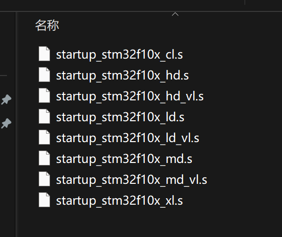
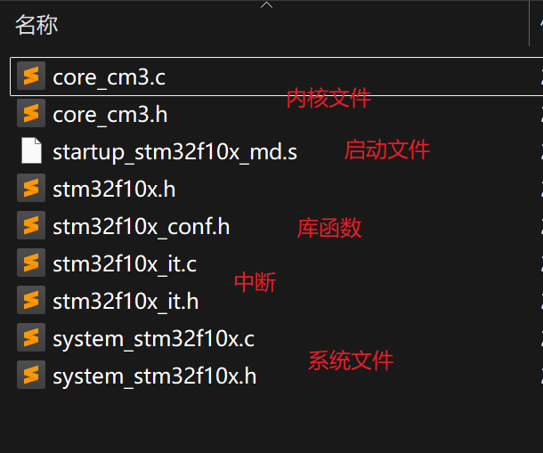
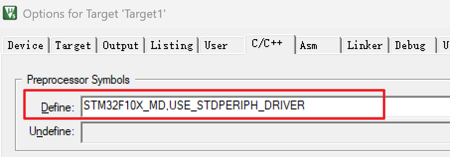
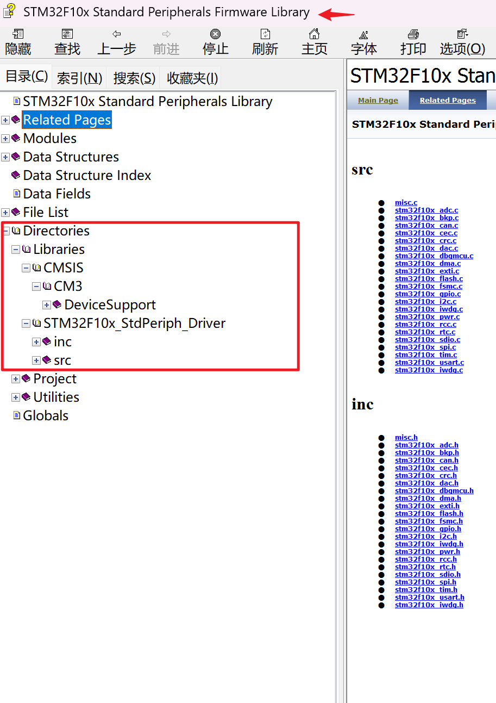
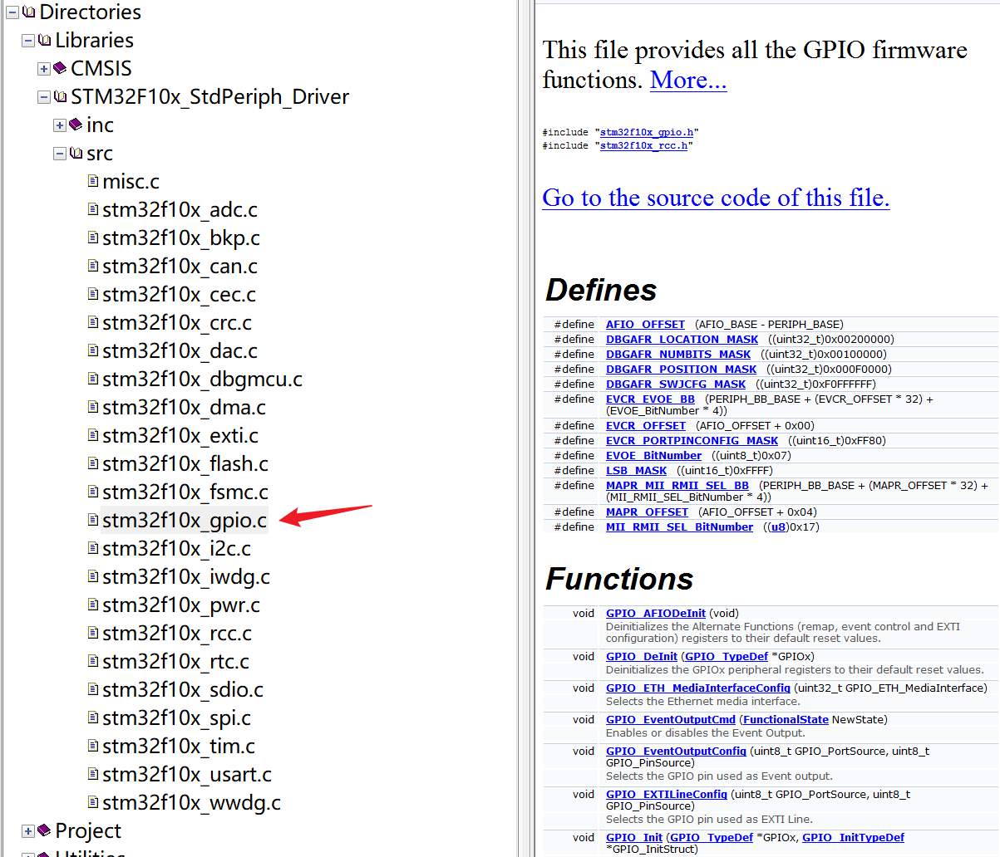
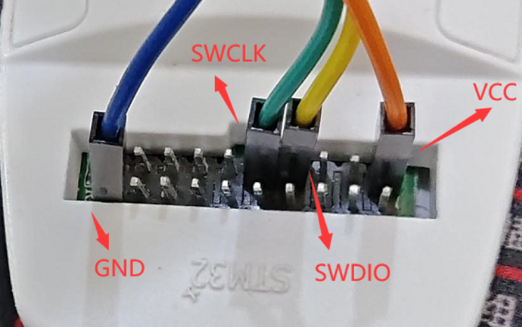

库函数开发：启动外设，看原理图

对某个外设熟悉，可以不看中文参考手册，不熟练的还是经常看，库函数使用手册

 

**型号名称解读：**

> （1）STM32：STM32代表ARM Cortex-M4内核的32位微控制器。
（2）F：F代表芯片子系列。
（3）407：407代表高性能基础系列。
（4）R：代表引脚数，其中T代表36脚，C代表48脚，R代表64脚，V代表100脚，Z代表144脚。
（5）B：代表内嵌Flash容量，其中6代表32K字节Flash，8代表64K字节Flash，B代表128K字节Flash，C代表256K字节Flash，D代表384K字节Flash，E代表512K字节Flash。
（6）T：代表封装，其中H代表BGA封装，T代表LQFP封装，U代表VFQFPN封装。
（7）6：代表工作温度范围，其中6代表-40——85℃，7代表-40——105℃。

 

 

 

**启动文件选择：**按Flash容量选择不同文件

 

**编程所需文件：**

 

工程宏定义：STM32F10X_MD,USE_STDPERIPH_DRIVER

 

 

标准库文档：

 

接线：

