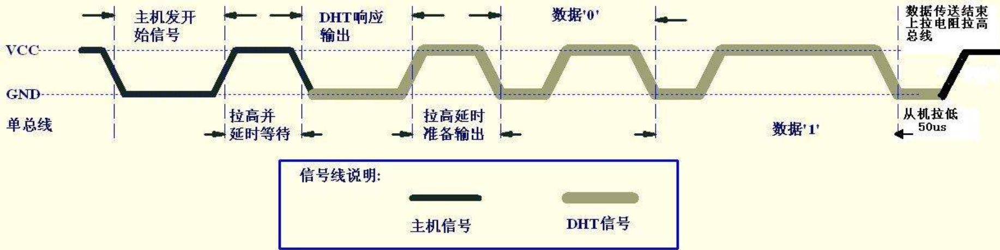
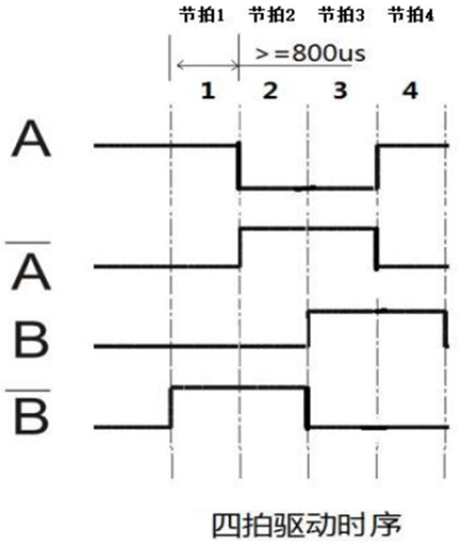
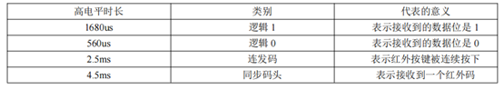
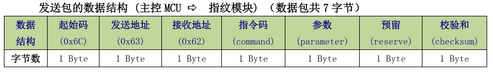
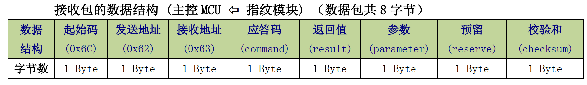

## 基础部分

 

### ADC

运行过程：① **采样** 

                  a、采样时间可以设定

                  b、采样周期也可以修改

                 ② **转换**

参考电压：用于对比的模拟量

精度（分辨率）：12位

时钟频率：STM32F4系列最大36Mhz

 

配置步骤：① 开GPIO口时钟

                 ② 开ADC外设时钟

				 ③ 配置GPIO口为**模拟输入**

				 ④ 配置ADC控制器

                     a、CR1 **分辨率**

                     b、CR1 **扫描模式**（多通道配置为扫描，单通道配置非扫描）

                     c、CR2 **配置数据对齐**（右对齐）

                     d、CR2 **结束转换选择**（每个通道转换结束都EOC置位）

                     e、CR2 **连续转换**（配置为单次转换，可控性好）

                     f、SMPR** 配置采样时间**（周期；需要选择配置对应的通道）

                     g、SQR** 规则序列**（有几个通道需要转换，从第0个开始排要转的通道）

                     h、CCR** 配置分频**（根据时钟频率和ADC最大频率选择分频值）

                     i、CR2 ADC使能

                 5、最后在获取数据时使用 CR2 **开始转换**规则通道

规则通道（16个）：① 多通道排序转换

                               ② 单次转换或连续转换

注入通道（4个）: ① 触发注入（可以打断规则通道） 

                           ② 自动注入（不会打断规则通道）

 

### DMA

STM32F4有**两个DMA控制器**，每个控制器有**8个数据流**，每个数据流有**8个通道**包含**一个FIFO**

数据传输模式：① 直接模式

                       ② FIFO模式（可以一次搬**4个字节**到FIFO里，省时间）

数据传输方向：① 存储器->外设   （数组名->串口DR = 串口发送）

                        ② 外设->存储器   （串口DR->数组名 = 串口接收）

                        ③ 存储器->存储器

通道优先级：**非常高、高、中、低**；在优先级相同时根据**通道号**较小的判定

 

 

## 项目部分

 

### 1、乐鑫ESP8266

通过串口发送AT指令配置MQTT通信。

 

### 2、安信可AI-WB2-13

通过串口发送AT指令配置MQTT通信。

 

### 3、温湿度传感DHT11

DHT11 与单片机之间能采用简单的**单总线**进行通信，仅仅需要**一个 I/O 口**。传感器内部湿度和温度数据 **40Bit 的数据**一次性传给单片机，数据采用校验和方式进行校验，有效的保证数据传输的准确性。 DHT11 功耗很低，5V 电源电压下，工作平均最大电流 0.5mA。 

**8bit湿度整数数据**+**8bit湿度小数数据**+**8bit温度整数数据**+**8bit温度小数数据**+**8bit校验和**。其中校验和数据为前四个字节相加。

通信过程：**主机拉低数据线**，保持 t1（至少 18ms）时间，然后**拉高数据线** t2（20~40us）时间，然后读取 DHT11 的响应，正常的话，** DHT11 会拉低数据线**，保持 t3（40~50us）时间，作为响应信号，然后 **DHT11 拉高数据线**，保持 t4（40~50us）时间后，开始输出数据

 

### 4、步进电机

丝杆步进电机有**四个引脚**，每一个**节拍的电平状态必须保持 800us 以上**的稳定状态才可以切换到下一个节拍，每一个节拍都需**控制四个管脚**的电平

### 5、红外传感

传输协议有两种：NEC和RC-5。这里采用NEC协议进行通信。

**8 位地址**和**8位指令长度**，地址和命令 **2 次传输**确保可靠性，PWM 脉冲宽度调制，以发射红外载波的**占空比代表“0”和“1”**，载波频率为 **38Khz**。位时间为** 1.125ms **或 **2.25ms**

**NEC** 数据格式组成：**同步码头**+**地址码**+**地址反码**+**控制码**+**控制反码**；均是** 8 位**数据格式

同步码头： 9ms 的低电平+ 4500us 的高电平

逻辑 1： 560us 低+1680us 高

逻辑 0： 560us 低+560us 高

 

### 6、电容按键

控制芯片采用CY8CMBR3116控制芯片，使用**IIC**进行通信，SCK、SDA、RES。

轮询读取控制芯片的寄存器**0x37器件地址**即可检测按下的按键，按键数据**占16bit**。

 

### 7、RFID刷卡（NFC）

通信方式**SPI**。 CS、SCK、MOSI、MISO。

整套通信组件分为**标签**、**读写器**、**天线组**，使用**13.56Mhz**通信频率。

RFID射频卡模块主要由RC522模块和S50射频卡组成，而**RC522模块**起到一个**发射指令**和**接收数据**的作用，恩智浦（NXP）**S50射频卡**相当于一个内存卡（**EEPROM**），卡内有一个器件唯一**地址ID**32bit用于识别卡。存储大小一共**1KB**。

 

### 8、指纹识别（MG200）

通信方式（**UART**）,通过串口发送**7个字节**的指令码，模块识别后会返回**8个字节**的响应码。

使用步骤：1、 注册指纹   2、校验指纹（开门），删除指纹

