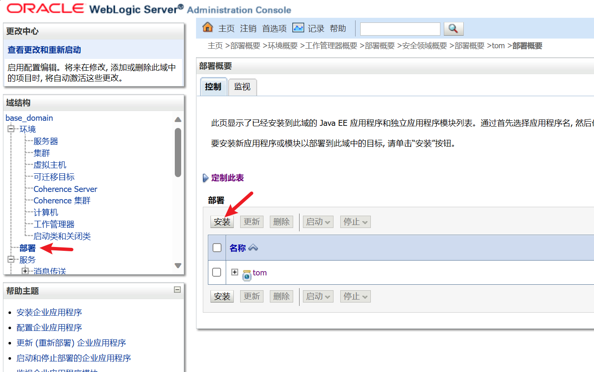
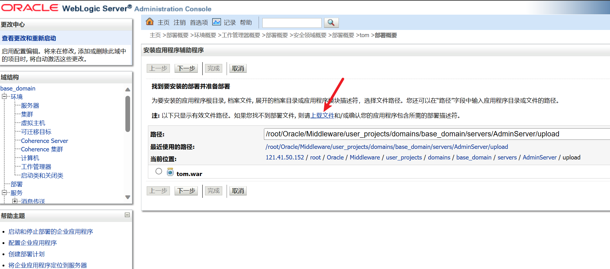

#### 一、简介

```
WebLogic是美国Oracle公司出品的一个application server，确切的说是一个基于JAVAEE架构的中间件，WebLogic是用于开发、集成、部署和管理大型分布式Web应用、网络应用和数据库应用的Java应用服务器。
```

<br/>

#### 二、特征

默认端口：7001
Web界面：Error 404--Not Found
控制后台：`http://ip:7001/console`

<br/>

#### 三、历史漏洞发现

##### 1）获取资产

使用shodan、fofa、zoomeye等

查找语法：`fofa：app="BEA-WebLogic-Server" && country!="CN"`

<br/>

##### 2）批量扫描脚本

WeblogicScan：`https://github.com/rabbitmask/WeblogicScan`

weblogicScaner：`https://github.com/0xn0ne/weblogicScanner`

<br/>

##### 3）漏洞环境搭建

vulhub：`https://github.com/vulhub/vulhub/tree/master/weblogic`

```sh
docker pull vulhub/weblogic:10.3.6.0-2017
docker run -dit -p 7001:7001 vulhub/weblogic:10.3.6.0-2017
```

<br/>

##### 4）漏洞利用

用户名：`weblogic`

密码：`Oracle@123`

a、弱口令：`https://cirt.net/passwords?criteria=weblogic`

b、部署war包(载入木马)





<br/>

##### 5）其他漏洞

前往[VulHub](https://github.com/vulhub/vulhub/tree/master)查看
