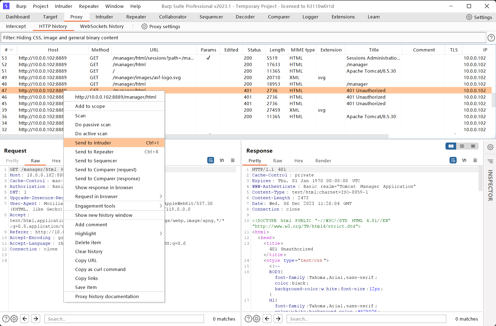
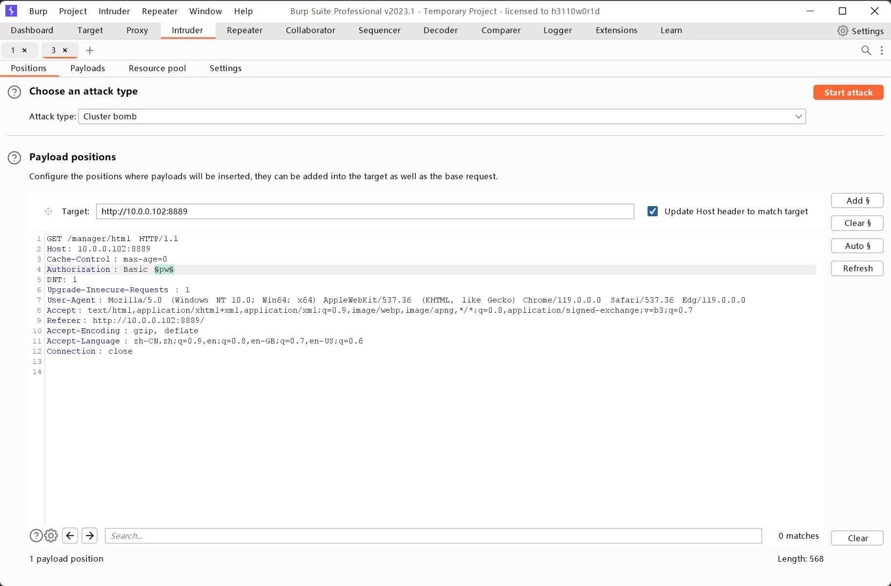
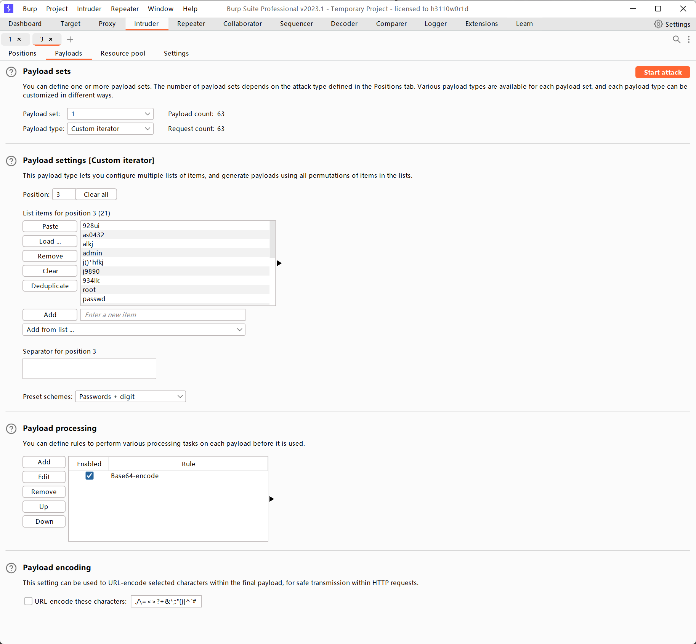
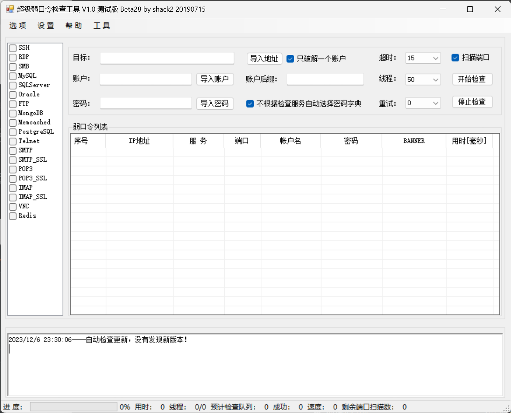
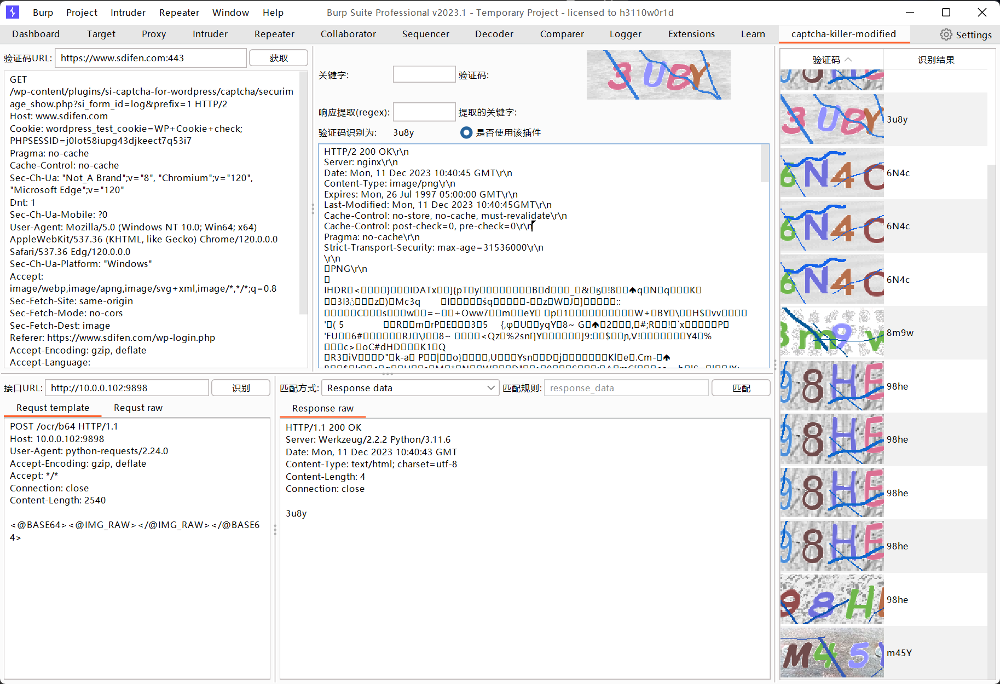

### 一、弱口令密码破解方法

<br/>

- 暴力破解工具
  
  `BurpSuite` 
  
  `Hydra`
  
  `Metasploit`
  
  `SNETCracker` : `https://github.com/shack2/SNETCracker`
- 暴力破解字典
  
  历年弱口令top100，github上搜索弱口令字典
  
  `https://github.com/k8gege/PasswordDic`
  
  `https://github.com/danielmiessler/SecLists`
  
  `https://192-168-1-1ip.mobi/default-router-passwords-list/`
  
  `https://github.com/danielmiessler/SecLists/blob/master/Passwords/Default-Credentials/default-passwords.csv`
  
  `https://github.com/Dormidera/WordList-Compendium`
  - 创建自定义字典
    
    1）Crunch
    > https://www.wangan.com/p/7fygf3883f0d6897
    
    2）pydictor
    > https://github.com/LandGrey/pydictor
    
    3）Cewl
    > https://blog.csdn.net/weixin_42918771/article/details/105107242

### 二、弱口令密码破解实例

<br/>

- Tomcat弱口令
  
  1）漏洞环境
  ```sh
  docker pull bytsy0/tomcat
  docker run -dit --privileged -p 8080:8080 --name tomcat-pass-shell betsy0/tomcat /usr/sbin/init
  ```
  
  2）操作爆破
  - Burpsuite爆破
    
    关键属性配置：
    - Attack type：攻击类型
      - sniper：一个字典对应一个参数值
      - battering ram：一个字段对应多个参数值（也就是不管选择爆破多少个参数值都是使用同一个字典）
      - pitchfork：平行爆破（也就是字典一对应参数值一，字典二对应参数值二，爆破的次数取决于小的字典）
      - cluster bomb：交叉爆破（顾名思义，交叉爆破产生的字典非常庞大）
    - payloads type：载入属性配置
      - simple list：简单字典
      - runtime file：运行文件
      - custom iterator：自定义迭代器
      - character sub：字符串替换
  
  
  
  
  
  
  
  3）后台getShell
  
  成功爆破密码后登进后台，部署后门war包
  
  war包制作方法
  
  `jar -cvf houmen.war webshell.jsp`
  
  部署此webshell之后即可使用工具反弹shell
- 爆破MySql
  
  使用上面提到的  SNETCracker
  
  
  
  <br/>

4）验证码模块

验证码插件：`https://github.com/f0ng/captcha-killer-modified`

验证码识别服务：`https://github.com/sml2h3/ddddocr` 、`https://github.com/sml2h3/ocr_api_server`

匹配文本：

```text
POST /ocr/b64 HTTP/1.1
Host: 124.71.45.28:9898
User-Agent: python-requests/2.24.0
Accept-Encoding: gzip, deflate
Accept: */*
Connection: close
Content-Length: 2540

<@BASE64><@IMG_RAW></@IMG_RAW></@BASE64>
```


